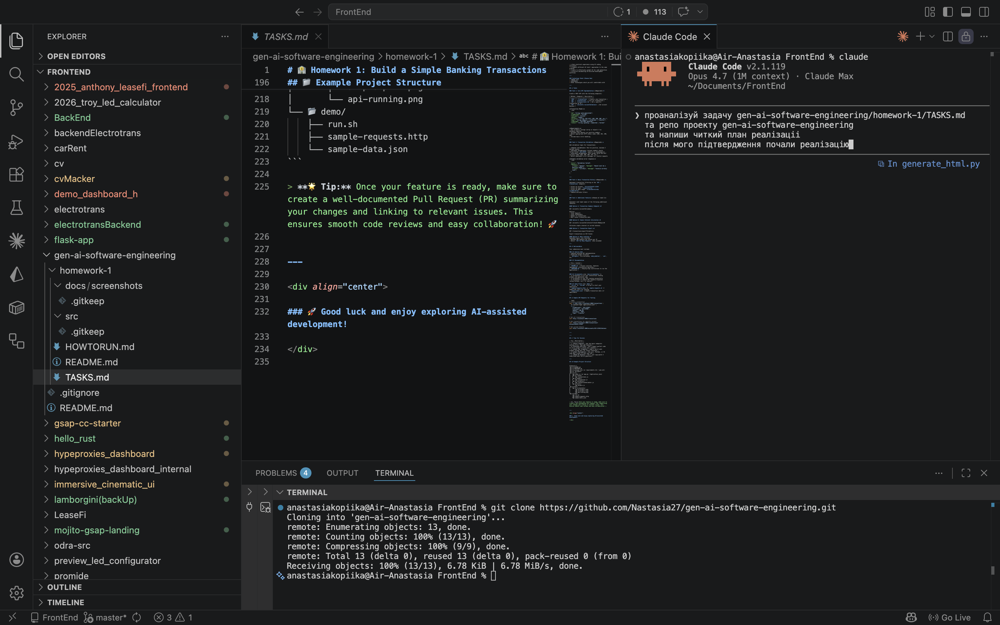
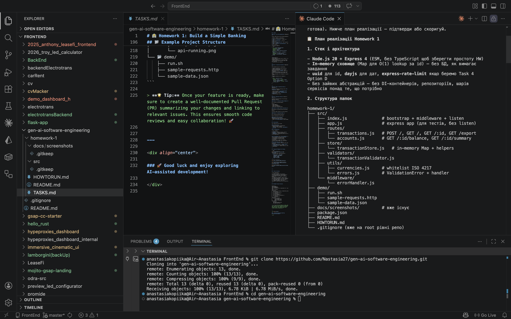
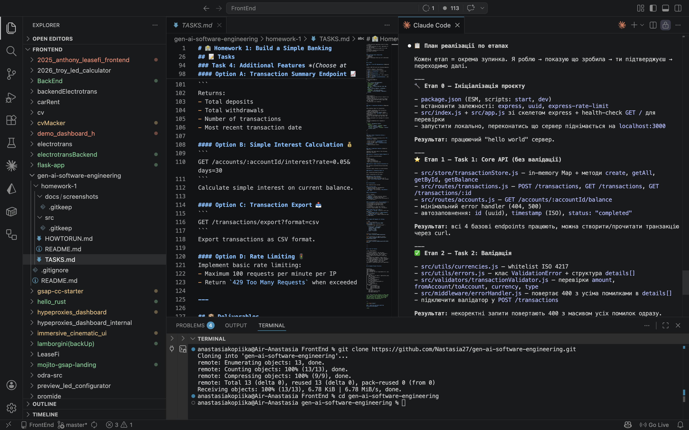
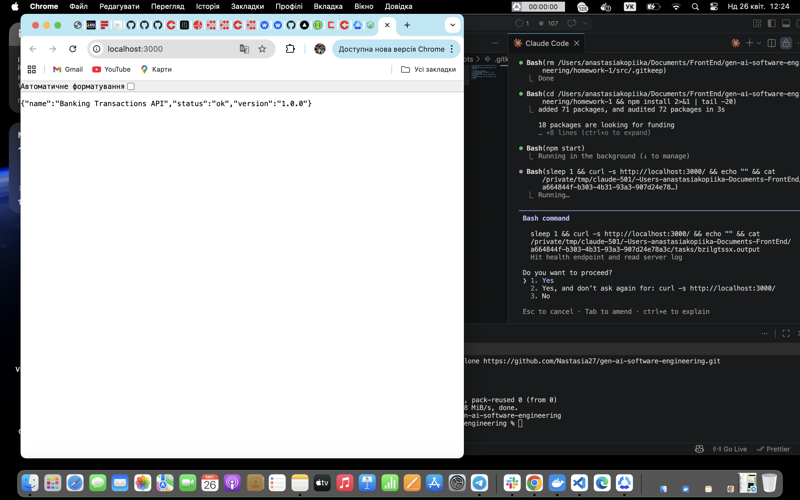
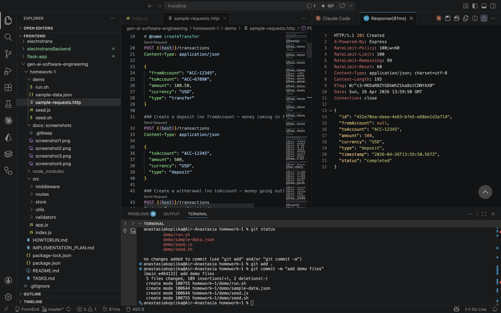
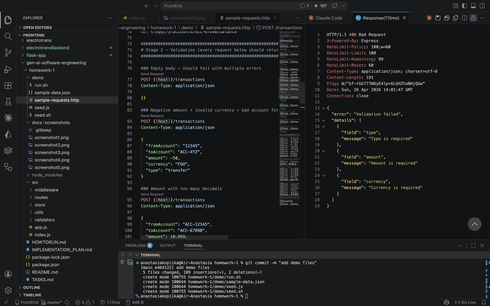

# 🏦 Homework 1: Banking Transactions API

> **Student:** Anastasia Kopiika
> **Submitted:** 2026-04-26
> **AI tools used:** Claude Code (Opus 4.7)

A minimal REST API for banking transactions, built end-to-end with AI assistance for the GenAI & Agentic AI for Software Engineering course.

---

## 📋 Project Overview

The API supports creating and querying banking transactions, computing account balances, exporting transaction history, and demonstrates production-style concerns such as input validation and IP-based rate limiting. All data lives in memory — no database required.

The implementation was built incrementally, one stage at a time, using a written plan ([`IMPLEMENTATION_PLAN.md`](./IMPLEMENTATION_PLAN.md)) that was verified in REST Client (`demo/sample-requests.http`) before moving to the next stage.

---

## ✅ Features Implemented

All four required tasks plus **all four** optional Task 4 features.

### Task 1 — Core API ⭐
| Method | Endpoint | Description |
|---|---|---|
| `POST` | `/transactions` | Create a new transaction |
| `GET` | `/transactions` | List all transactions (with optional filters) |
| `GET` | `/transactions/:id` | Get a transaction by id |
| `GET` | `/accounts/:accountId/balance` | Get an account's current balance |

### Task 2 — Validation ✅
- `amount` — positive number, max 2 decimal places
- `fromAccount` / `toAccount` — regex `^ACC-[A-Z0-9]{5,}$`
- `currency` — ISO 4217 whitelist (28 codes), case-insensitive, normalized to uppercase
- `type` — `deposit | withdrawal | transfer`
- Conditional account requirements per type (e.g. deposit needs only `toAccount`)
- Same-account transfers rejected
- All errors returned in a single `details[]` array (no fail-fast)

### Task 3 — Filtering 📜
`GET /transactions` accepts:
- `?accountId=ACC-12345` — matches `fromAccount` OR `toAccount`
- `?type=transfer`
- `?from=2026-01-01&to=2026-12-31` — date-only or full ISO 8601
- Filters combine with AND

### Task 4 — All four optional features 🌟

| Option | Endpoint | Notes |
|---|---|---|
| **A. Summary** | `GET /accounts/:id/summary` | totalDeposits / totalWithdrawals (money-flow), transactionCount, lastTransactionDate |
| **B. Interest** | `GET /accounts/:id/interest?rate=0.05&days=30` | Simple interest: `balance × rate × days / 365` |
| **C. Export** | `GET /transactions/export?format=csv` | CSV (default) or JSON; supports the same filters as `GET /transactions` |
| **D. Rate Limiting** | global middleware | 100 req / minute / IP, configurable via `RATE_LIMIT_MAX` and `RATE_LIMIT_WINDOW_MS` env vars |

---

## 🏗️ Architecture Decisions

| Decision | Rationale |
|---|---|
| **Node.js + Express (ESM)** | Standard for REST APIs, runs locally without Docker, no compilation step |
| **In-memory `Map`** | Required by spec; O(1) lookup by id; module-level singleton keeps the store simple |
| **No TypeScript** | Homework 1 prioritises simplicity; types would add ceremony without grading benefit |
| **Validators as plain functions throwing `ValidationError`** | Keeps routes thin; centralised error handler maps to HTTP responses |
| **Hand-written CSV serializer** (no `csv-stringify` dep) | RFC 4180 compliant, ~15 lines, zero added attack surface |
| **Rate limiter knobs via env vars** | Lets reviewers easily demo a 429 (`RATE_LIMIT_MAX=3 npm start`) without code changes |
| **`/transactions/export` registered before `/:id`** | Otherwise Express would match `:id="export"` and the route would 404 |

---

## 📁 Project Structure

```
homework-1/
├── src/
│   ├── index.js                     # bootstrap + app.listen
│   ├── app.js                       # Express app factory (testable)
│   ├── routes/
│   │   ├── transactions.js          # POST/GET/:id, /export
│   │   └── accounts.js              # /:id/balance, /:id/summary, /:id/interest
│   ├── store/transactionStore.js    # in-memory Map + helpers
│   ├── validators/
│   │   ├── transactionValidator.js  # POST body validation
│   │   └── queryValidator.js        # GET filter validation
│   ├── utils/
│   │   ├── currencies.js            # ISO 4217 whitelist
│   │   ├── csv.js                   # RFC 4180 serializer
│   │   └── errors.js                # ValidationError, NotFoundError
│   └── middleware/
│       ├── errorHandler.js          # 400/404/500 mapping
│       └── rateLimiter.js           # express-rate-limit config
├── demo/
│   ├── run.sh                       # one-command bootstrap
│   ├── seed.sh / seed.js            # POST sample-data.json into the API
│   ├── sample-data.json             # 7 ready-to-use transactions
│   └── sample-requests.http         # 40+ REST Client examples covering every endpoint
├── docs/screenshots/                # AI prompts + running app evidence
├── IMPLEMENTATION_PLAN.md           # stage-by-stage plan with status checkboxes
├── HOWTORUN.md                      # detailed run instructions
├── README.md                        # this file
└── package.json
```

---

## 🤖 AI Usage

The entire implementation was driven by **Claude Code** (Anthropic's CLI agent, Opus 4.7) acting as a pair-programmer:

1. **Plan first.** Before writing any code I asked Claude to read `TASKS.md` and produce a step-by-step implementation plan, which it saved as `IMPLEMENTATION_PLAN.md`. Each stage has a status checkbox so progress is visible at a glance.
2. **One stage at a time.** I told Claude to implement, self-test with curl, then **stop and wait for confirmation** before continuing. After each stage I verified the change in `demo/sample-requests.http` (REST Client extension in VS Code).
3. **Self-verifying loop.** For each stage Claude:
   - wrote the code,
   - restarted the server,
   - prepared curl-style assertions ("expected balance = 349.50"),
   - ran them, and only then handed control back to me.
4. **Live updates to artefacts.** As each stage closed, Claude updated `IMPLEMENTATION_PLAN.md` with what was actually verified — not what it intended to do.

### Sample prompts that worked well
- *"Проаналізуй задачу `homework-1/TASKS.md` та напиши читкий план реалізації. Після підтвердження — реалізація поетапно, кожен етап з паузою на перевірку."*
- *"Додай цей план як md файл в репо проекту homework-1, англійською, з блоком статусу після кожного етапу."*
- *"Як перевірити реальне завантаження CSV?"* — Claude offered three options (browser, `curl -OJ`, REST Client save), I picked one.
- *"Як зробити в sample-requests.http щоб GET-by-id автоматично підхопив id з попереднього POST?"* — led to using `# @name` tags + `{{createTransfer.response.body.id}}` substitution.

### What I verified myself (not blindly copy-pasted)
- All response bodies and status codes via REST Client.
- Balance arithmetic across deposits / withdrawals / transfers.
- Rate-limit demo with `RATE_LIMIT_MAX=3 npm start`.
- CSV download in the browser to confirm `Content-Disposition` triggers the file dialog.

### What I corrected during the work
- Asked Claude to **stop after each stage** instead of running all of them in one go (I wanted to verify each step myself).
- Asked it to leave the server running (instead of killing it) so I could exercise endpoints between stages.

---

## 📸 Screenshots

All captures live in [`docs/screenshots/`](./docs/screenshots/).

### 1. Initial prompt to the AI assistant
Asking Claude Code to analyse `TASKS.md` and produce a step-by-step implementation plan.



### 2. AI response with the analysis
Claude's structured response covering tech stack, folder layout, endpoints, validation rules, and Task 4 strategy.



### 3. Implementation plan committed to the repo
The agreed plan saved as [`IMPLEMENTATION_PLAN.md`](./IMPLEMENTATION_PLAN.md) — 11 stages with status checkboxes that were ticked off as each stage was verified.



### 4. Server running + health check in the browser
`npm start` boots the API on `http://localhost:3000`; `GET /` returns the JSON health payload.



### 5. Successful `POST /transactions` returning **201**
REST Client showing a created transaction with auto-generated `id`, `timestamp`, and `status: "completed"`.



### 6. Validation failure returning **400** with `details[]`
Multiple validation errors collected in a single response (no fail-fast) — `fromAccount` format, `amount` sign, `currency` whitelist.



---

## ▶️ How to Run

See [`HOWTORUN.md`](./HOWTORUN.md) for the full step-by-step guide.

**TL;DR**:
```bash
cd homework-1
npm install
npm start          # http://localhost:3000
node demo/seed.js  # optional — pre-load 7 sample transactions
```

Then open `demo/sample-requests.http` in VS Code (with the **REST Client** extension) and click *Send Request* on any block.

---

## 📦 Deliverables Checklist

- [x] Source code organised by responsibility (`src/routes`, `src/store`, `src/validators`, `src/utils`, `src/middleware`)
- [x] All 4 required endpoints + filtering + 4/4 optional features
- [x] `README.md` (this file)
- [x] `HOWTORUN.md`
- [x] `demo/run.sh`, `demo/sample-data.json`, `demo/sample-requests.http`, `demo/seed.js`
- [x] `.gitignore` (at repo root)
- [x] Screenshots in `docs/screenshots/` (6 captures: prompt, AI response, plan, running server, 201, 400)
- [ ] PR opened on the personal fork with this folder as the diff

---

<div align="center">

*This project was completed as part of the AI-Assisted Development course.*

</div>
