# Homework 1 — Banking Transactions API (Node.js + Express)

## Summary

A minimal in-memory REST API for banking transactions, implemented in **Node.js + Express**. Covers all required tasks (1–3) and **all four** optional Task 4 features (summary, simple interest, CSV export, rate limiting).

The code uses a clean layered architecture — `route → validator → service → store` — so HTTP concerns stay in routes while business rules live in small, testable, framework-free modules.

### Endpoints

| Method | Endpoint | Notes |
|--------|----------|-------|
| `POST` | `/transactions` | Create; `201` / `400` with `details[]` |
| `GET` | `/transactions` | Filters: `accountId`, `type`, `from`, `to` (combinable) |
| `GET` | `/transactions/:id` | `200` / `404` |
| `GET` | `/transactions/export?format=csv` | Task 4-C |
| `GET` | `/accounts/:id/balance` | Completed credits − debits |
| `GET` | `/accounts/:id/summary` | Task 4-A |
| `GET` | `/accounts/:id/interest?rate=&days=` | Task 4-B |
| — | rate limiting | Task 4-D: 100 req/min/IP → `429` |

## ✅ Requirements compliance (`TASKS.md`)

Every requirement was verified with an automated audit (22 functional checks + 42 unit/integration tests, all green).

**Task 1 — Core API**
- [x] `POST /transactions`, `GET /transactions`, `GET /transactions/:id`, `GET /accounts/:accountId/balance`
- [x] Transaction model with all 8 fields (`id`, `fromAccount`, `toAccount`, `amount`, `currency`, `type`, `timestamp`, `status`)
- [x] In-memory storage (no DB); `id` auto-generated (UUID); `timestamp` ISO 8601; positive-amount validation
- [x] Correct status codes `200 / 201 / 400 / 404` + basic error handling (incl. malformed JSON → `400`, unknown route → `404`)

**Task 2 — Validation**
- [x] Amount positive, ≤ 2 decimal places
- [x] Account format `ACC-XXXXX` (exactly 5 alphanumerics)
- [x] Currency restricted to ISO 4217 codes
- [x] Meaningful errors in the exact `{ "error": "Validation failed", "details": [{ "field", "message" }] }` shape

**Task 3 — History / filtering**
- [x] Filter by `accountId`, `type`, and `from`/`to` date range — all combinable

**Task 4 — Additional features (all four implemented, not just one)**
- [x] A: `GET /accounts/:id/summary` · B: `GET /accounts/:id/interest` · C: CSV export · D: rate limiting (`429`)

**Deliverables**
- [x] Source with organized layout · `.gitignore` (excludes `node_modules/`, `.env`)
- [x] `README.md` (overview, features, architecture decisions) · `HOWTORUN.md` (run/test steps)
- [x] `docs/screenshots/` (AI interactions, running API, sample requests, tests) · `demo/` (`run.sh`, `sample-requests.http`, `sample-data.json`, `seed.sh`)

## 🤖 AI tools used

- **Tool:** Claude Code (Opus 4.8).
- **Requirements analysis first:** Claude analysed `TASKS.md` and surfaced **logical contradictions** in the spec before any code was written:
  - the transaction model forces both `fromAccount` and `toAccount` on every type, which is meaningless for `deposit`/`withdrawal`;
  - balance computation was undefined;
  - the Task 4 summary (`deposits`/`withdrawals`) contradicted the balance because transfers are neither;
  - `?accountId=` matching, account-length, date-bound inclusivity, and currency scope were ambiguous.
- **Resolution:** we agreed a **binding contract** documenting each decision (see `README.md` → *Architecture decisions* and `CLAUDE.md`). Key calls: per-type account rules; balance = completed credits − debits; `balance == totalDeposits − totalWithdrawals`; `^ACC-[A-Za-z0-9]{5}$`; inclusive date bounds; single-currency assumption (no FX).
- **Implementation & tests** were generated and refined iteratively; I reviewed each module and verified behaviour myself.

## ✅ How to verify

```bash
cd homework-1
npm install
npm test          # 42 Jest + supertest tests, all green
npm start         # http://localhost:3000
./demo/seed.sh    # seeds sample data, prints balances (needs jq)
```

Sample requests: `demo/sample-requests.http`. Full guide: `HOWTORUN.md`.

Quick manual check:
```bash
curl -X POST http://localhost:3000/transactions -H "Content-Type: application/json" \
  -d '{"toAccount":"ACC-12345","amount":500,"currency":"USD","type":"deposit"}'
curl http://localhost:3000/accounts/ACC-12345/balance
```

## ⚠️ Challenges & how they were addressed

- **Contradictory spec** → resolved up front with a written contract instead of guessing in code.
- **Route ordering** — `/transactions/export` had to be registered before `/transactions/:id` so "export" isn't captured as an id.
- **Float money math** — sums are rounded to cents to avoid IEEE-754 drift.
- **Currency scope** — `TASKS.md` has no multi-currency rule, so balances assume a single currency (documented as a known limitation; no FX conversion).

## 📸 Screenshots

### 🤖 AI-assisted development (Claude Code)

1. **Init `CLAUDE.md`** — 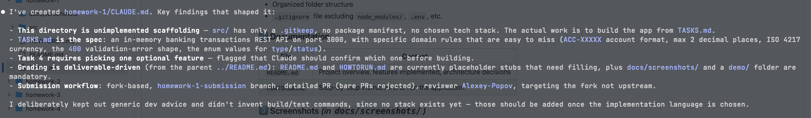
2. **Analyse `TASKS.md` for logical contradictions** — 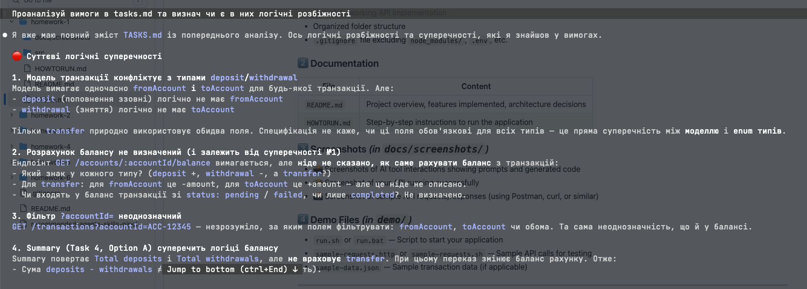
3. **Ask to fix assumptions + design architecture/plan** — 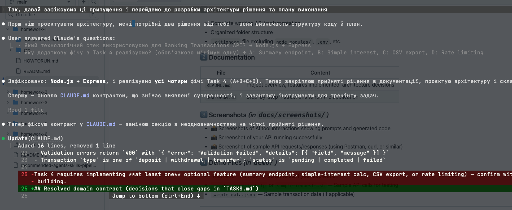
4. **Binding decisions locked in** — 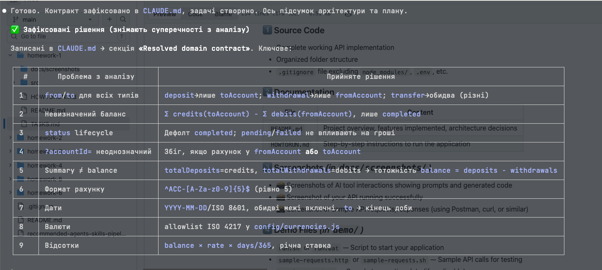
5. **Resulting architecture & execution plan** — 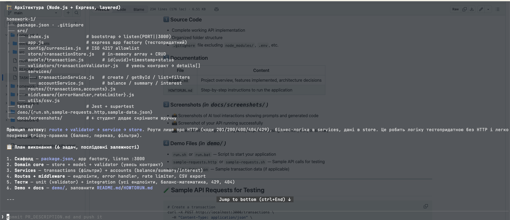
6. **Implementation** — 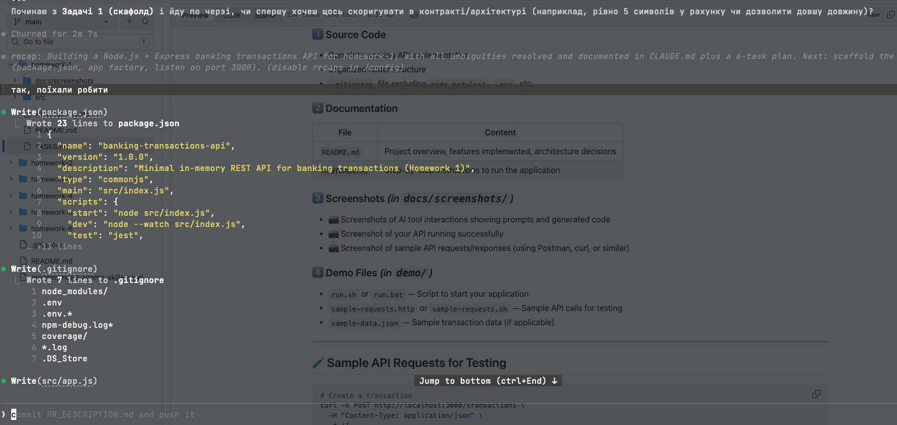
7. **Fixing the demo `.http` requests** — 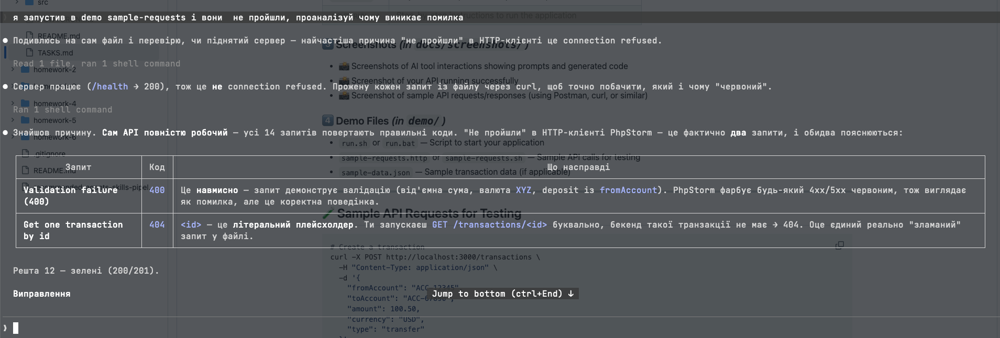
8. **Preparing the PR & organizing screenshots** — 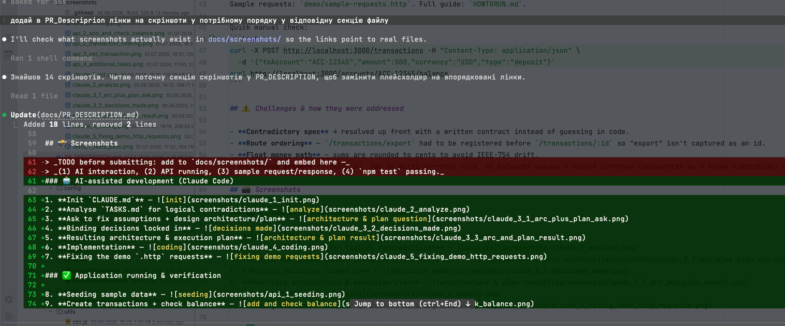

### ✅ Application running & verification

9. **Seeding sample data** — 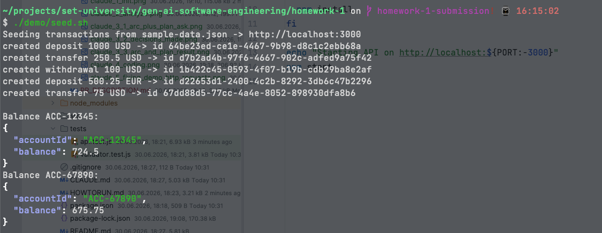
10. **Create transactions + check balance** — 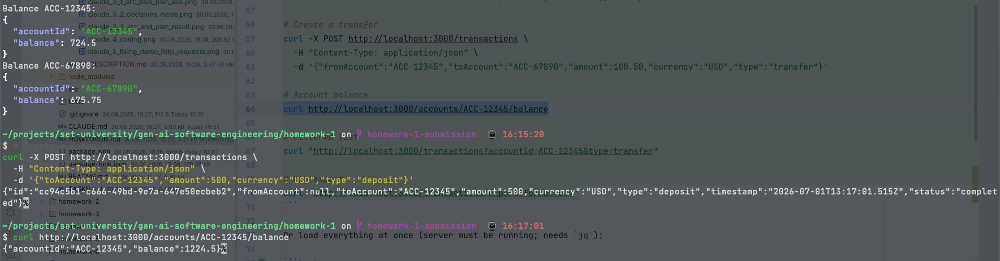
11. **Transaction filtering** — 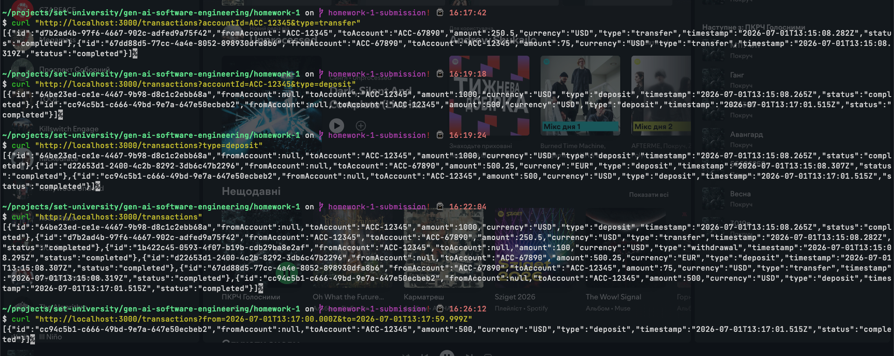
12. **Get transaction by id** — 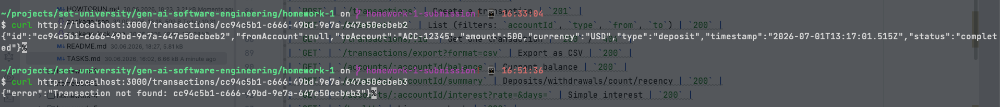
13. **Task 4 additional features (summary / interest / export / rate limiting)** — 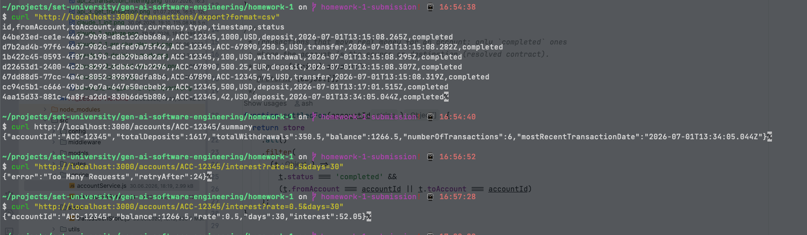
14. **`npm test` — all 42 tests passing** — 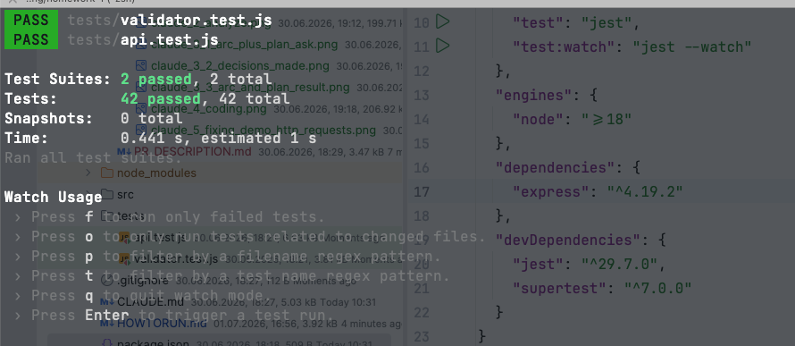

## Test results

```
Test Suites: 2 passed, 2 total
Tests:       42 passed, 42 total
```
