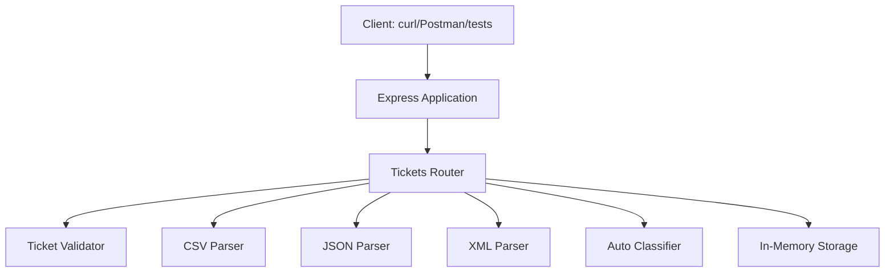
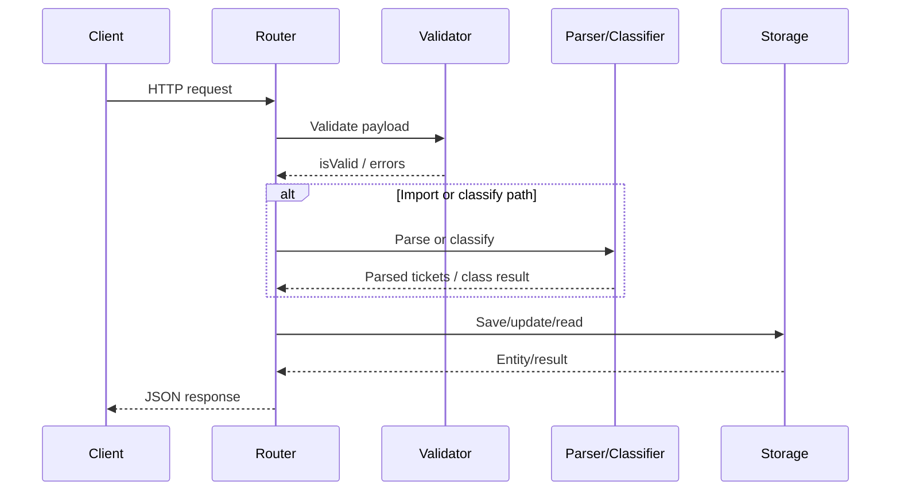

# Architecture Guide

## High-Level Architecture

## Components

- `src/index.js`: app bootstrap, middleware, route registration, error handling
- `src/routes/tickets.js`: endpoint handlers and orchestration
- `src/validators/ticketValidator.js`: schema-based validation and enum checks
- `src/parsers/*.js`: CSV/JSON/XML parsing and normalization
- `src/classification/autoClassifier.js`: rule-based keyword classification
- `src/storage/inMemoryStorage.js`: singleton-style in-memory store
- `src/models/ticket.js`: ticket defaults and shape normalization

## Request Flow

## Design Decisions and Trade-offs

- Rule-based classifier over external AI inference:
  - Pros: deterministic, fast, easy to test
  - Cons: lower semantic flexibility than ML/NLP models
- In-memory storage over database:
  - Pros: simple setup, fast iteration for homework scope
  - Cons: no persistence between restarts
- Schema-based validation:
  - Pros: centralized rules, predictable errors
  - Cons: more manual upkeep when model evolves

## Security and Performance Considerations

- Input validation for all key fields and enums
- Controlled payload parsing for import endpoint
- Consistent error responses without stack traces in API response body
- Fast local operations due to in-memory store and synchronous filter paths
