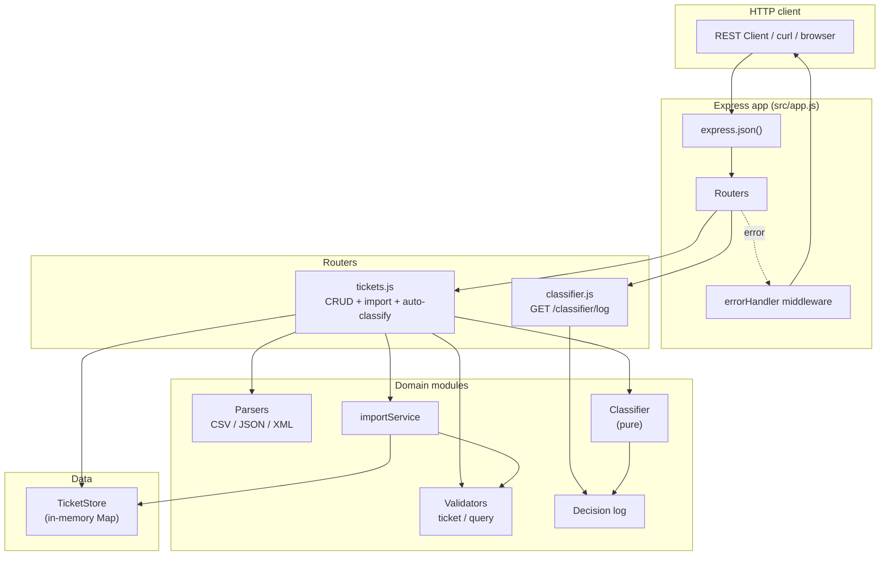
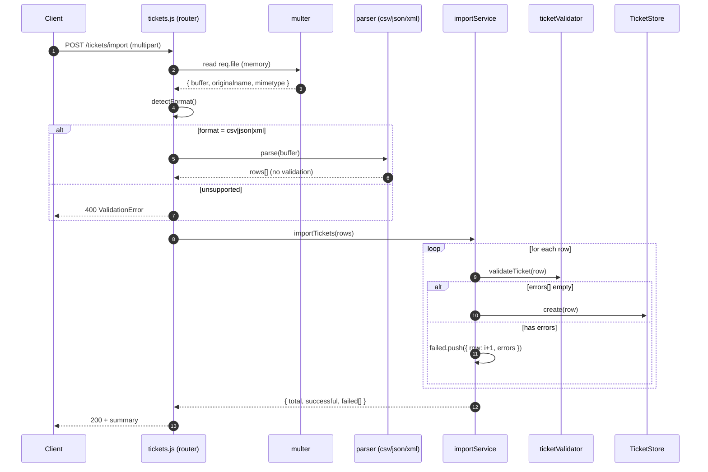
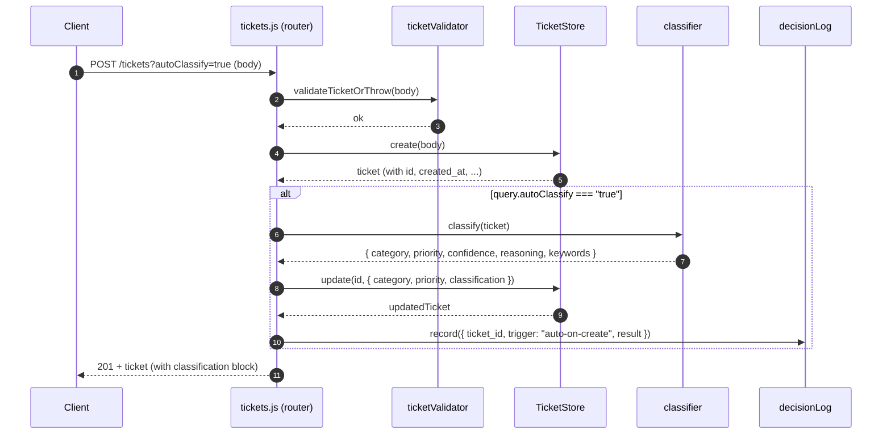

# 🏛️ Architecture — Intelligent Customer Support Ticket System

> Audience: technical leads / reviewers who need to understand *why* the system is shaped the way it is, not just *what* the endpoints are.

---

## 1. High-Level Architecture

The architecture follows a **thin-router / thick-service** pattern: routes do dispatch, validation, and shape the HTTP response; everything domain-specific (parsing, classification, validation rules) lives in pure modules that are unit-testable without an HTTP layer.

---

## 2. Component Breakdown

### 2.1 Routes (`src/routes/`)

| File | Owns | Notes |
|---|---|---|
| `tickets.js` | All `/tickets/*` endpoints — CRUD, `/import`, `/:id/auto-classify` | Registers `/import` **before** the `/:id/...` patterns to avoid collisions. |
| `classifier.js` | `GET /classifier/log` | Read-only window into the in-memory ring buffer. |

Routes are deliberately thin: validate → call domain → shape response. They never inline business logic.

### 2.2 Validators (`src/validators/`)

| File | Function | Strategy |
|---|---|---|
| `ticketValidator.js` | `validateTicket` (full) + `validateTicketPartial` (PUT) | **Collects all errors** before throwing — no fail-fast. Caller decides between the strict and partial variants. |
| `queryValidator.js` | `validateQueryFilters` | Returns a *sanitized* criteria object (with `Date` instances for `from`/`to`). |

Throwing-versions (`*OrThrow`) are wrappers around the pure variants — keeping the pure variant available for direct unit testing.

### 2.3 Parsers (`src/parsers/`)

Three independent pure functions, one per format. Each:
- accepts `Buffer` or `string`
- throws on parse failure with a `Malformed ${FORMAT}: ...` message
- maps to the same shape (an array of ticket payloads)
- never validates business rules — that's the importService's job

### 2.4 Services (`src/services/`)

`importService.importTickets(parsedRows)` walks an array of ticket payloads, validates each, persists the valid ones, and accumulates a partial-success summary (`total`, `successful`, `failed[{row, errors}]`).

### 2.5 Classifier (`src/classifier/`)

| File | Owns |
|---|---|
| `keywords.js` | Static maps for 6 categories + 4 priorities. Priority words come **verbatim from the spec**. |
| `classify.js` | Pure function `classify(ticket) → { category, priority, confidence, reasoning, keywords }`. |
| `decisionLog.js` | 1000-entry ring buffer; writes via `record(entry)`, reads via `getAll()`. |

The classifier is intentionally rule-based, not ML. Reasons: deterministic, debuggable, no model artefacts, readable reasoning string for graders.

### 2.6 Store (`src/store/`)

`ticketStore.js` exports a singleton wrapping a `Map<id, ticket>`. Provides:
- CRUD primitives (`create`, `getAll`, `getById`, `update`, `delete`)
- `filter(criteria)` — equality match for scalars, range match for `from`/`to` against `created_at`
- `clear()` for tests

Server-generated fields (`id`, `created_at`, `updated_at`, `resolved_at`) are stamped here, not in routes — the model owns its lifecycle.

### 2.7 Middleware (`src/middleware/`)

`errorHandler.js` is the single point that maps domain errors to HTTP statuses:

| Error class | Status |
|---|---|
| `NotFoundError` | `404` |
| `ValidationError` | `400 + details[]` |
| anything else | `500` (logged to stderr) |

400/404 are **not** logged — they're expected outcomes of bad input, not server faults.

---

## 3. Sequence Diagrams

### 3.1 Bulk import + per-row validation

### 3.2 Auto-classify on creation

---

## 4. Design Decisions & Trade-offs

| Decision | Trade-off accepted | Why it's the right call here |
|---|---|---|
| **Rule-based classifier instead of ML** | Less "smart" on novel phrasing | Deterministic + auditable + zero infra; perfect fit for graded homework where reasoning matters. |
| **In-memory store, no DB** | All data lost on restart | Spec says in-memory; keeps the surface tiny so tests don't need fixtures setup. |
| **Module-level singleton store** | Tests must call `clear()` between cases | Acceptable — every test file does so in `beforeEach`. Avoids dep-injection ceremony for a 5-task project. |
| **Throwing validators (instead of returning errors)** | Routes need try/catch | Centralises HTTP mapping in one middleware; routes stay one-screen tall. |
| **Single `/tickets/import` endpoint with format dispatch** | One handler does three things | One URL is easier to document and curl; format branch is 3 lines per format. |
| **Stage-based incremental build** | Slower than a "write it all at once" generation | Each stage was verified before the next; the model-contract spec at Stage 11 caught a real defect (caller-supplied id leaking through). |
| **Classifier output stored on the ticket itself** | Slight schema bloat (`classification` block) | Clients can render the reasoning without a second round-trip. |
| **Decision log capped at 1000** | Older entries lost on overflow | Bounded memory; serves grader visibility, not production observability. |
| **Bootstrap (`src/index.js`) excluded from coverage** | One file at 0% | It's a 7-line `app.listen` — measuring its coverage tells us nothing. |

---

## 5. Security Considerations

- **Input validation everywhere user data enters.** Both POST body (`validateTicketOrThrow`) and query string (`validateQueryFilters`) reject anything outside the documented shape.
- **`details[]` returns **error messages**, never the raw input** — no opportunity to reflect-XSS into the response shape.
- **Multipart upload cap of 5 MB.** Defends against accidental upload of huge files that would OOM the in-memory parser.
- **No SQL/NoSQL.** Map storage is immune to injection. If the store later moves to a real DB, the validator boundary is already in place.
- **No authentication.** Out of scope for this homework — would be a clear next step (e.g. JWT middleware in front of the routers). Routers are factored so adding auth would be one `app.use(...)` line above `app.use('/tickets', ...)`.

---

## 6. Performance Considerations

| Operation | Complexity | Measured (locally) |
|---|---|---|
| Create / get-by-id | O(1) — Map operations | < 1 ms |
| List with filter | O(n) — single pass over the Map | <100 ms over 1000 tickets ([Stage 13 perf](./tests/performance/test_performance.spec.js)) |
| Bulk import 50 rows (CSV) | O(n) parse + O(n) validate + O(n) insert | < 1 s end-to-end |
| Single-ticket classify | O(k) where k = number of keywords | < 50 ms (averaged over 100 calls) |
| 25 concurrent POSTs | Express sync handlers, no I/O | < 2 s for the whole batch |

These are upper bounds chosen so CI doesn't flake. Local runs come in **far** under each one. The benchmarks are checked in (`tests/performance/test_performance.spec.js`); a regression that doubles any of them will fail the suite.

### Where it would get slow

- The store's `filter()` is O(n) — fine for thousands, would need indexing for millions.
- Bulk import is single-threaded — for >10 k rows we'd want streaming + `csv-parse` async API.
- Classifier scan is O(k × tokens). Both are tiny constants, but a ML upgrade would change the picture.

None of these matter for the homework scope; flagging them so a future reader knows the boundaries.

---

— *Drafted by Claude Opus 4.7 (claude-opus-4-7), reviewed and edited by Anastasia Kopiika.*

