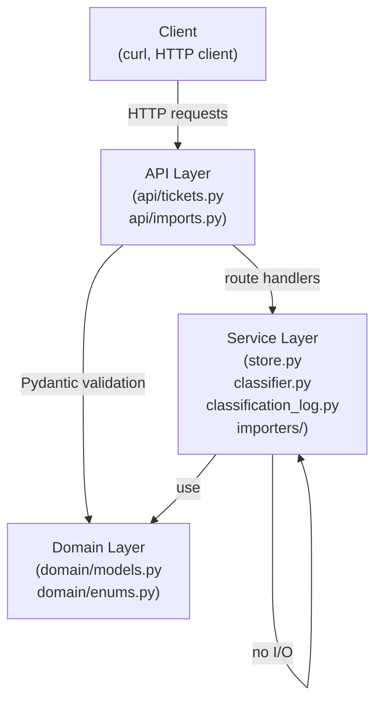
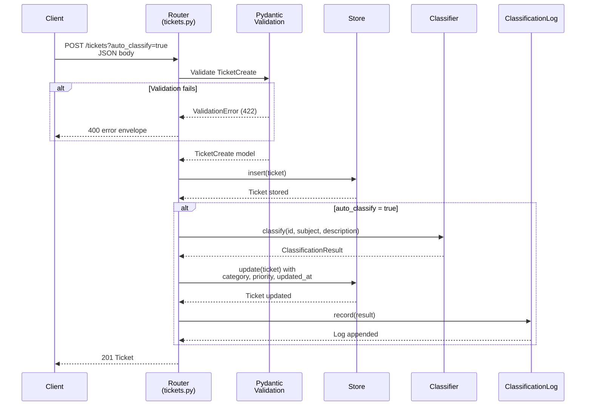
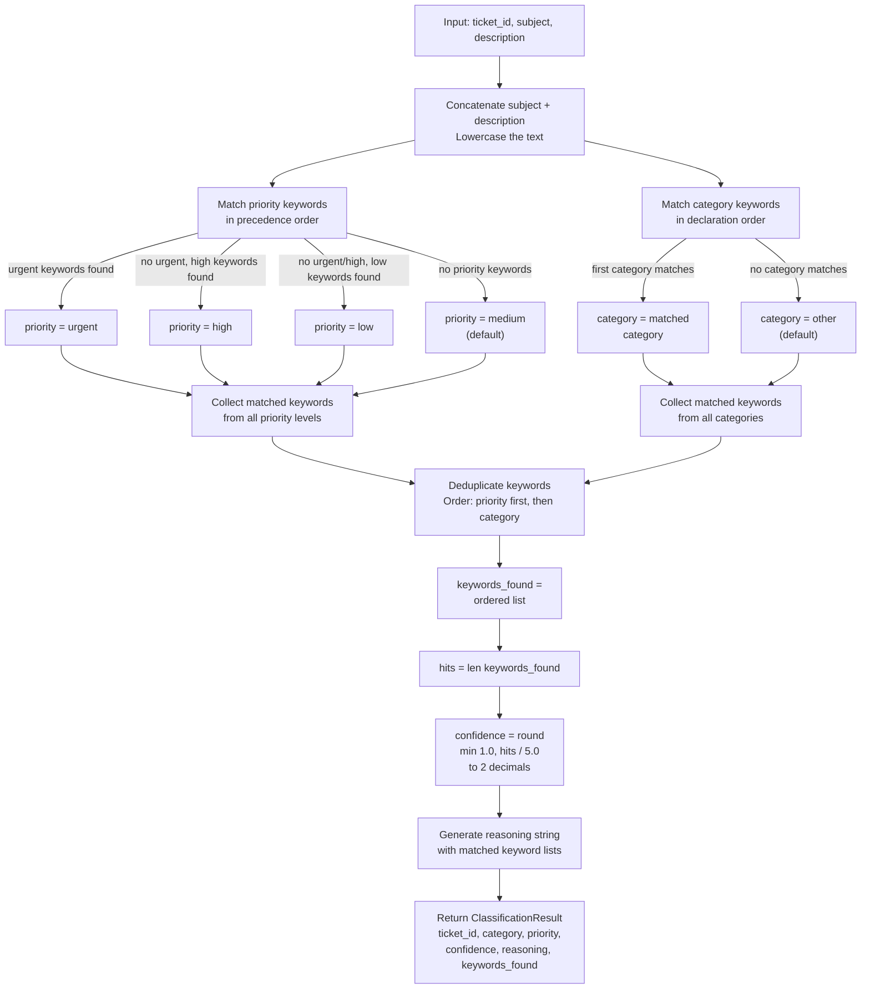

# Homework 2 Architecture — Support Tickets API

**Last Updated:** 2026-05-03

This document provides a technical overview of the Intelligent Customer Support System architecture for engineering leads and contributors. It covers the layered design, component responsibilities, request lifecycle, and key design decisions.

## System Overview

The Support Tickets API is a FastAPI-based REST service that manages customer support tickets with multi-format import (CSV/JSON/XML), automatic keyword-based classification, and full CRUD operations. The system uses a pure in-memory store for simplicity and test isolation, with a rule-based classifier that assigns category and priority to tickets without external API calls.

---

## Module Architecture

---

## Component Descriptions

### API Layer (`api/tickets.py`, `api/imports.py`)

**Responsibility:** HTTP endpoint routing, request validation, response serialization, and dependency injection wiring.

The API layer exposes all public routes:
- **Ticket CRUD:** POST (create), GET (list/single), PUT (update), DELETE
- **Auto-classification:** POST `/tickets/{id}/auto-classify`, GET `/tickets/{id}/classifications`
- **Bulk import:** POST `/tickets/import`

Each route accepts Pydantic models (TicketCreate, TicketUpdate) which are validated by the framework. FastAPI's native 422 Validation Error responses are intercepted and converted to 400 with a standard error envelope (details array containing field-level errors). Dependency injection (`Depends()`) wires in the singleton store and classification log.

The auto-classify flag (`?auto_classify=true` on POST /tickets) triggers classification after insertion and overwrites the ticket's category and priority. All invalid query parameter values (e.g., `?auto_classify=banana`) are caught by FastAPI's query validation and returned as 400 with `field: "auto_classify"` before the ticket is created.

### Domain Layer (`domain/models.py`, `domain/enums.py`)

**Responsibility:** Data contracts and validation rules for all domain entities.

Pydantic v2 models define the shape and constraints of all data:
- **Ticket models:** `TicketCreate` (request), `TicketUpdate` (request), `Ticket` (in-memory and response)
- **Metadata:** `TicketMetadata` for source/browser/device_type sub-object
- **Classification:** `ClassificationResult` for audit log entries
- **Import:** `ImportSummary` and `ImportError` for bulk operations

String enums (Status, Category, Priority, Source, DeviceType) use Pydantic's `str` mixin for automatic JSON serialization and FastAPI query parameter validation. All write models use `extra="forbid"` to reject unknown fields. Timestamps are always ISO 8601 UTC; `resolved_at` is `null` unless the ticket is in `resolved` status.

**No I/O is performed in the domain layer.** Validation is purely structural (field type, length, enum membership); there are no database queries, file reads, or external API calls.

### Store Service (`services/store.py`)

**Responsibility:** Persistent storage abstraction and ticket lifecycle management.

`InMemoryTicketStore` is a singleton (one instance per app lifetime in production; replaced with a fresh instance per test via dependency_overrides). It provides:
- **insert(ticket):** Add a new ticket; fails if ID already exists
- **get(ticket_id):** Fetch a single ticket by ID; returns `None` if not found
- **update(ticket):** Overwrite an existing ticket; fails if ticket does not exist
- **delete(ticket_id):** Remove a ticket by ID; returns `True` if deleted, `False` if not found
- **filter(category, priority, status):** List tickets matching all supplied filters (AND semantics); returns empty list if no matches

All data is stored in memory as a dict keyed by ticket UUID. On application restart, all tickets are lost. This is acceptable for a demo system and simplifies test isolation (no fixtures to clean up databases; just replace the dependency).

### Classifier Service (`services/classifier.py`)

**Responsibility:** Rule-based keyword matching and decision logic for category and priority assignment.

The `classify(ticket_id, subject, description) -> ClassificationResult` function is a pure function with no I/O or side effects:
1. Concatenates `subject + " " + description` and lowercases the combined text.
2. Matches priority keywords against the text in precedence order (urgent > high > low > medium).
3. Matches category keywords in declaration order; the first category with a match wins.
4. Collects all distinct matched keywords (deduped, priority-first order).
5. Calculates confidence as `min(1.0, len(keywords_found) / 5.0)` rounded to 2 decimal places.
6. Generates a human-readable reasoning string listing matched keywords per category.

The keyword tables are hardcoded in the service (see API_REFERENCE.md for the full list). The classifier is deterministic: same input always produces the same output, and it never fails — empty text returns defaults (category=other, priority=medium, confidence=0.0, keywords_found=[]).

### Classification Log (`services/classification_log.py`)

**Responsibility:** Append-only audit log of all classification decisions.

`ClassificationLog` is a singleton that maintains an in-memory list of `ClassificationResult` objects. Callers invoke `log.record(result)` to append a decision. The `entries(ticket_id=None)` method returns all log entries (optionally filtered by ticket_id) in insertion order.

The log persists across requests but is lost on application restart (consistent with the in-memory store). In a production system, this would be backed by a database or event stream. Per-test isolation is achieved by replacing the dependency with a fresh instance.

### Importers (`services/importers/csv.py`, `json.py`, `xml.py`)

**Responsibility:** Parse and validate bulk ticket data from three file formats.

Each importer exports a pure `parse(file_bytes) -> (list[TicketCreate], list[ImportError])` function:
- **CSV:** RFC 4180 compliant; required header row; `tags` semicolon-separated; `metadata_*` flattened to three columns; blank cells treated as omitted
- **JSON:** Top-level array of objects; non-array root or non-object elements become per-row errors
- **XML:** Root `<tickets>`, child `<ticket>` elements with snake_case child elements; parsed via `defusedxml.ElementTree` (secure against XXE)

All three return a tuple: valid tickets (as `TicketCreate` models) and a list of per-row validation errors (field name + message). Row numbers are 1-based (data rows only; CSV header is row 0). The caller constructs the final `ImportSummary` by counting successes, failures, and collating errors.

---

## Request Lifecycle

### POST /tickets?auto_classify=true

1. Client sends POST with `TicketCreate` JSON and optional `?auto_classify=true` query parameter.
2. FastAPI validates the JSON against `TicketCreate` (which rejects unknown fields via `extra="forbid"`). Invalid query parameters are caught here.
3. If validation fails, a 422 is generated; the central error handler converts it to 400 with the standard error envelope.
4. Router creates a new `Ticket` with auto-generated UUID and current UTC timestamp.
5. Router inserts the ticket into the store.
6. If `auto_classify=true`:
   - Router invokes the classifier with the ticket ID, subject, and description.
   - Classifier returns a `ClassificationResult` with assigned category, priority, confidence, reasoning, and matched keywords.
   - Router updates the ticket's category, priority, and updated_at fields.
   - Router updates the ticket in the store.
   - Router records the classification result in the log.
7. Router returns 201 with the updated ticket (or original if auto_classify was false).

### POST /tickets/{ticket_id}/auto-classify

1. Client sends POST with a valid UUID path parameter.
2. Router fetches the ticket from the store; returns 404 if not found.
3. Router invokes the classifier.
4. Router updates the ticket's category, priority, and updated_at.
5. Router records the classification result.
6. Router returns 200 with the `ClassificationResult` (not the full Ticket).

---

## Classifier Decision Flow

---

## Design Decisions and Trade-offs

### In-Memory Store

**Decision:** Use an in-memory dictionary backed by a Python list; no persistent storage.

**Chosen for:**
- **Simplicity:** No database setup, migration, or schema management
- **Test isolation:** Each test receives a fresh store instance via dependency_overrides; no cleanup fixtures needed
- **Specification compliance:** The spec requires an in-memory demo; persistence is out of scope

**Trade-off:** All data is lost on application restart. For a production system, this would be backed by PostgreSQL, MongoDB, or similar with proper migrations and transaction semantics.

### Rule-Based Classifier vs. LLM

**Decision:** Use static keyword tables and substring matching; no LLM/ML API calls.

**Chosen for:**
- **Determinism:** Same input always produces identical output; no randomness or model variation
- **Cost:** Zero API calls; no OpenAI/Claude tokens consumed
- **Testability:** Trivial to mock and verify; no network latency or rate limits
- **Speed:** Keyword matching is O(text_length × keyword_count); negligible for typical ticket text (< 5ms per call)

**Trade-off:** Limited semantic understanding. The classifier misses conceptual matches (e.g., "my password reset isn't working" might not match "login" if not phrased exactly) and may produce false positives (e.g., "$500 transaction fee" matches the "500" keyword for technical_issue). This is acceptable for a demo; a production system might use an LLM with caching or fine-tuned embeddings.

### First-Match Category Precedence

**Decision:** Return the first category (in table order) whose keywords appear in the text; don't score all categories.

**Chosen for:**
- **Simplicity:** Single-pass matching; no need to compare scores or ranks
- **Determinism:** Category assignment is unambiguous; no ties or tie-breaking logic
- **Predictability:** The keyword table order is the single source of truth for precedence

**Trade-off:** The category assignment is order-dependent. If the keyword tables are reordered, the results change. This is acceptable because the table order is locked by the spec; any change would be an intentional policy update.

### Confidence as Keyword-Count Proxy

**Decision:** Calculate confidence as `min(1.0, distinct_hits / 5.0)`, where `hits` is the number of unique matched keywords.

**Chosen for:**
- **Simplicity:** Single numeric summary; easy to threshold (e.g., "confidence > 0.8" is high confidence)
- **Interpretability:** More keywords = more evidence for the classification
- **Computation:** No ML model; just count and divide

**Limitation:** Confidence does not reflect semantic relevance. A ticket matching five generic keywords has 1.0 confidence even if those keywords are weakly associated with the category. A production system might weight keywords by their discriminative power or use an ML model to calibrate confidence.

### defusedxml for XML Parsing

**Decision:** Use `defusedxml.ElementTree` instead of the standard library's `xml.etree.ElementTree`.

**Chosen for:**
- **Security:** Prevents XXE (XML External Entity) injection attacks and billion-laughs (quadratic blowup) attacks
- **Drop-in replacement:** Same API as standard ElementTree; no code changes needed
- **Industry standard:** Recommended by OWASP and the Python security community

**No trade-off:** defusedxml is secure by default and has no performance penalty for well-formed XML.

---

## Security Considerations

### XML Parsing

**Threat:** XML External Entity (XXE) injection and billion-laughs denial-of-service attacks.
**Mitigation:** All XML parsing uses `defusedxml.ElementTree`, which disables external entity resolution by default.

### Email Validation

**Validation:** The `customer_email` field uses Pydantic's `EmailStr` type, which validates email format (RFC 5322 subset) on model instantiation.
**Limitation:** Email validation does not verify deliverability; a malformed email will be rejected, but a non-existent address will be accepted. This is by design — the spec requires no network I/O.

### Extra Field Rejection

**Mechanism:** All write models (`TicketCreate`, `TicketUpdate`) use `extra="forbid"` in Pydantic's ConfigDict, which causes validation to fail if the JSON body contains unknown fields.
**Purpose:** Prevents accidental acceptance of misspelled or future-incompatible fields, and stops attackers from injecting arbitrary data.

### File Uploads

**Known limitation:** The `/tickets/import` endpoint has no file size limit. The spec intentionally omits size validation.
**Risk:** A multi-gigabyte file will be read entirely into memory before parsing, potentially causing out-of-memory errors.
**Acceptable for:** Demo and homework submission; production systems should enforce size limits (e.g., 100 MB max) at the nginx/load-balancer level.

---

## Performance Considerations

### Classifier

**Time complexity:** O(text_length × keyword_count) for each call.
- Text length: typical ticket text is 100–2000 characters
- Keyword count: ~30 keywords across all priorities and categories
- Cost: ~3000–60000 character comparisons per call, negligible on modern hardware

**Measured:** < 1 ms per classification on typical input.

### Store Filtering

**Time complexity:** O(n) where n is the number of tickets.
- Each filter (category, priority, status) requires a linear scan.
- AND composition means tickets must match all supplied filters.

**Acceptable for:** In-memory demo with < 10,000 tickets. Production systems use database indices or full-text search.

### Bulk Import

**Processing model:** All rows are parsed and validated in memory before any are inserted.
- CSV/JSON files are read entirely into memory.
- XML is parsed into an ElementTree (also in memory).
- All validation errors are collected before responding.

**Complexity:** O(file_size) for parsing + O(rows × fields) for validation.

**Acceptable for:** CSV files up to ~1 GB (millions of rows) on a machine with 8 GB RAM. Streaming parsers (not implemented) would reduce memory usage but complicate error reporting.

---

## Testing Strategy

The test suite is organized into three categories (see `tests/` directory):

1. **Unit tests** (`tests/unit/`):
   - `test_ticket_model.py`: Pydantic validation (field constraints, type coercion, extra field rejection)
   - `test_import_csv.py`, `test_import_json.py`, `test_import_xml.py`: Format-specific parsing and error handling
   - `test_categorization.py`: Classifier decision logic and edge cases (empty text, multiple matches, keyword deduplication)

2. **Integration tests** (`tests/integration/`):
   - `test_ticket_api.py`: HTTP endpoint contracts (status codes, response shapes, error envelopes)
   - `test_integration.py`: End-to-end workflows (create → classify → update → list)
   - `test_performance.py`: Concurrent requests and bulk operations

3. **Fixtures** (`tests/conftest.py`):
   - `fresh_store`: A new `InMemoryTicketStore` for each test
   - `fresh_log`: A new `ClassificationLog` for each test
   - `client`: TestClient with both dependencies overridden to fresh instances
   - Helper functions for loading sample CSV/JSON/XML files

**Target:** > 85% code coverage by Task 3 completion. All paths exercised, including error cases.

---

## Related Documentation

- **[API_REFERENCE.md](./API_REFERENCE.md):** Complete HTTP contract for all endpoints, request/response schemas, error codes, and cURL examples
- **[README.md](./README.md):** Project overview, feature status, and how AI assisted the implementation
- **[HOWTORUN.md](./HOWTORUN.md):** Setup and execution instructions
- **[docs/task2-design.md](./docs/task2-design.md):** Locked specification for the classifier (source of truth for test-driven development)
