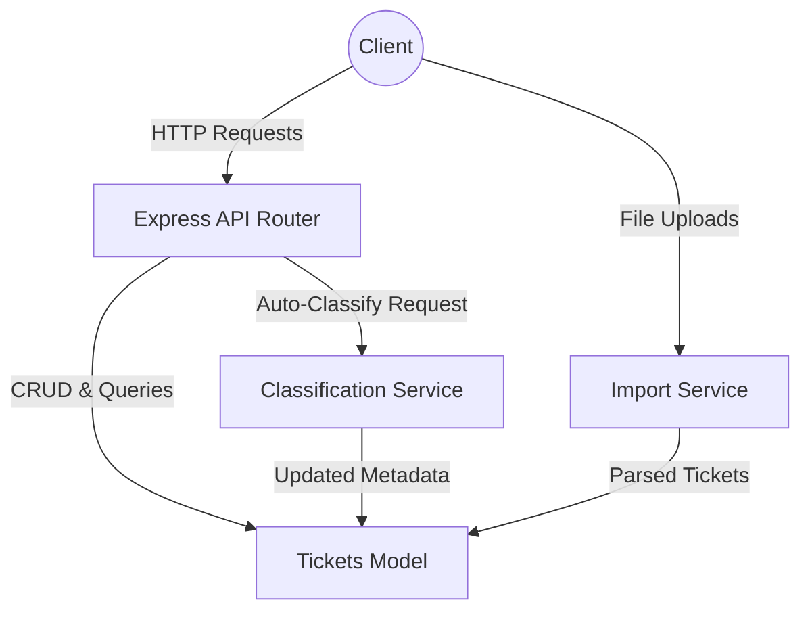

# 🎧 Intelligent Customer Support System

> **Student Name**: Dmitry Upatov
> **Date Submitted**: 2026-04-30
> **AI Tools Used**: Antigravity (Google Deepmind)

## 📋 Project Overview

A comprehensive customer support ticket management system that automates ticket handling, categorizes issues, and assigns priorities. 
This REST API is built with Node.js and Express, implementing the **Context-Model-Prompt** framework to ensure robust data parsing and accurate auto-classification.

Key features:
- **Multi-Format Import API:** Bulk import support tickets from CSV, JSON, and XML files.
- **Auto-Classification:** Automatically determines ticket category and priority based on textual analysis and keyword extraction.
- **Extensive Test Coverage:** Fully automated Jest test suite achieving >98% coverage for API endpoints, data models, integration, and performance workflows.
- **RESTful Endpoints:** Complete CRUD operations for support tickets with advanced filtering.

---

## 🏗 Architecture Overview



## 🚀 Installation and Setup

1. **Clone and navigate to the project directory:**
   ```bash
   cd homework-2
   ```
2. **Install dependencies:**
   ```bash
   npm install
   ```
3. **Run the server locally:**
   ```bash
   node src/server.js
   ```
   The server will start on port `3000` (or `process.env.PORT`).

## 🧪 How to Run Tests

The project includes an extensive test suite using Jest and Supertest.

1. **Run all tests with coverage:**
   ```bash
   npm test
   ```

Current coverage is >98% across all lines, functions, and branches. A screenshot is available in `docs/screenshots/test_coverage.png`.

## 📁 Project Structure

```text
homework-2/
├── docs/                     # Documentation files
├── src/
│   ├── app.js                # Express app setup and middleware
│   ├── server.js             # Server entry point
│   ├── models/
│   │   └── ticket.js         # Ticket validation and in-memory storage
│   ├── services/
│   │   ├── classificationService.js # AI categorization rules
│   │   └── importService.js  # CSV/JSON/XML parsing logic
├── tests/                    # Jest test files
├── generate_samples.js       # Script to generate sample data
├── package.json
└── README.md
```

<div align="center">
*This project was completed as part of the AI-Assisted Development course.*
</div>
