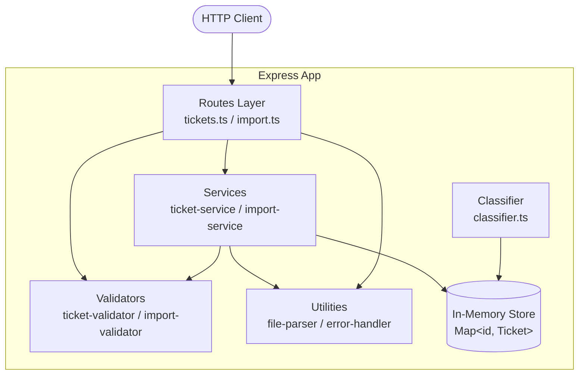

# Customer Support Ticket Management System

> **Generated with**: Claude Haiku 4.5  
> **Audience**: Developers

A Node.js + TypeScript REST API for managing customer support tickets with multi-format bulk import (CSV, JSON, XML), in-memory storage, and keyword-based auto-classification.

---

## Features

- Full CRUD operations for support tickets
- Bulk import from CSV, JSON, and XML files with per-record error recovery
- Auto-classification of tickets by category and priority using keyword matching
- Zod-based schema validation with detailed error messages
- Consistent JSON error responses across all endpoints
- 56-test suite achieving >85% code coverage

---

## Architecture



---

## Project Structure

```
homework-2/
├── src/
│   ├── app.ts                  # Express middleware setup
│   ├── index.ts                # Server entry point (port 3000)
│   ├── config.ts               # Environment variable loader
│   ├── models/ticket.ts        # TypeScript interfaces and enums
│   ├── routes/
│   │   ├── tickets.ts          # CRUD endpoints
│   │   └── import.ts           # Bulk import endpoint
│   ├── services/
│   │   ├── ticket-service.ts   # CRUD + in-memory storage
│   │   ├── import-service.ts   # Bulk import orchestration
│   │   └── classifier.ts       # Keyword-based auto-classification
│   ├── validators/
│   │   ├── ticket-validator.ts # Zod schemas for ticket fields
│   │   └── import-validator.ts # File format validation
│   └── utils/
│       ├── file-parser.ts      # CSV / JSON / XML parsers
│       └── error-handler.ts    # Error mapping and Express middleware
├── tests/
│   ├── test_ticket_api.ts      # API endpoint tests (11)
│   ├── test_ticket_model.ts    # Data validation tests (9)
│   ├── test_import_csv.ts      # CSV import tests (6)
│   ├── test_import_json.ts     # JSON import tests (5)
│   ├── test_import_xml.ts      # XML import tests (5)
│   ├── test_categorization.ts  # Classifier tests (10)
│   ├── test_integration.ts     # End-to-end tests (5)
│   ├── test_performance.ts     # Benchmark tests (5)
│   └── fixtures/               # Sample CSV / JSON / XML data
├── demo/                       # Quick-start scripts and sample data
├── DEVELOPMENT_PLAN.md
├── HOWTORUN.md
├── API_REFERENCE.md
├── ARCHITECTURE.md
└── TESTING_GUIDE.md
```

---

## Installation & Setup

**Prerequisites**: Node.js v18+, npm v9+

```bash
# 1. Navigate to the project directory
cd homework-2

# 2. Install dependencies
npm install

# 3. Copy environment template
cp .env.example .env

# 4. Start the development server (hot-reload)
npm run dev
```

The server starts at `http://localhost:3000`.

---

## How to Run Tests

```bash
# Run all 56 tests
npm test

# Watch mode (re-runs on file save)
npm run test:watch

# Coverage report (target >85%)
npm run test:coverage
```

Coverage report is written to `coverage/lcov-report/index.html`.

---

## Quick API Reference

| Method | Endpoint           | Description              |
|--------|--------------------|--------------------------|
| POST   | /tickets           | Create a single ticket   |
| GET    | /tickets           | List tickets (filterable)|
| GET    | /tickets/:id       | Get ticket by ID         |
| PUT    | /tickets/:id       | Update ticket fields     |
| DELETE | /tickets/:id       | Delete a ticket          |
| POST   | /tickets/import    | Bulk import CSV/JSON/XML |

See [API_REFERENCE.md](./API_REFERENCE.md) for full request/response examples.

---

## Environment Variables

| Variable   | Default       | Description              |
|------------|---------------|--------------------------|
| PORT       | 3000          | HTTP server port         |
| NODE_ENV   | development   | Runtime environment      |
| LOG_LEVEL  | debug         | Logging verbosity        |

---

## Related Documentation

| File                                       | Audience        |
|--------------------------------------------|-----------------|
| [API_REFERENCE.md](./API_REFERENCE.md)     | API consumers   |
| [ARCHITECTURE.md](./ARCHITECTURE.md)       | Technical leads |
| [TESTING_GUIDE.md](./TESTING_GUIDE.md)     | QA engineers    |
| [HOWTORUN.md](./HOWTORUN.md)               | All users       |
