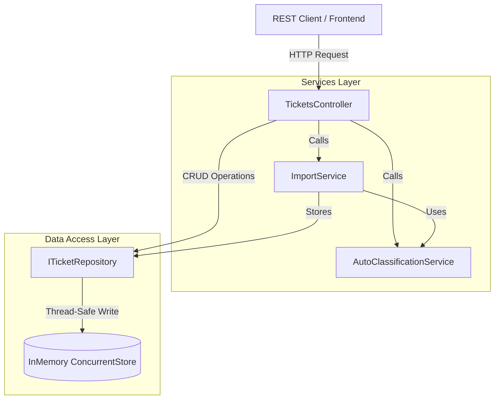

# 🎧 Homework 2: Intelligent Customer Support System

> **Student Name**: Dmytro Samartsov
> **Date Submitted**: 2026-06-12
> **AI Tools Used**: Gemini 3.5 Flash, Antigravity

---

## 📋 Project Overview

This project implements an intelligent customer support ticket management system using **ASP.NET Core / .NET 10**. It supports multi-format bulk imports (CSV, JSON, XML), validates and processes input records with detailed failure logging, and classifies support tickets based on deterministic, case-insensitive keyword rules.

### Key Features
- **Intelligent Classification**: Automatically classifies categories and assigns priorities (e.g. `urgent`, `high`, `medium`, `low`) based on subject and description text keywords.
- **Bulk Imports**: Gracefully parses and processes CSV, JSON, and XML structures, generating a granular parsing and validation summary report.
- **Manual Overrides**: Preserves manual categorization updates and sets classification confidence to `1.0` to indicate human intervention.
- **High Concurrency Safety**: Manages ticket mutations safely under concurrent loads (20+ simultaneous operations) using thread-safe in-memory collections.
- **Robust Coverage**: Exceeds **91% line coverage** across the API codebase.

---

## 🏛️ High-Level Architecture

The system uses a clean decoupled layer separation to split core business logic from routing, serialization, and storage.



---

## 📂 Project Structure

```
homework-2/
├── TicketManagementApi.sln          # Solution file
├── src/
│   └── TicketManagementApi/
│       ├── Program.cs               # App entry and Dependency Injection configuration
│       ├── TicketManagementApi.csproj
│       ├── Controllers/
│       │   └── TicketsController.cs # REST Endpoint Routes
│       ├── Models/
│       │   └── Ticket.cs            # Domain Models, Enums, and DTOs
│       ├── Repositories/
│       │   ├── ITicketRepository.cs
│       │   └── InMemoryTicketRepository.cs
│       └── Services/
│           ├── IAutoClassificationService.cs
│           ├── AutoClassificationService.cs
│           ├── IImportService.cs
│           └── ImportService.cs
├── tests/
│   └── TicketManagementApi.Tests/
│       ├── TicketManagementApi.Tests.csproj
│       ├── TicketModelTests.cs      # Data model validation tests
│       ├── ImportCsvTests.cs        # CSV importer edge-cases
│       ├── ImportJsonTests.cs       # JSON malformed parsing tests
│       ├── ImportXmlTests.cs        # XML schema elements validation
│       ├── CategorizationTests.cs   # Urgency/priority decision rules tests
│       ├── TicketApiTests.cs        # REST Endpoint Status codes (CRUD)
│       ├── IntegrationTests.cs      # E2E Lifecycle and Bulk Import integrations
│       ├── PerformanceTests.cs      # Concurrency load and latency checks
│       ├── Helpers/
│       │   └── FixtureGenerator.cs  # Programmatic mock fixture creator
│       └── fixtures/                # Generated CSV, JSON, and XML files
└── docs/
    ├── API_REFERENCE.md             # Schema definitions and cURL examples
    ├── ARCHITECTURE.md              # Decoupled components design and sequence flow
    └── TESTING_GUIDE.md             # Testing hierarchy, benchmarks and manual checklists
```

---

## 🚀 Installation and Setup

### Prerequisites
- **.NET 10 SDK** (Installed SDKs: `dotnet --list-sdks`)

### Build the Solution
Run from the `homework-2` root directory:
```bash
dotnet build
```

### Run the Web API Locally
Start the development server:
```bash
dotnet run --project src/TicketManagementApi/TicketManagementApi.csproj
```
The API is available at `http://localhost:5104` or `https://localhost:7285`.

### Local Manual Testing
You can interact with and test the endpoints directly using the [tickets.http](tickets.http) request collection file in VS Code (using the REST Client extension) or JetBrains Rider.

---

## 🧪 Running Tests

All tests are implemented using **xUnit** and integration tests utilize **Microsoft.AspNetCore.Mvc.Testing**.

Run the complete suite of 73 tests:
```bash
dotnet test
```

Collect code coverage reports using dotnet-coverage:
```bash
dotnet tool install -g dotnet-coverage
dotnet-coverage collect dotnet test
```
The codebase achieves **91.45% line coverage**.
