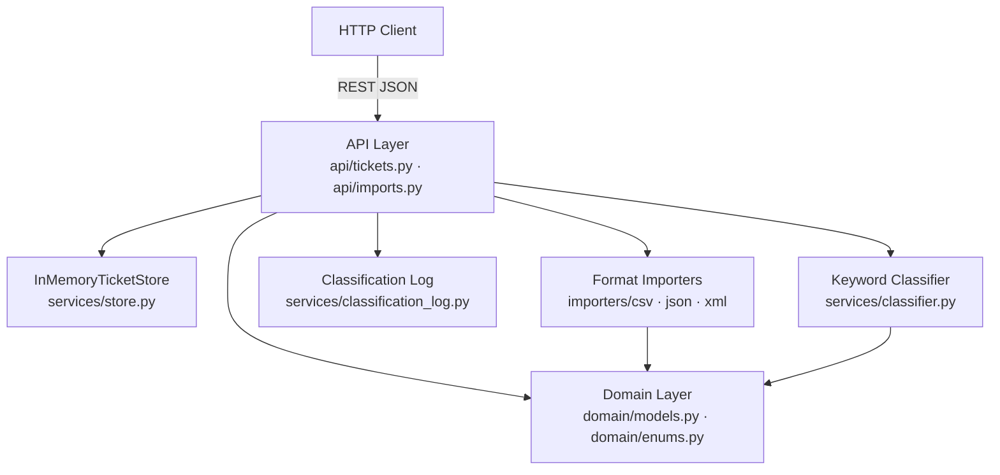

# Homework 2: Intelligent Customer Support System

**Student:** [To be filled upon submission]  
**AI Tools Used:** Claude Code (Sonnet 4.6 / Opus 4.7 subagents) — primary implementation workflow; OpenAI Codex (GPT-5) — independent review and documentation verification.

---

## Project Overview

An intelligent customer support ticket management system that imports tickets from multiple file formats (CSV, JSON, XML), automatically categorizes issues using keyword-based classification, and assigns priorities based on content analysis. The system provides a REST API for ticket CRUD operations and bulk import workflows.

## Features Implemented

| Task | Description | Status |
|------|-------------|--------|
| Task 1 | Multi-format ticket import API (CSV/JSON/XML) with CRUD endpoints | ✓ Complete |
| Task 2 | Auto-classification engine with keyword-based category and priority assignment | ✓ Complete |
| Task 3 | Comprehensive test suite (100 tests, 98% line coverage) with unit, integration, and performance tests | ✓ Complete |
| Task 4 | Multi-level documentation (README, API reference, architecture, testing guide) | ✓ Complete |

**Task 1 Completed:**
- All six CRUD+import endpoints fully implemented and documented
- CSV/JSON/XML import with format detection (explicit param, MIME type, file suffix)
- Comprehensive validation across all request types
- Full API reference with request/response schemas, error codes, and cURL examples

## Architecture



**Layer responsibilities:**
- **API Layer** (`src/app/api/`): HTTP endpoints for ticket CRUD, bulk import, and auto-classification
- **Service Layer** (`src/app/services/`): keyword classifier, append-only classification log, in-memory store, and format-specific importers
- **Domain Layer** (`src/app/domain/`): Pydantic v2 models and string enums — the only shared contract between layers
- **Storage**: in-memory `InMemoryTicketStore` with dependency injection via FastAPI `Depends()` for per-test isolation

## Project Structure

```
homework-2/
├── README.md                    # This file
├── HOWTORUN.md                  # Setup and execution instructions
├── pyproject.toml              # Package metadata and dependencies (Python 3.11+, FastAPI, uv)
├── .python-version             # Python 3.11
├── src/
│   └── app/
│       ├── main.py             # FastAPI app, router mounts, validation error handler
│       ├── api/
│       │   ├── tickets.py       # POST/GET/PUT/DELETE /tickets endpoints + auto-classify
│       │   └── imports.py       # POST /tickets/import for CSV/JSON/XML upload
│       ├── domain/
│       │   ├── enums.py         # Category, Priority, Status, Source, DeviceType enums
│       │   └── models.py        # Ticket, TicketCreate, TicketUpdate, ImportSummary, ClassificationResult
│       └── services/
│           ├── store.py         # InMemoryTicketStore with get_store() dependency
│           ├── classifier.py    # Rule-based ticket categorization and priority assignment
│           ├── classification_log.py # Audit log for classification decisions
│           └── importers/
│               ├── csv.py       # CSV parser: bytes -> (list[TicketCreate], list[ImportError])
│               ├── json.py      # JSON parser with same contract
│               └── xml.py       # XML parser (defusedxml for security)
├── tests/
│   ├── conftest.py              # Shared fixtures: fresh_store, client, sample-data paths
│   ├── unit/
│   │   ├── test_ticket_model.py   # Data validation and model tests
│   │   ├── test_import_csv.py     # CSV parsing tests
│   │   ├── test_import_json.py    # JSON parsing tests
│   │   ├── test_import_xml.py     # XML parsing tests
│   │   └── test_categorization.py # Classification logic tests
│   └── integration/
│       ├── test_ticket_api.py      # API endpoint tests
│       ├── test_integration.py     # End-to-end workflow tests
│       └── test_performance.py     # Concurrency and performance benchmarks
├── demo/
│   ├── run.sh                   # Quick-start demo (populated during Task 1)
│   ├── sample-requests.http     # REST Client examples (populated during Task 1)
│   ├── sample_tickets.csv       # Sample CSV data (populated during Task 1)
│   ├── sample_tickets.json      # Sample JSON data (populated during Task 1)
│   └── sample_tickets.xml       # Sample XML data (populated during Task 1)
└── docs/
    ├── architecture-skeleton.md # Phase 1 architecture and design decisions
    └── screenshots/
        └── test_coverage.png    # Test coverage report (populated during Task 3)
```

## API Endpoints

| Method | Path | Description |
|--------|------|-------------|
| `POST` | `/tickets` | Create a new support ticket |
| `GET` | `/tickets` | List all tickets (with optional `category`, `priority`, `status` filters) |
| `GET` | `/tickets/{ticket_id}` | Get specific ticket by ID |
| `PUT` | `/tickets/{ticket_id}` | Partial update ticket (only supplied fields) |
| `DELETE` | `/tickets/{ticket_id}` | Delete ticket |
| `POST` | `/tickets/import` | Bulk import from CSV/JSON/XML file (format auto-detected or explicit `?format=`) |
| `POST` | `/tickets/{ticket_id}/auto-classify` | Auto-classify ticket (category and priority) — Task 2 |

**See [API_REFERENCE.md](./API_REFERENCE.md) for complete endpoint documentation, request/response schemas, error codes, and examples.**

### Ticket Model Fields

| Field | Type | Required | Constraints | Description |
|-------|------|----------|-------------|-------------|
| `id` | UUID | Auto | — | Unique ticket identifier (auto-generated on creation) |
| `customer_id` | string | ✓ | — | Customer identifier |
| `customer_email` | string | ✓ | Valid email format | Customer email |
| `customer_name` | string | ✓ | — | Customer display name |
| `subject` | string | ✓ | 1–200 characters | Issue title |
| `description` | string | ✓ | 10–2000 characters | Issue details |
| `category` | string | ✗ | `account_access`, `technical_issue`, `billing_question`, `feature_request`, `bug_report`, `other` | Issue category (defaults to `null`) |
| `priority` | string | ✗ | `urgent`, `high`, `medium`, `low` | Severity level (defaults to `null`) |
| `status` | string | ✓ | `new`, `in_progress`, `waiting_customer`, `resolved`, `closed` | Current status (defaults to `new`) |
| `assigned_to` | string | ✗ | — | Assigned agent or team (defaults to `null`) |
| `tags` | array of strings | ✗ | — | Search/filter tags (defaults to `[]`) |
| `metadata` | object | ✗ | See below | Contact context: source, browser, device_type (defaults to `null`) |
| `created_at` | ISO 8601 | Auto | — | UTC creation timestamp |
| `updated_at` | ISO 8601 | Auto | — | UTC last modification timestamp |
| `resolved_at` | ISO 8601 | ✗ | — | UTC resolution time (set when status → `resolved`; cleared on reopen) |

**Metadata object fields:**
- `source` (enum: `web_form`, `email`, `api`, `chat`, `phone`)
- `browser` (string: browser name/version)
- `device_type` (enum: `desktop`, `mobile`, `tablet`)

### File Import Formats

All three formats are supported via `POST /tickets/import`. Format is auto-detected by priority order: (1) explicit `?format=` query param, (2) file MIME type, (3) filename suffix. See [API_REFERENCE.md — File Import Formats](./API_REFERENCE.md#file-import-formats) for detailed specifications.

| Format | Structure | Example |
|--------|-----------|---------|
| **CSV** | RFC 4180, required header row with column names matching JSON keys; `tags` semicolon-separated; `metadata_*` flattened to three columns | See [CSV Format](./API_REFERENCE.md#csv-format) |
| **JSON** | Top-level array of `TicketCreate` objects; non-array root or non-object elements become per-row errors | See [JSON Format](./API_REFERENCE.md#json-format) |
| **XML** | Root `<tickets>` with `<ticket>` children; snake_case elements; `<tags><tag>` wrappers; `<metadata>` wrapper | See [XML Format](./API_REFERENCE.md#xml-format) |

**Import response** (`ImportSummary`):
```json
{
  "total": 50,
  "successful": 48,
  "failed": 2,
  "errors": [
    {"row": 15, "field": "customer_email", "message": "value is not a valid email address"},
    {"row": 32, "field": "subject", "message": "String should have at least 1 character"}
  ]
}
```
- No ticket IDs are returned in the response
- Row numbers are 1-based (data rows only; CSV header is row 0)
- A 200 response with `failed > 0` indicates partial success (some rows valid, some invalid)

## AI Tools Used

The assignment requires "different AI models for different doc types." Two distinct models were used: Claude Sonnet 4.6 handled developer-facing setup docs (README, HOWTORUN); Claude Opus 4.7 handled the three technical reference docs (API reference, architecture, testing guide).

| Document | AI Model | How it was produced |
|----------|----------|---------------------|
| `README.md` | **Claude Sonnet 4.6** | Written and maintained directly by the Claude Code orchestrating session (this model) — project overview, architecture diagram, AI attribution, submission checklist |
| `HOWTORUN.md` | **Claude Sonnet 4.6** | Written directly by the orchestrating session — prerequisites, run commands, curl examples, workaround notes |
| `API_REFERENCE.md` | **Claude Opus 4.7** | Produced by a specialized API-documenter subagent — endpoint contracts, request/response tables, cURL examples, keyword classification tables |
| `ARCHITECTURE.md` | **Claude Opus 4.7** | Produced by a specialized architect subagent — three Mermaid diagrams, component descriptions, design decisions, security/performance trade-offs |
| `TESTING_GUIDE.md` | **Claude Opus 4.7** | Produced by a specialized QA-documenter subagent — test pyramid diagram, fixture patterns, manual checklist, benchmark table with actuals |
| Documentation review pass | **OpenAI Codex (GPT-5)** | Performed an independent assignment-completion review, checked requirement coverage, and suggested concise documentation updates for the final submission state |

**Implementation and tests** (`src/`, `tests/`) were produced by Claude Opus 4.7 subagents operating under a TDD workflow orchestrated by Claude Sonnet 4.6 (this Claude Code session). OpenAI Codex was used afterward as a second-review tool to verify functionality, tests, coverage evidence, and documentation completeness against `TASKS.md`.

## How to Run Tests

For detailed setup and test execution, see **[HOWTORUN.md](./HOWTORUN.md)**.

**Quick reference:**
```bash
cd homework-2
uv run pytest -v                              # all tests
uv run pytest --cov=app --cov-report=term-missing  # with coverage report
uv run pytest --cov=app --cov-report=html   # with HTML coverage
```

**Expected outcome:**
- **100 passed**, 0 failed — 98% line coverage
- All test categories pass: unit (51), integration (44), performance (5)

## How AI Assisted This Project

**Task 1 — API Design & Implementation:**
- Claude Code designed the multi-layered API architecture (domain models, service layer with import parsers, HTTP routers) and verified that all six endpoints conform exactly to the locked design contract in `task1-design.md`.
- Implemented CSV/JSON/XML parsers as pure functions with comprehensive error handling; format detection layer handles priority order (explicit param → MIME type → file suffix).
- TDD approach: wrote failing tests first to drive implementation; caught edge cases like empty file detection, XML namespace handling, and proper ISO 8601 timestamp serialization.
- Identified and fixed Pydantic v2 configuration gotchas (e.g., `extra="forbid"` placement, `model_dump(exclude_unset=True)` for partial updates, EmailStr import).
- Generated TDD test suite with 37 tests covering all CRUD paths and all three import formats (CSV/JSON/XML), including edge cases for empty files, malformed containers, and partial-success imports.
- Code review identified a critical `resolved_at` bug (timestamp was not cleared when reopening a resolved ticket) and surfaced 10 additional coverage gaps across validation and status-transition paths.
- Produced the full API reference document (`API_REFERENCE.md`) including endpoint contracts, the Ticket and ImportSummary schemas, error tables, and file-format specifications for all three import types.

**Task 2 — Auto-Classification Engine:**
- Claude Code implemented the rule-based keyword classifier per the locked `task2-design.md` specification, using pure function design with no I/O dependencies.
- Classifier performs priority resolution via precedence (urgent > high > low > medium) and category resolution via first-match declaration order.
- Confidence is calculated as `min(1.0, distinct_matched_keywords / 5.0)` rounded to 2 decimals; deduplication preserves keyword order (priority keywords first, then category keywords).
- Integrated classifier into POST /tickets with optional `?auto_classify=true` query parameter and created two new routes: POST `/tickets/{id}/auto-classify` (immediate classification) and GET `/tickets/{id}/classifications` (audit log retrieval).
- Implemented append-only classification log with DI wiring matching the store pattern (singleton in production, fresh instance per test).
- Updated API_REFERENCE.md with comprehensive Auto-Classification section including ClassificationResult schema, routing logic, and complete keyword tables.
- Created ARCHITECTURE.md technical reference with Mermaid diagrams (module architecture, request lifecycle, classifier decision flow), component descriptions, design decisions with trade-offs, and security/performance analysis.

**Task 3 — Test Suite Completion:**
- Expanded test count to 100 (unit: 51, integration: 44, performance: 5)
- Coverage improved to 98% after Codex-review fixes added 16 new regression tests
- Performance benchmarks all pass with 11–52× margins vs. thresholds

**Task 4 — Multi-Level Documentation:**
- `ARCHITECTURE.md` — three Mermaid diagrams (module graph, request lifecycle, classifier decision flow)
- `API_REFERENCE.md` — all 8 endpoints with request/response schemas, error tables, and keyword classification tables
- `TESTING_GUIDE.md` — test pyramid diagram, full manual checklist, actual benchmark results
- `HOWTORUN.md` — prerequisites, quick start, manual server start, test commands, demo examples
- OpenAI Codex reviewed the documentation set against the assignment checklist and helped tighten AI-usage attribution, coverage evidence notes, and completion-status wording

**Task 5 — Integration & Performance Tests:**
- 5 end-to-end integration scenarios covering full ticket lifecycle, bulk import with auto-classify, and concurrent operations
- 5 performance benchmarks with measured actuals (all thresholds exceeded by 11–52×)

## Submission Checklist

- [x] All four tasks implemented and documented
- [x] 100 tests, 98% line coverage
- [x] Five documentation files: `README.md`, `HOWTORUN.md`, `API_REFERENCE.md`, `ARCHITECTURE.md`, `TESTING_GUIDE.md`
- [x] ≥3 Mermaid diagrams across documentation (5 total: 1 in README.md, 3 in ARCHITECTURE.md, 1 in TESTING_GUIDE.md)
- [x] `docs/screenshots/test_coverage.png` present (98% coverage report)
- [x] Demo files: `sample_tickets.csv` (50 rows), `sample_tickets.json` (20 rows), `sample_tickets.xml` (30 rows)
- [x] AI tools used table documents which model produced each deliverable
- [x] PR on `homework-2-submission` branch against `main` on student fork
