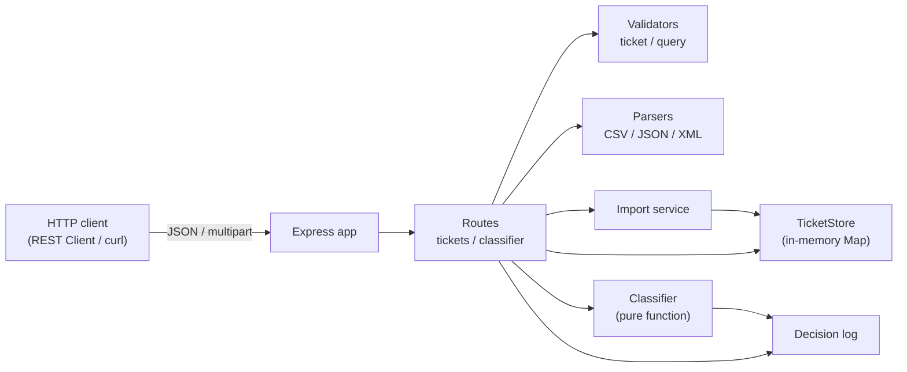
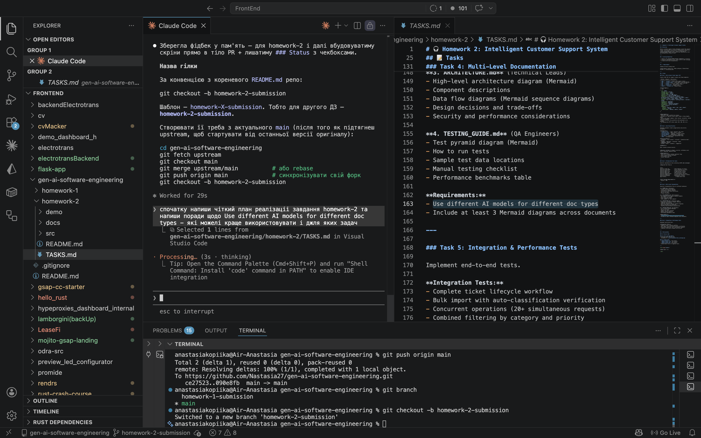
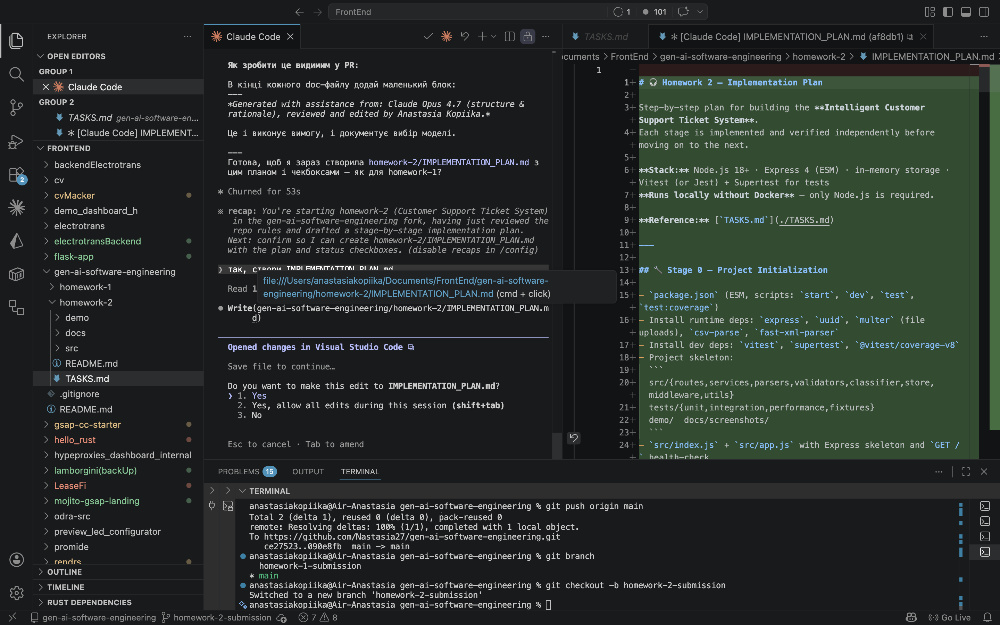
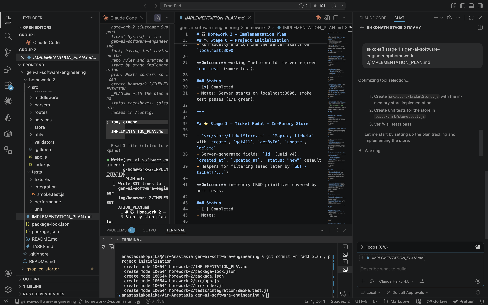
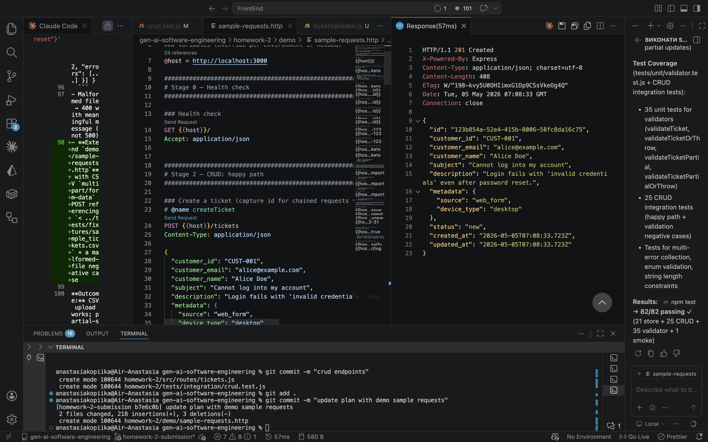
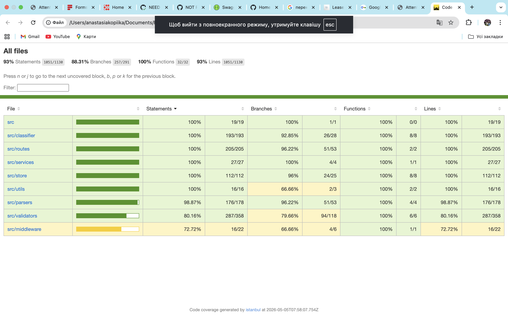

# 🎧 Homework 2: Intelligent Customer Support Ticket System

> **Student:** Anastasia Kopiika
> **Submitted:** 2026-05-05
> **AI tools used:** Claude Opus 4.7 (planning + all documentation), Cursor + Claude Haiku 4.5 (per-stage code scaffolding), GitHub Copilot + Claude Sonnet 4.6 (editorial review of API reference)

A REST API for support-ticket management with multi-format bulk import (CSV/JSON/XML), keyword-based auto-classification, comprehensive tests (≥85% coverage), and multi-level documentation — built end-to-end with AI assistance for the *GenAI & Agentic AI for Software Engineering* course.

---

## 📋 Project Overview

The API supports the full ticket lifecycle (create → classify → assign → resolve → delete), bulk import from three different file formats, deterministic keyword-based classification with confidence scores, and filtering by every meaningful field. All data lives in memory — no database required.

The implementation was built **incrementally, one stage at a time**, against a written plan ([`IMPLEMENTATION_PLAN.md`](./IMPLEMENTATION_PLAN.md)) that was verified at the end of each stage in REST Client (`demo/sample-requests.http`) before moving on.

### High-level architecture



---

## ✅ Features Implemented

All five tasks from [`TASKS.md`](./TASKS.md), including the optional auto-classify-on-create flag.

### Task 1 — Ticket API + Multi-Format Bulk Import

| Method | Endpoint | Description |
|---|---|---|
| `POST` | `/tickets` | Create a ticket (`?autoClassify=true` runs classifier) |
| `GET` | `/tickets` | List with filters (category/priority/status/customer_id/assigned_to/from/to) |
| `GET` | `/tickets/:id` | Get a ticket by id |
| `PUT` | `/tickets/:id` | Partial update (manual override of category/priority preserved) |
| `DELETE` | `/tickets/:id` | Delete a ticket |
| `POST` | `/tickets/import` | Bulk import (CSV / JSON / XML, `multipart/form-data`) |

### Task 2 — Auto-Classification

- Keyword-based classifier — 6 categories + 4 priorities (priority words taken **verbatim from spec**)
- Output: `{ category, priority, confidence, reasoning, keywords }`
- `POST /tickets/:id/auto-classify` — explicit (re-)classification
- `POST /tickets?autoClassify=true` — auto-run on creation
- Decision log (1000-entry ring buffer) at `GET /classifier/log` distinguishes `auto-on-create` vs `manual` triggers

### Task 3 — Tests + Coverage

- **205 tests** across 19 files (110 unit + 95 integration/perf)
- **Coverage:** 93% statements / 88.31% branches / 100% functions / 93% lines (threshold: 85%)
- Vitest + Supertest + `@vitest/coverage-v8`

### Task 4 — Multi-Level Documentation

| Doc | Audience | Content |
|---|---|---|
| `README.md` | Developers | this file — overview, features, architecture, run instructions |
| [`API_REFERENCE.md`](./API_REFERENCE.md) | API consumers | every endpoint, request/response, cURL examples |
| [`ARCHITECTURE.md`](./ARCHITECTURE.md) | Tech leads | components, sequence diagrams, design tradeoffs |
| [`TESTING_GUIDE.md`](./TESTING_GUIDE.md) | QA | test pyramid, fixtures, manual checklist, perf benchmarks |

### Task 5 — Sample Data + Integration/Perf Tests

- **50** valid CSV rows, **20** valid JSON tickets, **30** valid XML tickets
- Invalid fixtures for parser-level and row-level negative tests
- 5 integration narratives + 5 performance benchmarks (lifecycle, bulk+classify, mixed-format batch, 25 concurrent POSTs, etc.)

---

## 🏗️ Architecture Decisions

| Decision | Rationale |
|---|---|
| **Node.js + Express (ESM)** | Same stack as HW1 — minimum context-switch, runs locally without Docker |
| **In-memory `Map` store** | Required by spec; O(1) lookup; module-level singleton |
| **Pure classifier function** | Deterministic, testable, side-effect-free; routes call it then persist |
| **Plain-function validators throwing `ValidationError`** | Centralised error handler maps to HTTP responses; routes stay thin |
| **`multer` memory storage for bulk import** | No filesystem I/O; 5 MB cap defends against accidental huge uploads |
| **Format dispatch by extension/MIME in import** | Single endpoint handles CSV/JSON/XML; clear branch per format |
| **Decision log as in-memory ring buffer (1000)** | Bounded memory; enough for grading visibility without persistence |
| **`POST /:id/auto-classify` separate from PUT** | PUT stays a plain partial update so manual override is preserved |

---

## 📁 Project Structure

```
homework-2/
├── src/
│   ├── index.js                       # bootstrap + app.listen
│   ├── app.js                         # Express app factory (testable)
│   ├── routes/
│   │   ├── tickets.js                 # CRUD + /import + /:id/auto-classify
│   │   └── classifier.js              # GET /classifier/log
│   ├── store/ticketStore.js           # in-memory Map + filter helpers
│   ├── parsers/
│   │   ├── csvParser.js               # csv-parse/sync
│   │   ├── jsonParser.js              # array OR { tickets: [...] }
│   │   └── xmlParser.js               # fast-xml-parser v5 + XMLValidator
│   ├── services/importService.js      # validate + create per row, partial-success summary
│   ├── classifier/
│   │   ├── keywords.js                # 6 categories + 4 priorities
│   │   ├── classify.js                # pure function, returns confidence/reasoning/keywords
│   │   └── decisionLog.js             # 1000-entry ring buffer
│   ├── validators/
│   │   ├── ticketValidator.js         # full + partial; collects all errors
│   │   └── queryValidator.js          # GET /tickets filters + dates
│   ├── middleware/errorHandler.js     # 400/404/500 mapping
│   └── utils/errors.js                # ValidationError, NotFoundError
├── tests/
│   ├── unit/                          # 9 files, 110 tests
│   ├── integration/                   # 9 files, 90 tests
│   ├── performance/                   # 1 file, 5 tests
│   └── fixtures/                      # sample_tickets.{csv,json,xml} + invalid_*
├── demo/
│   ├── sample-requests.http           # 60+ REST Client examples covering every endpoint
│   ├── import-all.sh                  # POSTs all three valid fixtures
│   └── import-sample.{csv,json,xml}   # tiny demo files
├── docs/screenshots/                  # AI prompts + running app + coverage report
├── coverage/                          # generated by `npm run test:coverage` (gitignored)
├── vitest.config.js                   # threshold: lines/functions/branches/statements ≥ 85
├── IMPLEMENTATION_PLAN.md             # 17 stages with status checkboxes
├── HOWTORUN.md                        # detailed run instructions
└── README.md                          # this file
```

---

## ▶️ Quick Start

```bash
cd homework-2
npm install
npm start          # http://localhost:3000
```

Then:

```bash
./demo/import-all.sh              # POST all 100 sample tickets (CSV+JSON+XML)
curl 'http://localhost:3000/tickets?category=technical_issue&priority=high'
```

Or open `demo/sample-requests.http` in VS Code (with the **REST Client** extension) and click *Send Request* on any block. See [`HOWTORUN.md`](./HOWTORUN.md) for the full guide.

### Running tests

```bash
npm test                           # all 205 tests
npm run test:coverage              # with HTML report at coverage/index.html
```

---

## 🤖 AI Usage

Three-model workflow — each model used where it fits best:

1. **Planning + complex implementation + all documentation — Claude Opus 4.7** (this CLI session)
   - Read `TASKS.md` and produced [`IMPLEMENTATION_PLAN.md`](./IMPLEMENTATION_PLAN.md) — 17 stages with status checkboxes
   - Verified each stage end-to-end (tests + curl) before moving on
   - Drafted all four documentation files (README, API_REFERENCE, ARCHITECTURE, TESTING_GUIDE)

2. **Per-stage code scaffolding — Cursor + Claude Haiku 4.5**
   - Used Cursor with Claude Haiku for the deterministic per-stage code generation (CRUD routes, parser implementations, repetitive test cases)
   - Cheaper + faster than Opus for "do exactly what the plan says"

3. **Editorial review of structured reference — GitHub Copilot + Claude Sonnet 4.6**
   - Reviewed `API_REFERENCE.md` for factual accuracy against the codebase, clarity of endpoint examples, and consistency of error-case coverage
   - Caught small drift between the prose and the actual response shape (e.g. clarified that `classification` lives at the ticket root, not nested inside the response envelope)

### Sample prompts that worked well

- *"Проаналізуй задачу `homework-2/TASKS.md` та напиши читкий план реалізації за тим самим патерном що homework-1 — стейджі з чекбоксами, перевірка через REST Client після кожного."*
- *"Перевір виконання Stage 3 — здається є помилки та не все зроблено."* — led me to find and flag two real bugs (errorHandler stderr noise + dead `NotFoundError` class), which I then fixed.
- *"Як підтягнути зміни з upstream після форку?"* — led me to walk through `git remote add upstream`.

### What I verified myself (not blindly copy-pasted)

- Round-trip CRUD via REST Client (every endpoint, both happy and 404 paths).
- Bulk import for all three formats with partial-success summaries.
- Coverage report ≥ 85% on all four metrics (`npm run test:coverage`).
- Auto-classify on a known-classifiable ticket — verified the keyword reasoning matched expectations.

### What was caught while writing tests

The Stage-11 model-contract spec caught a real defect: `ticketStore.create` was accepting caller-supplied `id` through object spread. Fix was a one-line spread reorder; the tests existed only because the plan asked for a focused model-contract file.

---

## 📸 Screenshots

All captures live in [`docs/screenshots/`](./docs/screenshots/).

### 1. Initial prompt — asking Claude to draft the plan


### 2. AI response — structured plan with stages and per-stage AI-model recommendations


### 3. Cursor + Claude Haiku — per-stage code generation from the plan


### 4. REST Client demo — verifying every endpoint manually


### 5. Coverage report (HTML) — 93% statements / 88.31% branches / 100% functions / 93% lines


---

## 📦 Deliverables Checklist

- [x] Source code organised by responsibility (routes / store / parsers / services / classifier / validators / middleware / utils)
- [x] All Task 1–5 features (CRUD, bulk import, auto-classify, tests, sample data)
- [x] **205 tests** across 19 files, **93% coverage**
- [x] Four documentation files with **3+ Mermaid diagrams**
- [x] `README.md`, `HOWTORUN.md`, `IMPLEMENTATION_PLAN.md`
- [x] Sample fixtures: 50 CSV, 20 JSON, 30 XML + invalid files
- [x] `demo/sample-requests.http` (REST Client) + `demo/import-all.sh`
- [x] Screenshots in `docs/screenshots/` (5 captures)
- [ ] PR opened on the personal fork with this folder as the diff

---

<div align="center">

*This project was completed as part of the AI-Assisted Development course.*

— *Drafted by Claude Opus 4.7 (claude-opus-4-7), reviewed and edited by Anastasia Kopiika.*

</div>
