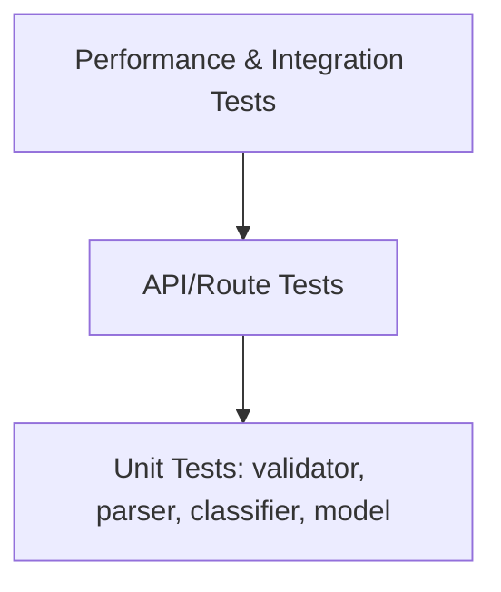

# Testing Guide

## Test Pyramid



## How to Run Tests

```bash
cd homework-2
npm install
npm test
```

## Test Plan

### Setup

- [ ] `cd homework-2`
- [ ] `npm install`

### Start API

- [ ] `npm start`

### Automated Tests

- [ ] `npm test`
- [ ] `npm run test:coverage`

### API Smoke / E2E Script

- [ ] `./demo/test-all-routes.sh`

Coverage:

```bash
npm run test:coverage
```

Run a single suite:

```bash
npm test -- test_ticket_api
```

## Test Data Locations

- `tests/fixtures/`: XML and additional fixture samples
- `demo/sample_tickets.csv`: CSV import sample (50 records)
- `demo/sample_tickets.json`: JSON import sample (20 records)
- `demo/sample_tickets.xml`: XML import sample (30 records)

## Manual Testing Checklist

- Start API and verify `GET /` health endpoint
- Create ticket via `POST /tickets`
- Import file via `POST /tickets/import` for CSV/JSON/XML
- Filter with combined query params on `GET /tickets`
- Run `POST /tickets/:id/auto-classify` and verify confidence output
- Update and delete ticket lifecycle (`PUT`, `DELETE`)
- Validate error handling for malformed payloads/files

## Performance Benchmarks (Target)

| Operation | Dataset | Expected |
|---|---|---|
| CSV import | 50 tickets | < 1s |
| Filter | 100+ tickets | < 100ms |
| Classification | 10 tickets | < 500ms |
| Concurrent API requests | 20+ requests | all successful |
