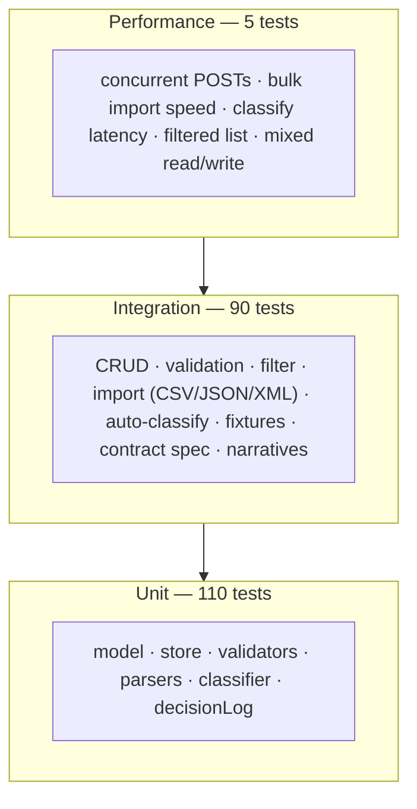

# 🧪 Testing Guide — Intelligent Customer Support Ticket System

> Audience: QA engineers and reviewers running the suite, mapping fixtures, and reading benchmarks.

---

## 1. Test Pyramid



The shape is intentional: **the base is broad** (cheap, fast, deterministic unit tests against pure functions), **the middle is workflows** (Supertest hits the actual Express app — no mocking), **the tip is performance** (smallest set, generous bounds, just regression smoke).

---

## 2. Running the Suite

| Command | What it does |
|---|---|
| `npm test` | Run every test file once and exit (Vitest `run` mode) |
| `npm run test:coverage` | Same as above + V8 coverage report (HTML at `coverage/index.html`) |
| `npx vitest` | Watch mode — re-runs on file change |
| `npx vitest run tests/unit` | Only unit tests |
| `npx vitest run tests/integration` | Only integration tests |
| `npx vitest run tests/performance` | Only performance benchmarks |

**Coverage threshold** (`vitest.config.js`): `lines / functions / branches / statements ≥ 85`. The threshold is enforced — if any metric drops below 85%, `npm run test:coverage` exits non-zero.

---

## 3. Test File Map

### Unit tests (`tests/unit/`)

| File | Tests | Subject |
|---|---|---|
| `test_ticket_model.spec.js` | 9 | Model contract: defaults, UUID v4, ISO 8601 timestamps, immutability of `id` and `created_at`, `resolved_at` lifecycle |
| `store.test.js` | 21 | Map-backed CRUD + filter helpers + clear() |
| `validator.test.js` | 35 | Email regex, length bounds, all five enums, full + partial flavours |
| `queryValidator.test.js` | 9 | Enum filters, date-only/ISO 8601, `from > to`, unknown params silently ignored |
| `csvParser.test.js` | 6 | RFC-4180-ish; `tags` split on `;`; `metadata.*` nested; malformed throws |
| `jsonParser.test.js` | 5 | Both `[...]` and `{ tickets: [...] }` shapes; malformed; unsupported shape |
| `xmlParser.test.js` | 7 | `<tickets><ticket/></tickets>`; nested `<tags>` and `<metadata>`; malformed; wrong root; empty root → `[]` |
| `classify.test.js` | 13 | One per category + per priority + edge cases (empty input, ties) |
| `decisionLog.test.js` | 5 | Insertion order, ring-buffer overflow, getAll returns a copy |

### Integration tests (`tests/integration/`)

| File | Tests | Scope |
|---|---|---|
| `smoke.test.js` | 1 | `GET /` health |
| `crud.test.js` | 25 | All CRUD endpoints + 11 validation cases at the HTTP boundary |
| `filtering.test.js` | 12 | Single + combined + date-range filters; 400 cases |
| `import.test.js` | 16 | CSV + JSON + XML happy/sad paths through the `/import` endpoint |
| `autoClassify.test.js` | 10 | Both auto-classify entry points + manual override + log triggers |
| `classifier.test.js` | 2 | `GET /classifier/log` |
| `fixtures.test.js` | 8 | Imports the actual 50/20/30 fixture files end-to-end |
| `test_ticket_api.spec.js` | 11 | Status-code contract spec (one test per documented response code) |
| `test_integration.spec.js` | 5 | End-to-end narratives: lifecycle, bulk+classify, mixed-format batch, manual override |

### Performance (`tests/performance/`)

`test_performance.spec.js` — 5 benchmarks listed in the next section.

**Total: 205 tests across 19 files.**

---

## 4. Fixtures Map (`tests/fixtures/`)

| File | Rows | Used in |
|---|---|---|
| `sample_tickets.csv` | 50 (all valid) | `fixtures.test.js`, `test_integration.spec.js`, `import-all.sh` |
| `sample_tickets.json` | 20 (all valid) | same as above |
| `sample_tickets.xml` | 30 (all valid) | same as above |
| `invalid_sample.csv` | malformed (broken quotes) | `fixtures.test.js` — 400 path |
| `invalid_sample.json` | malformed (truncated) | `fixtures.test.js` — 400 path |
| `invalid_sample.xml` | malformed (mismatched closing tag) | `fixtures.test.js` — 400 path |
| `invalid_rows.csv` | well-formed, 5 invalid rows + 1 valid | `fixtures.test.js` — partial-success summary |

For tiny manual-testing files used by `demo/sample-requests.http`, see `demo/import-sample.{csv,json,xml}` — they're separate from the test fixtures so the test suite doesn't depend on the demo set.

---

## 5. Manual Testing Checklist

Use this before opening the PR. Server must be running (`npm start`).

### Stage 0–2 — health + CRUD
- [ ] `GET /` → `{ status: "ok" }`
- [ ] `POST /tickets` with valid body → 201 with `id`, `created_at`, `status: "new"`
- [ ] `POST /tickets` with `{}` → 400 with three errors in `details[]`
- [ ] `GET /tickets/<id>` → 200; `GET /tickets/no-such-id` → 404
- [ ] `PUT /tickets/<id>` with `{ status: "resolved" }` → 200, response includes `resolved_at`
- [ ] `DELETE /tickets/<id>` → 204; subsequent `GET` → 404

### Stage 3 — validation
- [ ] `POST /tickets` with bad email + short subject + invalid enum → 400 with **all three** errors in `details[]`
- [ ] `PUT /tickets/<id>` with `{}` → 200 (no-op accepted)
- [ ] `PUT /tickets/<id>` with `{ priority: "super_urgent" }` → 400

### Stage 4–6 — bulk import
- [ ] `POST /tickets/import` with `tests/fixtures/sample_tickets.csv` → `{ total: 50, successful: 50 }`
- [ ] `POST /tickets/import` with `tests/fixtures/sample_tickets.json` → `{ total: 20, successful: 20 }`
- [ ] `POST /tickets/import` with `tests/fixtures/sample_tickets.xml` → `{ total: 30, successful: 30 }`
- [ ] `POST /tickets/import` with `tests/fixtures/invalid_rows.csv` → 200, `successful: 1`, `failed.length: 5`
- [ ] `POST /tickets/import` with `tests/fixtures/invalid_sample.csv` → 400 `Malformed CSV`
- [ ] `POST /tickets/import` without a file → 400 `file is required`

### Stage 7 — filtering
- [ ] `?category=technical_issue` filters correctly
- [ ] `?category=technical_issue&priority=high` AND-combines
- [ ] `?from=2026-01-01&to=2026-12-31` date-range works
- [ ] `?from=2026-12-31&to=2026-01-01` → 400
- [ ] `?category=invalid` → 400 with allowed values listed

### Stage 8–9 — auto-classify
- [ ] `POST /tickets?autoClassify=true` → response contains `classification` block
- [ ] `POST /tickets/<id>/auto-classify` → returns `{ ticket, classification }`; `category` updated on the ticket
- [ ] `PUT /tickets/<id>` with `{ category: ... }` after auto-classify → category overridden, **no** new log entry
- [ ] `POST /tickets/no-such-id/auto-classify` → 404
- [ ] `GET /classifier/log` → array with `at`, `ticket_id`, `trigger` (`"auto-on-create"` or `"manual"`), `result`

### Coverage gate
- [ ] `npm run test:coverage` → exit 0, summary shows all four metrics ≥ 85

---

## 6. Performance Benchmarks

All benchmarks live in `tests/performance/test_performance.spec.js`. Upper bounds are chosen for CI stability — local runs land far under each one.

| # | Scenario | Upper bound | Notes |
|---|---|---|---|
| 1 | 25 concurrent `POST /tickets` (`Promise.all`) | < 2 s for the batch | Stresses the synchronous create path |
| 2 | Bulk import of 50 CSV rows | < 1 s end-to-end | Includes parse + 50× validate + 50× insert |
| 3 | Single-ticket `classify()` (avg over 100 calls) | < 50 ms / call | Pure function, no I/O |
| 4 | Filtered list over 1 000 seeded tickets | < 100 ms | Validates the filter is O(n), not O(n²) |
| 5 | Mixed load: 10 readers + 5 writers in `Promise.all` | all 200/201 | Smoke test of concurrent operation |

Run them in isolation:
```bash
npx vitest run tests/performance
```
The whole performance file finishes in ~300 ms on a 2023 MBP. CI margins above are 6–20× headroom.

---

## 7. Reading the Coverage Report

After `npm run test:coverage`, open `coverage/index.html` to see:
- The **summary bar** (top of page) showing the four metrics — these must all be ≥ 85% for the build to pass.
- A **per-folder/per-file table** — click any row to see the file annotated with green (covered) / red (uncovered) / yellow (partial-branch) gutters.
- The **filter input** to focus on a single file or path.

| Folder | Coverage (current) | What to know |
|---|---|---|
| `src/classifier/` | 100% / 92.85% / 100% / 100% | Two uncovered branches in `classify.js` are the empty-input fallbacks |
| `src/parsers/` | 98.87% / 96.22% / 100% / 98.87% | Single uncovered branch is an internal XML guard |
| `src/routes/` | 100% / 96.22% / 100% / 100% | Single uncovered branch is a defensive `format == null` check the dispatch already covers |
| `src/store/` | 100% / 96% / 100% / 100% | One unused branch in `clear()` |
| `src/middleware/` | 72.72% / 66.66% / 100% / 72.72% | The 500 fallback path (intentionally hard to trigger) |
| `src/validators/` | 80.16% / 79.66% / 100% / 80.16% | `validateTicketPartial` mirrors most of `validateTicket`; tests cover the partial-update concerns directly |
| `src/utils/` | 100% / 66.66% / 100% / 100% | Default-arg branch in `ValidationError` constructor |

The overall numbers (93/88.31/100/93) clear the bar comfortably — the per-folder dips above are localised to fallback paths and are documented here on purpose.

---

<div align="center">

— *Drafted by Claude Opus 4.7 (claude-opus-4-7), reviewed and edited by Anastasia Kopiika.*

</div>
