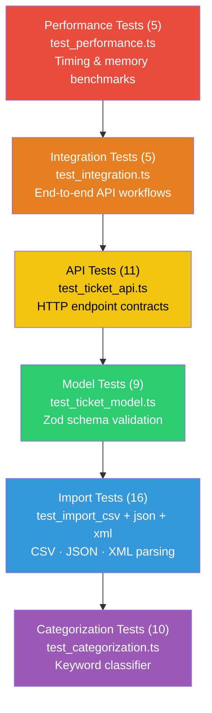

# Testing Guide

> **Generated with**: Claude Sonnet 4.6  
> **Audience**: QA Engineers

---

## Test Pyramid



**Total**: 56 tests across 8 files | **Coverage target**: >85%

---

## Test File Overview

| File                      | Count | What it verifies                                    |
|---------------------------|-------|-----------------------------------------------------|
| `test_ticket_api.ts`      | 11    | HTTP status codes, request/response shapes          |
| `test_ticket_model.ts`    | 9     | Zod field validation, enum rejection, edge cases    |
| `test_import_csv.ts`      | 6     | CSV parsing, error recovery, empty files            |
| `test_import_json.ts`     | 5     | JSON array/object normalization, malformed input    |
| `test_import_xml.ts`      | 5     | XML element parsing, invalid records, empty root    |
| `test_categorization.ts`  | 10    | Keyword matching, default fallbacks, result shape   |
| `test_integration.ts`     | 5     | Full lifecycle, cross-component workflows           |
| `test_performance.ts`     | 5     | Response time and memory thresholds                 |

---

## How to Run Tests

```bash
# Run all 56 tests
npm test

# Run a single test file
npx jest tests/test_ticket_api.ts --verbose

# Run tests matching a name pattern
npx jest --testNamePattern "POST /tickets"

# Watch mode — re-runs on save
npm run test:watch

# Coverage report (writes HTML to coverage/)
npm run test:coverage
```

Open `coverage/lcov-report/index.html` in a browser to browse line-by-line coverage.

---

## Sample Test Data Locations

```
tests/fixtures/
├── valid-tickets.csv      — 10 fully valid tickets (all fields)
├── valid-tickets.json     — 3 fully valid tickets as JSON array
├── valid-tickets.xml      — 3 fully valid tickets as XML document
├── mixed-tickets.csv      — 5 rows: 3 valid + 2 with intentional errors
└── invalid-tickets.csv    — 5 rows all with validation errors
```

### Errors present in `invalid-tickets.csv`

| Row | Error                              |
|-----|------------------------------------|
| 1   | `customer_email`: not a valid email |
| 2   | `customer_name`: empty string       |
| 3   | `description`: too short (< 10 chars) |
| 4   | `priority`: unknown enum value      |
| 5   | `status`: unknown enum value        |

### Errors present in `mixed-tickets.csv`

| Row | Valid? | Error                        |
|-----|--------|------------------------------|
| 1   | yes    | —                            |
| 2   | no     | invalid email                |
| 3   | yes    | —                            |
| 4   | no     | description too short        |
| 5   | yes    | —                            |

---

## Manual Testing Checklist

Use these steps to verify the API manually after starting the server (`npm run dev`).

### Ticket CRUD

- [ ] `POST /tickets` with valid body returns `201` and a UUID in `id`
- [ ] `POST /tickets` with missing `customer_email` returns `400` with `details` array
- [ ] `POST /tickets` with invalid email returns `400` and `details[].field === "customer_email"`
- [ ] `GET /tickets` returns `200` and an array (may be empty)
- [ ] `GET /tickets?status=new` returns only tickets with `status: "new"`
- [ ] `GET /tickets?priority=urgent` returns only tickets with `priority: "urgent"`
- [ ] `GET /tickets/:id` with known ID returns `200` with full ticket
- [ ] `GET /tickets/:id` with unknown ID returns `404`
- [ ] `PUT /tickets/:id` with `{ "status": "in_progress" }` returns `200` with updated field
- [ ] `PUT /tickets/:id` with empty body `{}` returns `400`
- [ ] `DELETE /tickets/:id` returns `204` and subsequent GET returns `404`

### Bulk Import

- [ ] `POST /tickets/import` with `valid-tickets.csv` + `Content-Type: text/csv` returns `{ total: 10, successful: 10, failed: 0 }`
- [ ] `POST /tickets/import` with `valid-tickets.json` + `Content-Type: application/json` returns `{ total: 3, successful: 3 }`
- [ ] `POST /tickets/import` with `valid-tickets.xml` + `Content-Type: text/xml` returns `{ total: 3, successful: 3 }`
- [ ] `POST /tickets/import` with `mixed-tickets.csv` returns `failed > 0` and a non-empty `errors` array
- [ ] `POST /tickets/import` with `invalid-tickets.csv` returns `successful: 0`

---

## Performance Benchmarks

These thresholds are enforced by `test_performance.ts`. A test failure means a regression.

| Scenario                                    | Threshold  |
|---------------------------------------------|------------|
| `POST /tickets` single request              | < 100 ms   |
| `GET /tickets` with 1 000 tickets in store  | < 200 ms   |
| Bulk import of 100-record CSV               | < 2 000 ms |
| 50 concurrent `GET /tickets` requests       | all pass   |
| Heap increase after creating 100 tickets    | < 50 MB    |

Run performance tests in isolation to reduce interference:

```bash
npx jest tests/test_performance.ts --verbose --runInBand
```

`--runInBand` forces sequential execution, which gives more stable timing readings.
