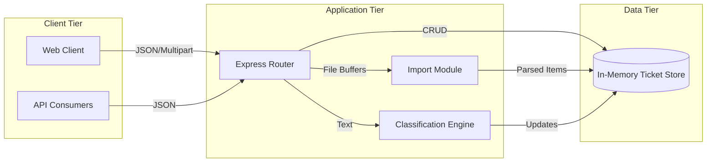
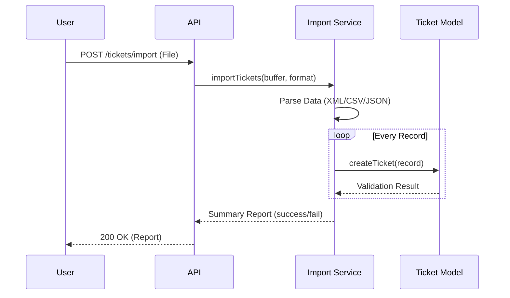

# Architecture Documentation

## High-Level Architecture

## Components Description

1. **Express Router (`app.js`)**: Orchestrates HTTP requests, handles multipart file parsing via `multer`, and serializes responses.
2. **Ticket Model (`models/ticket.js`)**: Encapsulates business logic, data validation, and acts as the data access layer connecting to the runtime array storage.
3. **Import Service (`services/importService.js`)**: Uses highly optimized parsers (`csv-parse/sync`, `fast-xml-parser`) to extract and map semi-structured data into domain models.
4. **Classification Service (`services/classificationService.js`)**: A heuristic-based engine that employs NLP-like regex patterns and keyword aggregation to infer categories and priorities.

## Data Flow: Bulk Import Workflow

## Design Decisions and Trade-Offs

- **In-Memory Storage**: Chose in-memory arrays for development speed and to minimize environment setup. Trade-off: Data loss on restart; unsuitable for production without attaching a DB (like Postgres or Mongo).
- **Synchronous Parsing**: Used synchronous parsing for CSV and XML. Trade-off: Blocks event loop for large files, though extremely performant for the required batch sizes (<1000 rows).
- **Rule-Based Classification**: Adopted a regex-based classification approach to fulfill auto-classification without integrating an external LLM API, ensuring high speed and no external dependency costs.

## Security & Performance

- Input validation strictly enforces schema invariants (e.g. email regex, length constraints) to prevent injection or DoS through massive payloads.
- `multer` uses in-memory buffering. To scale, this should stream directly to a blob storage like AWS S3 to prevent RAM exhaustion.
