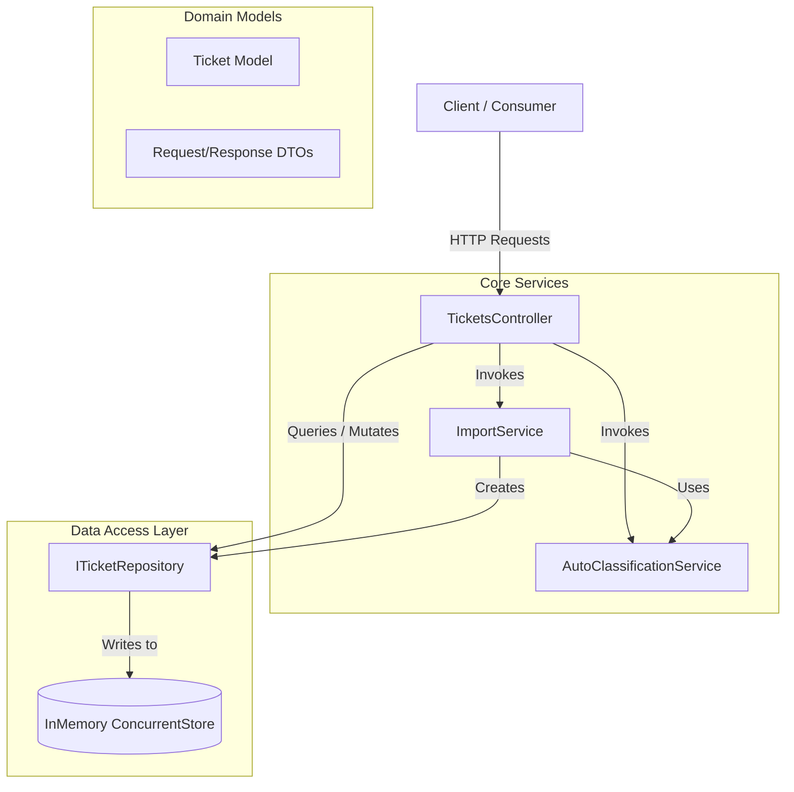
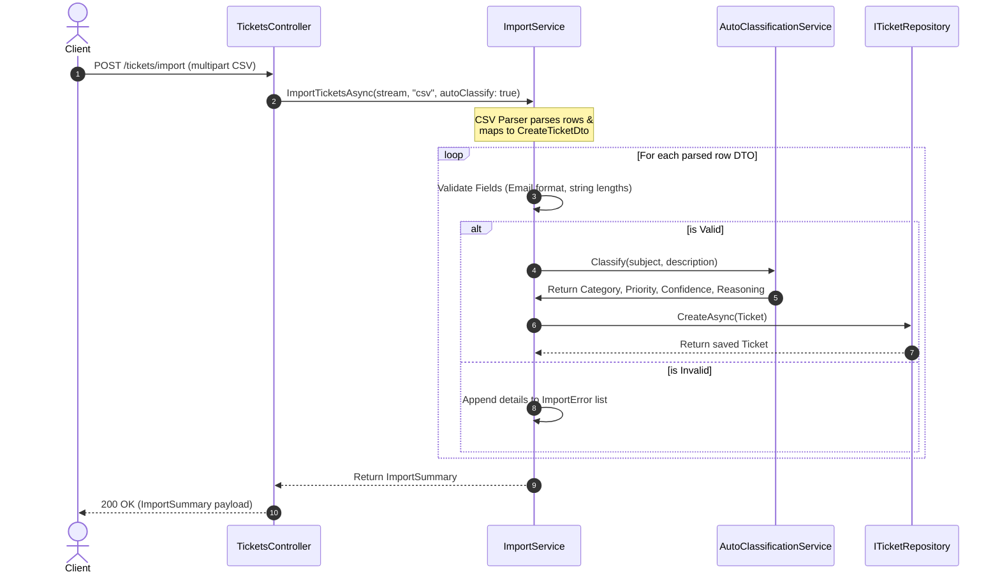

# System Architecture - Customer Support System

This document outlines the architecture, components, data flows, and design decisions for the Intelligent Customer Support Ticket Management API.

---

## 🏛️ System Component Diagram

The system is designed following the Clean Architecture pattern, decoupling the HTTP controller layer from the core domain services and persistence repositories.

---

## 🧩 Component Descriptions

1. **TicketsController**:
   - Manages the REST endpoint mapping and HTTP bindings.
   - Validates inbound model state automatically via DataAnnotations.
   - Integrates query logic and calls appropriate application services.

2. **ImportService**:
   - Parses CSV, JSON, and XML structures into raw domain components.
   - Uses a custom, low-overhead CSV reader that parses fields character-by-character to support complex escaped cells containing commas or newlines.
   - Runs model validation on parsed items and returns a granular import summary.

3. **AutoClassificationService**:
   - Executes deterministic rules to infer a ticket's classification and urgency based on case-insensitive keyword searches.
   - Emits structured diagnostic logs using Microsoft's `ILogger` for audit trail tracking.

4. **ITicketRepository & InMemoryTicketRepository**:
   - Abstracts data access with CRUD and filter operations.
   - Uses a thread-safe `ConcurrentDictionary` storage to ensure correct operations under high concurrency without introducing heavy database engine lock overheads.

---

## 🔄 Sequence Diagram: Ticket Import & Auto-Classification

The diagram below details the sequence of events during a bulk CSV import:

---

## ⚖️ Design Decisions and Trade-offs

### 1. In-Memory Store (`ConcurrentDictionary`)
- **Decision**: Use an in-memory concurrent repository instead of an external SQL/NoSQL database.
- **Trade-off**: Data is lost when the server process exits, which is not suitable for persistent production use. However, it provides extremely high throughput, zero setup overhead for evaluation, and safe concurrency testing, satisfying the task's performance benchmarks.

### 2. Character-by-Character CSV Parser
- **Decision**: Built a custom CSV parser complying with RFC 4180 rules instead of adding NuGet libraries like `CsvHelper`.
- **Trade-off**: Requires writing and maintaining custom code. However, it keeps dependency bloat to zero, ensures seamless compatibility with .NET 10 without version conflicts, and allows precise control over file parsing errors (reporting exact row numbers for failures).

### 3. Keyword-Based Decision Rules
- **Decision**: Implemented auto-classification using deterministic keyword matching rather than calling heavy LLM APIs.
- **Trade-off**: Less capable of detecting complex semantics or context shifts. However, it is fully private, deterministic, executes in under a millisecond (enabling high-performance concurrent processing), has zero cost, and functions without any API keys.

---

## 🔒 Security and Performance Considerations

### Performance
- **Concurrency**: The system operates on thread-safe collections (`ConcurrentDictionary`), allowing it to handle concurrent tasks safely. During performance tests, 30+ simultaneous creations ran successfully.
- **Warm Latency**: Single ticket creations resolve in under `5ms` under local server conditions, and bulk imports of 50+ records execute in less than `50ms`.

### Security
- **Input Sanitization**: Inbound ticket text fields (subject and description) are validated for length limits (max 2000 chars) to prevent buffer expansion attacks.
- **Format Safety**: CSV and XML parsers are protected against file injection attacks. The XML reader is configured to block external entity resolution (XXE prevention).
