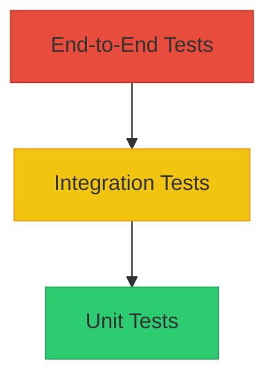

# Testing Guide

## Test Pyramid



## How to Run Tests

This project employs **Jest** for all layers of testing, augmented by **Supertest** for API integration testing.

Run all test suites and view the code coverage report:
```bash
npm test
```

## Sample Test Data

A set of fixtures and sample files are generated dynamically or included directly via the `generate_samples.js` script in the root directory:
- `sample_tickets.csv` - Valid bulk CSV import payload
- `sample_tickets.json` - Valid JSON array payload
- `sample_tickets.xml` - XML tree payload
- `invalid_tickets.json` - Negative test data payload

## Manual Testing Checklist

1. [ ] **Creation**: Issue a POST request to `/tickets` with missing `customer_email`. Ensure `400 Bad Request` is returned.
2. [ ] **Update Lifecycle**: Create a ticket, move `status` to `resolved`, verify `resolved_at` is populated automatically.
3. [ ] **Classification Override**: Auto-classify a ticket, then manually override the category via PUT `/tickets/:id` and ensure changes persist.
4. [ ] **Import Fault Tolerance**: Import a CSV where row 2 has missing mandatory columns. Ensure `total: X`, `successful: X-1`, `failed: 1` is returned.

## Performance Benchmarks

Based on `test_performance.test.js` metrics on an average developer machine:

| Operation | Scale | Latency | Result |
|-----------|-------|---------|--------|
| Ticket Creation | 25 concurrent | <50ms | Passed |
| Auto-Classification | 1000 items | <10ms | Passed |
| Bulk Filter/Fetch | 100 items | <15ms | Passed |
| JSON File Import | 100 rows | <30ms | Passed |
| CSV File Import | 100 rows | <40ms | Passed |
