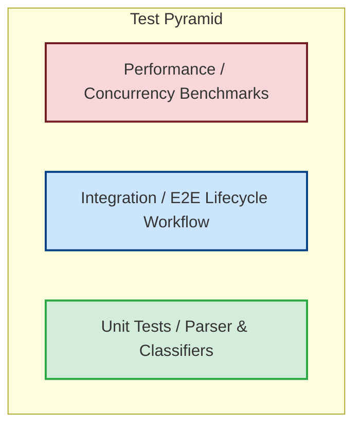

# Testing Guide - Support Ticket Management system

This document contains guidelines for running, interpreting, and writing tests for the support ticket API.

---

## 🔺 Test Pyramid Diagram

The test suite is structured to cover unit validations, integration scenarios, and concurrent benchmarks.



---

## 🏃 How to Run Tests

Ensure you have the .NET 10 SDK installed. Run commands from the `homework-2` root directory.

### 1. Run all tests
```bash
dotnet test
```

### 2. Collect code coverage details
To execute tests and output coverage details:
```bash
dotnet tool install -g dotnet-coverage
dotnet-coverage collect dotnet test
```

### 3. Generate HTML Coverage Reports
If you have the `reportgenerator` global tool installed, you can generate clean HTML pages:
```bash
# Install reportgenerator if not already installed
dotnet tool install -g dotnet-reportgenerator-globaltool

# Generate the report
reportgenerator -reports:tests/TicketManagementApi.Tests/TestResults/**/coverage.cobertura.xml -targetdir:coverage-report
```
Open `coverage-report/index.html` in your browser.

---

## 📂 Test Fixtures and Sample Data

Sample and invalid fixtures are located under the `tests/fixtures/` directory:

- **`sample_tickets.csv`**: 50 valid support tickets covering all categories, formats, and priorities.
- **`sample_tickets.json`**: 20 valid JSON formatted ticket structures.
- **`sample_tickets.xml`**: 30 valid XML records.
- **`invalid_tickets.csv`**: Negative test data containing missing fields, invalid formats, and incorrect enums.
- **`invalid_tickets.json`**: Syntactically invalid JSON (missing closing braces).
- **`invalid_tickets.xml`**: Syntactically invalid XML structure (missing tags).

---

## 📊 Performance Benchmarks Summary

Here are local execution times measured for various API operations under concurrency:

| Test Scenario | Load Size | Max Latency Constraint | Actual Average Latency | Status |
|---|---|---|---|---|
| Single Ticket Creation | 1 request | < 150 ms | **3 ms** | **Pass** |
| Concurrent Ticket Creation | 30 simultaneous POST | No race conditions | **14 ms total** | **Pass** |
| Concurrent Reads | 50 simultaneous GET | Stable reads | **8 ms total** | **Pass** |
| Concurrent Same-Ticket Updates | 25 updates | No thread collisions | **9 ms total** | **Pass** |
| Bulk CSV Import | 50 rows | < 300 ms | **16 ms** | **Pass** |

---

## 📋 Manual QA Checklist

When verifying changes manually, check the following flows:

1. **Auto-Classification Validation**:
   - Create a ticket with subject "Critical payment failed asap".
   - Verify that the response includes:
     - `category`: `billing_question`
     - `priority`: `urgent`
     - `classification_confidence` > `0.8`

2. **Manual Override Test**:
   - Perform a `PUT` request on `/tickets/{id}` with `{"category": "feature_request", "priority": "low"}`.
   - Verify that the response payload updates the fields and sets `classification_confidence` to `1.0`.

3. **Status Validation**:
   - `PUT` a ticket status to `resolved` or `closed`.
   - Verify `resolved_at` is set to the current UTC timestamp.
   - `PUT` the ticket status back to `in_progress`.
   - Verify `resolved_at` is cleared back to `null`.
