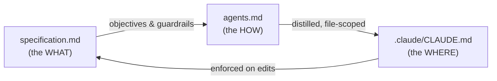

# 💳 Homework 3: Specification-Driven Design — Virtual Card Lifecycle

> **Student Name**: Oleksandr
> **Date Submitted**: 2026-06-04
> **AI Tools Used**: Claude Code (spec authoring, review); project rules live in `.claude/CLAUDE.md`

---

## 📋 Student & Task Summary

This homework is a **specification package** (documentation only — **no code**) for a regulated
FinTech feature: the **Virtual Card Lifecycle** (issue, freeze/unfreeze, set spending limits, view
activity, replace, close). The deliverable is the spec's *quality*: layered intent, traceability
from goals to tasks, and first-class treatment of edge cases, verification, and performance.

### 📂 Deliverables in this folder

| File | Purpose |
|------|---------|
| [`specification.md`](./specification.md) | **Primary artifact** — the layered spec (stakeholders → high/mid objectives → non-functional → implementation notes → context → 22 low-level tasks → edge cases → verification → traceability matrix → performance budgets). |
| [`agents.md`](./agents.md) | AI agent operating manual: stack assumptions, banking/PCI domain rules, code style, testing expectations, security/compliance, edge-case handling, workflow conventions. |
| [`.claude/CLAUDE.md`](./.claude/CLAUDE.md) | Claude Code editor/AI rules: always-on **Core** defaults plus scoped sections for **API & contracts** (`contracts/**`, `src/http/**`) and **Testing & fixtures**. |
| `README.md` | This file — rationale and best-practices map. |

> 🧩 A thin root [`CLAUDE.md`](./CLAUDE.md) re-exports `.claude/CLAUDE.md` via `@import`, so Claude Code
> auto-loads the ruleset from the directory root while the canonical rules stay in `.claude/` (as required).

> ℹ️ `HOWTORUN.md` is **N/A** for this homework — there is nothing executable to run; the artifact is
> the specification itself.

### 🗺️ How the documents relate

---

## 🧭 Rationale — why the spec is written this way

### Layering & traceability
The spec is deliberately **layered** so intent flows top-down and stays checkable bottom-up:
High-Level Objective (§2) → 8 observable Mid-Level Objectives (§3) → Non-Functional targets (§5) →
Implementation guardrails (§6) → Beginning/Ending context (§7) → **22 low-level tasks** (§8), each
tagged `Serves: M#` and ending in **Acceptance Criteria**. The **Requirements Traceability Matrix
(§11)** closes the loop: every objective maps to tasks, verification, a performance budget, and edge
cases — and every task maps back to an objective, so there are **no orphans** in either direction.

To avoid the usual spec problem of repeating boilerplate per endpoint, I factored the repeated
write-path logic into one **Standard Mutation Contract (§6.1)** and reference it from each mutating
task — the same DRY instinct you'd apply in code, applied to the spec.

### How I chose the **performance targets** (§12)
Targets are **labeled "assumed"** with an explicit rationale, not pulled from thin air:
- **State-change p95 < 300 ms** — UX research treats sub-300 ms as "instant"; self-service card
  controls must feel immediate or users distrust them.
- **Freeze → processor decisioning < 2 s (alert > 5 s)** — a freeze is a *fraud-containment* control,
  so I budgeted it tighter than ordinary reads; lag here has a direct money cost.
- **Activity list p95 < 500 ms with cursor pagination capped at 100** — bounds payload/DB cost so the
  budget stays flat as transaction history grows.
- **Read-after-write < 1 s**, **notification < 5 s**, **webhook ≥ 200 events/s**, **99.9% availability**
  — chosen to match customer-facing money-adjacent norms and to be measurable (percentiles/throughput),
  never "should be fast."

### How I chose **verification depth** (§10)
Verification is **risk-based**, not uniform: flows that move or protect money (issue, freeze, limits,
replace, close, audit) get integration + **e2e + reconciliation + concurrency** coverage, while
read-only views get integration + contract tests. I set a concrete bar — **≥ 85% lines** (matching
the course's HW2 standard) and **100% of state transitions exercised** — and added a per-objective
verification table plus **manual compliance checkpoints** (PAN-storage review, RBAC/dual-control
review, retention/erasure review) for the things tests alone can't certify.

### Edge cases as first-class citizens
The 19-row **Edge Cases & Failure Modes table (§9)** is scoped to *this* feature (empty states,
invalid limits, concurrency, idempotency replay, cross-tenant, frozen/closed mutations, out-of-order
webhooks, partial failures, fraud-ish velocity, PAN-exposure attempts) and each row states both the
**user-visible behavior** and the **audit/compliance implication** — so failure handling is designed,
not discovered.

---

## 🏛️ Industry best practices — what I added and **where it lives**

| # | Best practice | Why it matters in FinTech | Where it appears |
|---|---------------|---------------------------|------------------|
| 1 | **PCI-DSS scope minimization / PAN tokenization** (never store/log PAN/CVV) | Keeps us in reduced PCI scope; limits breach blast radius | `specification.md` §5.1, §6.2, T2, T17, EC19 · `agents.md` §3.1 · `.claude/CLAUDE.md` (Core) |
| 2 | **Money as integer minor units** (no floats) | Eliminates rounding/representation errors in money math | spec §0, §6.2, T6 · `agents.md` §3.2 · `.claude/CLAUDE.md` (Core) |
| 3 | **Idempotency keys on all writes** | Safe retries; no double-issue/double-charge effects | spec §6.2, T3, EC12/EC13 · `agents.md` §3.3 · `.claude/CLAUDE.md` (API) |
| 4 | **Optimistic concurrency / versioning** | Prevents lost updates on concurrent control changes | spec §6.1, T16, EC3 · `agents.md` §3.4 · `.claude/CLAUDE.md` (API) |
| 5 | **Append-only, tamper-evident audit in-transaction** | Regulator-grade evidence; no transition without audit | spec §5.3, T10, M8 · `agents.md` §3.5, §6 · `.claude/CLAUDE.md` (Core) |
| 6 | **Reason codes on lifecycle actions** | Explains *why* a state changed for audit/disputes | spec §4.1, T5/T8/T9 · `agents.md` §3.6 |
| 7 | **RBAC, least-privilege, default-deny + tenant isolation (404 not 403)** | Limits access; avoids leaking card existence | spec §1, §5.5, T13, EC6 · `agents.md` §3.7 · `.claude/CLAUDE.md` (Core) |
| 8 | **Dual control** (compliance-freeze lift, PII reveal) | Prevents unilateral high-risk actions; SoD | spec §5.5, T12 · `agents.md` §3.8 |
| 9 | **Fail-closed on money-protecting controls** | A freeze must never *appear* active when it isn't | spec §5.4, EC16 · `agents.md` §7 · `.claude/CLAUDE.md` (Core) |
| 10 | **Signed, idempotent, out-of-order-tolerant webhooks** | Trustworthy ingestion of processor events | spec §6.2, T15, EC11/EC18 · `agents.md` §3.10 |
| 11 | **Typed, leak-proof error model** | Stable client contracts; no sensitive data in errors | spec §6.2, T17 · `.claude/CLAUDE.md` (API) |
| 12 | **Cursor pagination with max page size** | Predictable latency/cost as data grows | spec §6.2, T7, §12 · `.claude/CLAUDE.md` (API) |
| 13 | **Data retention + GDPR/CCPA erasure-as-anonymization** | Meets privacy law without breaking audit chain | spec §5.2, T18 · `agents.md` §6 |
| 14 | **Reconciliation against the processor** | Detects state/money drift between systems | spec §10.1, T20 · `.claude/CLAUDE.md` (Testing) |
| 15 | **Observability + SLOs + audit-completeness monitor** | Proves the system meets §12 and that audit is whole | spec §5.7, §12, T19 · `.claude/CLAUDE.md` (Testing) |
| 16 | **Risk flagging (velocity/geo)** as flag-not-block in scope | Catches fraud-ish patterns without overreach | spec §9 EC17 |
| 17 | **Synthetic test BINs only / no real PAN in fixtures** | Keeps test data out of PCI scope | spec T21 · `agents.md` §5 · `.claude/CLAUDE.md` (Testing) |
| 18 | **Regulatory awareness** (PCI-DSS, GDPR/CCPA, PSD2/SCA, SOC 2, ISO-4217) | Anchors design to real obligations | spec §13 |

---

## ✅ Self-review against the rubric

- **Layering** — all six layers present (`specification.md` §2–§8).
- **Decomposition** — 22 low-level tasks (T1–T22), each `Serves: M#` with Acceptance Criteria.
- **Cross-cutting, not afterthoughts** — Edge Cases (§9), Verification + Traceability (§10–§11), and
  Performance budgets (§12) each have a dedicated, detailed section.
- **Consistency** — PAN handling, money units, idempotency, and audit rules say the same thing across
  `specification.md`, `agents.md`, and `.claude/CLAUDE.md`.

*This project was completed as part of the AI-Assisted Development course. No coding required —
the specification is the deliverable.*

