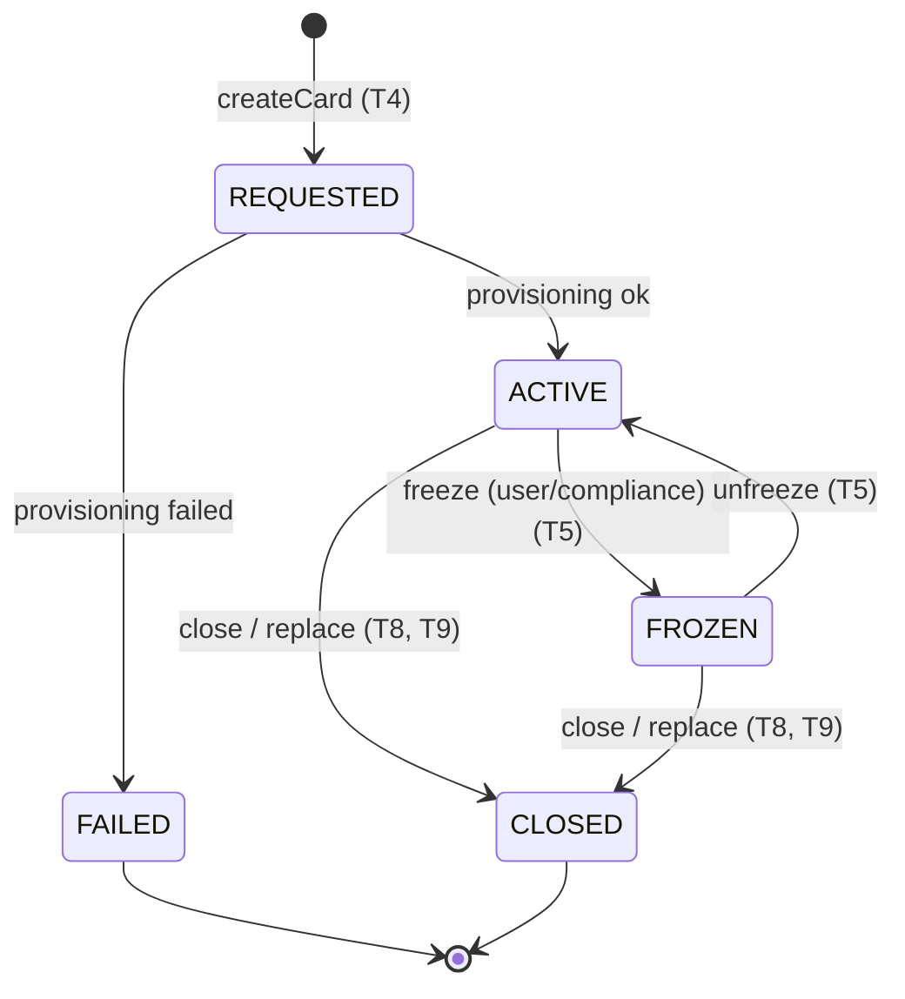

# 💳 Virtual Card Lifecycle — Feature Specification

> **Ingest the information in this file, implement the Low-Level Tasks (§8), and produce a system
> that satisfies the High-Level (§2) and Mid-Level (§3) Objectives.** Treat every guardrail in
> §6 and every Non-Functional target in §5 as a hard requirement, not a suggestion. Where a number
> is labeled *(assumed target)* it is a design assumption you may challenge — but not silently
> ignore.

| Field | Value |
|-------|-------|
| **Feature** | Virtual Card Lifecycle Management |
| **Spec status** | Approved for build (v1.0) |
| **Spec owner** | Cards Platform Team |
| **Assumed stack** | TypeScript + Node.js (NestJS/Express), PostgreSQL, Jest — *swappable; the spec is framework-agnostic, only the file paths assume this layout* |
| **Regulatory context** | PCI-DSS, GDPR/CCPA, PSD2/SCA (EEA), SOC 2 Type II controls. See §13. |
| **Out of scope** | Payment authorization/settlement engine, ledger/GL, KYC onboarding, physical card production. These are **external dependencies** the feature integrates with, not builds. |

---

## 0. Conventions used in this document

- **M#** = a Mid-Level Objective (§3). **T#** = a Low-Level Task (§8). **EC#** = an Edge Case (§9).
- Every Low-Level Task lists the objective it `Serves:` and ends with checkable **Acceptance
  Criteria (AC)**. The §11 Traceability Matrix proves there are no orphan objectives or tasks.
- **SMC** = *Standard Mutation Contract* (§6.1). Any task that changes card state inherits it, so it
  is written once and referenced rather than repeated.
- Money is always written as `amount_minor` (integer) + `currency` (ISO-4217). Never a float.
- `card_id` is an opaque **ULID** safe to log and expose. A **PAN** (card number) and **CVV** are
  never logged, never persisted in our datastore, and never returned in full — only `last4` + brand.

---

## 1. Stakeholders & Personas

| Persona | Role | Can do | Must **never** see/do |
|---------|------|--------|-----------------------|
| **Cardholder** (end-user) | Owns the card | Issue, freeze/unfreeze, set own limits, view own activity, replace, close *their own* cards | See another user's cards; see full PAN/CVV after issuance; bypass limits |
| **Support agent** | Tier-1 help | Read-only view of a user's cards + masked activity (with the user's consent token), trigger a freeze on the user's behalf | Set limits, close cards, view full PAN, export bulk data |
| **Ops / Compliance** | Back-office control & oversight | Read all cards, place a **compliance freeze**, read full audit trail, justified reveal of additional PII (logged) | Silently edit audit history; spend; unfreeze a compliance freeze without dual control |
| **Fraud analyst** | Risk monitoring | Read activity + risk flags, place a compliance freeze pending review | Adjust a user's limits; close without case reference |
| **Finance / Reconciliation** | Money integrity | Read reconciliation reports (card-state vs processor, limit vs spend) | Mutate card state |

> The persona → permission mapping is the source of truth for the RBAC matrix in **T13**.

---

## 2. High-Level Objective

**Enable cardholders to safely self-manage the entire lifecycle of a virtual payment card —
issue, freeze/unfreeze, set spending limits, view activity, replace, and close — inside a
regulated, fully auditable platform, while giving ops/compliance the controls and evidence they
need.**

**Scope boundary (one sentence):** This feature owns *card lifecycle state, spending controls,
activity presentation, audit, and notifications*; it **delegates** card number generation/storage
to an external tokenization vault and **delegates** authorization/settlement to an external card
processor, consuming their events rather than implementing them.

---

## 3. Mid-Level Objectives (observable)

Each objective states *what changes in the world* when it succeeds — so it is testable.

| ID | Objective | Observable success signal |
|----|-----------|---------------------------|
| **M1** | **Issue a virtual card** | A cardholder requests a card and within the issuance SLA a card exists in `ACTIVE` state with a usable token, `last4`, brand, and default limits; an `card.issued` audit event and notification exist. |
| **M2** | **Freeze / unfreeze** | A cardholder (or compliance) toggles a card between `ACTIVE` and `FROZEN`; a frozen card declines new authorizations within the propagation SLA; every toggle carries a reason code and is audited. |
| **M3** | **Set / change spending limits** | A cardholder sets a per-card limit (amount + interval); subsequent authorizations exceeding it are declined by the processor using our pushed control; old→new values are audited. |
| **M4** | **View activity** | A cardholder sees a paginated, masked, near-real-time list of authorizations/settlements for a card, consistent with the processor within the read-after-write SLA. |
| **M5** | **Replace a card** | A cardholder replaces a compromised card; the old token is revoked, a new card is issued in one atomic operation, controls/limits carry over, and the lineage (`replaces`/`replaced_by`) is recorded. |
| **M6** | **Close a card** | A cardholder closes a card; it reaches the terminal `CLOSED` state with a closure reason, declines all future authorizations, and is retained for the regulatory retention window. |
| **M7** | **Ops/Compliance control & oversight** | Compliance can view any card, place a dual-controlled compliance freeze, and read a complete, tamper-evident audit trail; privileged PII reveals are themselves logged. |
| **M8** | **Audit & notify on every transition** | Every state change emits exactly one immutable audit record (actor, action, target, reason, correlation-id) **and** a user notification; no transition can succeed without its audit record. |

---

## 4. Domain Model & State Machine

### 4.1 Card states



- **Terminal states:** `CLOSED`, `FAILED`. No transition leaves them.
- **`REPLACED` is a closure *reason*, not a state** — replace = close(old, reason=`REPLACED`) +
  issue(new). One terminal state keeps the invariant simple and the audit trail unambiguous.
- **`freeze_reason`** ∈ {`USER`, `COMPLIANCE`, `FRAUD`, `SUSPECTED_COMPROMISE`}. A `COMPLIANCE`/
  `FRAUD` freeze can only be lifted under dual control (T12); a `USER` freeze the user can lift.
- **`closure_reason`** ∈ {`USER_REQUESTED`, `LOST`, `STOLEN`, `FRAUD`, `REPLACED`, `COMPLIANCE`,
  `EXPIRED`}.

### 4.2 Core entities (illustrative shapes — not code to ship)

```jsonc
// Card
{
  "card_id": "ULID",                 // opaque, sortable, safe to log/expose
  "account_id": "ULID",              // owning account (external)
  "user_id": "ULID",                 // owning cardholder (external)
  "pan_token": "tok_…",              // reference into external vault — NEVER the PAN
  "last4": "4242",                   // display only
  "brand": "VISA|MASTERCARD",
  "exp_month": 12, "exp_year": 2028,
  "state": "REQUESTED|ACTIVE|FROZEN|CLOSED|FAILED",
  "freeze_reason": "USER|COMPLIANCE|FRAUD|SUSPECTED_COMPROMISE|null",
  "closure_reason": "…|null",
  "currency": "USD",                 // ISO-4217
  "replaces": "card_id|null",
  "replaced_by": "card_id|null",
  "version": 7,                      // optimistic-concurrency token
  "created_at": "2026-06-04T10:00:00Z",
  "updated_at": "2026-06-04T10:05:00Z"
}

// SpendingLimit (one active row per card; history retained)
{
  "card_id": "ULID",
  "amount_minor": 50000,             // 500.00 USD
  "currency": "USD",
  "interval": "PER_TRANSACTION|DAILY|WEEKLY|MONTHLY",
  "version": 3,
  "effective_at": "2026-06-04T10:06:00Z"
}

// AuditEvent (append-only; see T10)
{
  "audit_id": "ULID",
  "actor": { "id": "ULID", "role": "CARDHOLDER|COMPLIANCE|…", "on_behalf_of": "ULID|null" },
  "action": "card.frozen",
  "target": { "type": "card", "id": "ULID" },
  "reason": "USER",
  "before": { "state": "ACTIVE" }, "after": { "state": "FROZEN" },
  "correlation_id": "req_…",
  "occurred_at": "2026-06-04T10:05:00Z"
  // NEVER contains PAN, CVV, or full PII
}
```

---

## 5. Non-Functional & Policy Requirements

These are **targets/ranges**, not "should be fast." Each is verified in §10 and traced in §11.

### 5.1 Security
- **PCI-DSS scope minimization:** we store only `pan_token`, `last4`, brand, expiry. The PAN/CVV
  live in the external vault; our service is designed to qualify for the reduced **SAQ** scope.
- **Never log or persist PAN/CVV** anywhere — logs, traces, exceptions, fixtures, analytics, or
  error messages. Static analysis + log redaction enforce this (T17, `.claude/CLAUDE.md` § Testing).
- **Encryption:** TLS 1.2+ in transit; AES-256 (or KMS-managed) at rest for the datastore; secrets
  from a managed secret store, never in code or env files committed to VCS.
- **Webhook authenticity:** all inbound processor webhooks are signature-verified (T15).

### 5.2 Privacy & data handling
- **Data minimization:** collect only fields needed for the lifecycle. No marketing data here.
- **Residency:** card + audit data stays in the account's designated region.
- **Retention:** card + audit records retained **7 years** *(assumed target — typical financial
  record-keeping floor)* then purged/anonymized by the retention job (T18). Notifications retained 90 days.
- **GDPR/CCPA:** support data-subject export and erasure requests — erasure is *anonymization that
  preserves audit integrity* (we keep the immutable audit event but strip direct identifiers).

### 5.3 Audit & logging
- **Append-only, tamper-evident** audit store (hash-chained or WORM). No `UPDATE`/`DELETE` on audit.
- Every audit record carries **actor, action, target, reason, before/after, correlation-id, time**.
- **No transition is "done" until its audit record is committed** (SMC, §6.1).
- Application logs are structured JSON with a `correlation_id`; PII/PAN are redacted at the logger.

### 5.4 Reliability
- **Availability:** 99.9% monthly for read APIs, 99.9% for state-change APIs *(assumed target)*.
- **Idempotency & exactly-once transitions:** retries never double-apply a state change (T3, T16).
- **Fail-closed:** when a downstream that *protects money* (processor control push, vault) is
  unavailable, the **safe** outcome wins — e.g. a freeze that cannot be confirmed is treated as
  *not yet effective* and surfaced as pending; an unfreeze that cannot be confirmed stays frozen.

### 5.5 Access control
- **RBAC, least privilege, default-deny.** Persona→permission matrix in T13 is authoritative.
- **Tenant isolation:** a user can only ever address their own `card_id`s; cross-tenant access is a
  `404` (not `403`, to avoid confirming existence) and a security audit event.
- **Dual control** for lifting compliance/fraud freezes and for bulk PII reveal.

### 5.6 Rate limits & abuse
- Per-user write rate limits (T14) to contain abuse and accidental retry storms.

### 5.7 Observability & SLOs
- RED metrics (Rate/Errors/Duration) per endpoint; traces with `correlation_id`; SLO dashboards and
  an **audit-completeness** monitor (transitions vs audit records must match) (T19).

---

## 6. Implementation Notes (guardrails an agent must not violate)

### 6.1 Standard Mutation Contract (SMC)
> Any operation that changes card state **must** perform, in order:
> 1. **AuthN + RBAC** check (default-deny; tenant-scoped).
> 2. **Idempotency-Key** lookup/registration (T3) — replays return the original result.
> 3. **Optimistic-concurrency** check via expected `version` / `If-Match` (T16) — stale ⇒ `409`.
> 4. **State-machine guard** (T1) — illegal transition ⇒ typed `409 INVALID_TRANSITION`.
> 5. **Reason code** captured where the state/limit changes.
> 6. **Persist** the change and **emit the audit event in the same transaction** (§5.3).
> 7. **Dispatch notification** (best-effort, retried; failure does *not* roll back the transition — see EC10).
> 8. Return the new resource representation incl. new `version`.

Tasks that say "inherits SMC" must implement all eight steps; do not re-document them per task.

### 6.2 Other hard guardrails
- **Money:** integer minor units only; arithmetic in minor units; format only at the presentation
  edge. Reject mixed-currency operations (limit currency must equal card currency).
- **IDs:** ULID for `card_id`/`audit_id`; opaque cursors for pagination; never expose DB primary keys.
- **PAN handling:** request → vault → token; we receive token + `last4` only. A "reveal full PAN"
  capability, if ever needed, is a separate vault-side, dual-controlled, fully-audited flow — out of
  scope here.
- **Error semantics:** typed, stable, machine-readable codes (T17). Error bodies never contain PAN,
  CVV, secrets, or stack traces. Shape: `{ "error": { "code", "message", "correlation_id", "details" } }`.
- **Time:** UTC, ISO-8601, everywhere.
- **Pagination:** cursor-based; `limit` default 25, **max 100**; responses include `next_cursor`.
- **Idempotency keys:** required header on every mutating request; stored 24h with a request
  fingerprint; same key + same body ⇒ replay; same key + different body ⇒ `422 IDEMPOTENCY_CONFLICT`.
- **Webhooks:** verify signature, dedupe by event id, tolerate out-of-order delivery (T15).
- **Never** widen scope into authorization/settlement; we *push controls* and *consume events*.

---

## 7. Context

### 7.1 Beginning context (what exists before work starts — hypothetical but specific)
- **Auth service** issuing JWTs with `user_id`, `account_id`, `roles[]`; a gateway validates them.
- **External card processor** with: (a) an API to create a card token, push spend controls
  (limit + active/frozen), and revoke a token; (b) outbound **webhooks** for `authorization`,
  `settlement`, `decline`.
- **Tokenization vault** (PCI-scoped, external) — the only place a PAN exists.
- **PostgreSQL** instance; **event bus** (e.g. Kafka/SNS); **notification service** (push/email/SMS);
  **secret manager**; **object store** for the WORM audit archive.
- Existing tables: `users`, `accounts` (read-only to this feature).
- **Repo skeleton:**
  ```
  src/  contracts/  db/migrations/  test/  fixtures/  jobs/  observability/  docs/runbooks/
  ```
  with linting, CI, and the Claude Code rules in `.claude/CLAUDE.md` already present.

### 7.2 Ending context (artifacts/state that exist after work is done)
```
src/domain/money.ts
src/domain/card/cardState.ts            # state machine + transition guards (T1)
src/domain/card/card.entity.ts          # Card entity (T2)
src/domain/card/cardLimit.ts            # SpendingLimit (T6)
src/http/middleware/idempotency.ts      # (T3)   rbac.ts (T13)   rateLimit.ts (T14)
src/http/controllers/cardsController.ts # routes for T4–T9, T12
src/http/errors.ts                      # typed error catalog (T17)
src/services/{card,limit,activity,replace,compliance}Service.ts   # T4–T9, T12
src/events/auditEmitter.ts              # (T10)   notifications.ts (T11)
src/events/webhooks/processorWebhook.ts # (T15)
src/repositories/{card,audit,idempotency}Repository.ts
db/migrations/*.sql                     # card, limit, audit, idempotency tables (T2,T3,T6,T10)
contracts/openapi.yaml                  # API contract (T4–T9,T12)
contracts/events/*.json                 # audit + notification + webhook schemas
jobs/retention.ts (T18)   jobs/reconciliation.ts (T20)
observability/slo.ts (T19)
fixtures/** (T21)   test/** (T1–T20)
docs/runbooks/compliance-freeze.md (T22)
```
**End state:** all M1–M8 satisfied; all SLOs (§12) instrumented; audit-completeness monitor green.

---

## 8. Low-Level Tasks

> Each task uses the template idiom (*prompt / file / function / details*) plus **Serves** and
> **Acceptance Criteria**. Tasks marked *(inherits SMC)* implement all eight steps of §6.1.

### T1 — Card state machine & transition guards
- **Prompt:** "Create a pure, side-effect-free state machine for card states with an explicit
  allow-list of transitions, reason-code requirements, and typed errors for illegal transitions."
- **File:** `src/domain/card/cardState.ts`
- **Function/class:** `canTransition(from, to)`, `assertTransition(from, to, reason)`, `STATES`, `TRANSITIONS`
- **Details:** Encodes §4.1. Compliance/fraud freezes flagged as dual-control-to-lift.
- **Serves:** M1–M6 (foundation). **AC:**
  - [ ] Every transition in §4.1 is allowed; every other pair throws `INVALID_TRANSITION`.
  - [ ] Terminal states (`CLOSED`,`FAILED`) reject all outgoing transitions.
  - [ ] Freeze/close require a valid reason code; missing/invalid reason ⇒ typed error.
  - [ ] 100% branch coverage on the transition table (unit).

### T2 — Card data model & migration
- **Prompt:** "Create the `cards` table + entity matching §4.2 with NO column capable of storing a PAN or CVV."
- **File:** `db/migrations/0001_cards.sql`, `src/domain/card/card.entity.ts`, `src/repositories/cardRepository.ts`
- **Function/class:** `Card`, `CardRepository.{create,getByIdForUser,update,listForUser}`
- **Details:** `pan_token`,`last4`,`brand`,`currency`,`state`,`version`, lineage cols, timestamps.
  Unique index on `pan_token`. `version` defaults 1.
- **Serves:** M1. **AC:**
  - [ ] Schema has **no** `pan`/`cvv`/`card_number` column (asserted by a schema test).
  - [ ] `getByIdForUser` returns `null` for a card owned by another user (tenant isolation).
  - [ ] `last4` constrained to exactly 4 digits; `currency` to ISO-4217.

### T3 — Idempotency key contract & dedupe store
- **Prompt:** "Add idempotency middleware persisting `(key, route, request_fingerprint, response)` for 24h."
- **File:** `src/http/middleware/idempotency.ts`, `db/migrations/0002_idempotency.sql`, `src/repositories/idempotencyRepository.ts`
- **Function/class:** `withIdempotency(handler)`, `IdempotencyRepository`
- **Details:** Implements the idempotency rule in §6.2. In-flight key ⇒ `409 IDEMPOTENCY_IN_PROGRESS`.
- **Serves:** M1–M6 (reliability). **AC:**
  - [ ] Same key + same body returns the **identical** original response, no second side effect.
  - [ ] Same key + different body ⇒ `422 IDEMPOTENCY_CONFLICT`.
  - [ ] Keys expire after 24h; missing key on a mutating route ⇒ `400 IDEMPOTENCY_KEY_REQUIRED`.

### T4 — Issue a virtual card
- **Prompt:** "Implement card issuance: reserve token from vault, push default controls to processor,
  persist `ACTIVE` card, emit audit + notification." *(inherits SMC)*
- **File:** `src/services/cardService.ts`, `src/http/controllers/cardsController.ts` (`POST /cards`)
- **Function/class:** `CardService.issue(userId, accountId, params)`
- **Details:** REQUESTED→ACTIVE on success, →FAILED on provisioning error (audited). Default limit applied (T6).
- **Serves:** M1. **AC:**
  - [ ] Success returns `201` with `card_id`,`last4`,`brand`,`state=ACTIVE`,`version=1`; no PAN in body.
  - [ ] Provisioning failure ⇒ card `FAILED`, `card.issue_failed` audit, `502`-class typed error, no orphan token.
  - [ ] Issuance p95 within the §12 budget under nominal load.

### T5 — Freeze / unfreeze
- **Prompt:** "Implement freeze and unfreeze with reason codes; push the control to the processor." *(inherits SMC)*
- **File:** `src/services/cardService.ts`, controller `POST /cards/{id}/freeze`, `POST /cards/{id}/unfreeze`
- **Function/class:** `CardService.freeze(id, reason, expectedVersion)`, `CardService.unfreeze(...)`
- **Details:** USER freeze user-liftable; COMPLIANCE/FRAUD freeze requires T12 dual control to lift.
- **Serves:** M2. **AC:**
  - [ ] Freeze on `ACTIVE`⇒`FROZEN`; unfreeze on `FROZEN`⇒`ACTIVE`; both audited with reason.
  - [ ] Freezing an already-`FROZEN` card is **idempotent** (no error, no duplicate audit).
  - [ ] User cannot unfreeze a `COMPLIANCE`/`FRAUD` freeze ⇒ `403 DUAL_CONTROL_REQUIRED`.
  - [ ] Control-push confirmed effective within freeze-propagation SLA (§12); else state `pending`.

### T6 — Set / change spending limit
- **Prompt:** "Implement limit set/update with validation and history; push limit to processor." *(inherits SMC)*
- **File:** `src/services/limitService.ts`, `src/domain/card/cardLimit.ts`, `PUT /cards/{id}/limit`
- **Function/class:** `LimitService.setLimit(cardId, {amount_minor, currency, interval}, expectedVersion)`
- **Details:** Validate `amount_minor>0`, currency==card currency, interval enum, `amount_minor<=accountCeiling`.
  Keep prior rows for history.
- **Serves:** M3. **AC:**
  - [ ] `amount_minor<=0` ⇒ `422 INVALID_LIMIT`; currency mismatch ⇒ `422 CURRENCY_MISMATCH`.
  - [ ] Above account ceiling ⇒ `422 LIMIT_EXCEEDS_CEILING`.
  - [ ] Audit records `before`/`after` amounts; processor receives the new control.

### T7 — View activity (authorizations/settlements)
- **Prompt:** "Implement a cursor-paginated, masked, RBAC-checked activity feed per card."
- **File:** `src/services/activityService.ts`, `GET /cards/{id}/activity`
- **Function/class:** `ActivityService.list(cardId, {limit, cursor}, viewer)`
- **Details:** Reads activity projected from processor webhooks (T15). Masks card to `••••4242`.
- **Serves:** M4. **AC:**
  - [ ] `limit` defaults 25, caps at 100; returns `next_cursor`; stable ordering by `occurred_at,id`.
  - [ ] No PAN/CVV in any row; amounts in minor units with currency.
  - [ ] Empty card returns `200` with `[]` and `next_cursor=null` (EC1).
  - [ ] p95 within §12 activity budget for a 50-item page.

### T8 — Replace a card
- **Prompt:** "Implement atomic replace: close old (reason REPLACED) + issue new, carry over limits, link lineage." *(inherits SMC)*
- **File:** `src/services/replaceService.ts`, `POST /cards/{id}/replace`
- **Function/class:** `ReplaceService.replace(oldCardId, reason, expectedVersion)`
- **Details:** Single transaction; revoke old token; new card `replaces`=old, old `replaced_by`=new.
- **Serves:** M5. **AC:**
  - [ ] Old card ends `CLOSED/REPLACED`; new card `ACTIVE` with carried-over limit; lineage set both ways.
  - [ ] If new-card provisioning fails, the old card is **left intact** (no partial close) — all-or-nothing.
  - [ ] Two audit events (`card.replaced.closed`, `card.replaced.issued`) share one `correlation_id`.

### T9 — Close a card
- **Prompt:** "Implement close with closure reason; revoke token; terminal state." *(inherits SMC)*
- **File:** `src/services/cardService.ts`, `POST /cards/{id}/close`
- **Function/class:** `CardService.close(id, closureReason, expectedVersion)`
- **Details:** ACTIVE/FROZEN→CLOSED; revoke processor token; card retained per §5.2.
- **Serves:** M6. **AC:**
  - [ ] Closing already-`CLOSED` card ⇒ idempotent success (no duplicate audit).
  - [ ] Any mutation on a `CLOSED` card afterwards ⇒ `409 CARD_CLOSED` (EC8).
  - [ ] Token revocation confirmed; declines all subsequent authorizations.

### T10 — Audit event emitter & schema
- **Prompt:** "Create an append-only audit emitter writing in the same transaction as the state change."
- **File:** `src/events/auditEmitter.ts`, `db/migrations/0003_audit.sql`, `contracts/events/audit.schema.json`
- **Function/class:** `AuditEmitter.emit(event)` (transaction-aware), `AuditRepository.append`
- **Details:** Hash-chain each record (`prev_hash`) for tamper-evidence; WORM archive copy. Schema = §4.2.
- **Serves:** M8 (and all). **AC:**
  - [ ] No `UPDATE`/`DELETE` permitted on the audit table (enforced by grants + test).
  - [ ] Emitter participates in the caller's DB transaction — rollback drops both change and audit.
  - [ ] Schema validation rejects any payload containing `pan`/`cvv`-shaped fields.

### T11 — Notifications on transitions
- **Prompt:** "Dispatch a user notification after each successful transition; retry on failure; never block the transition."
- **File:** `src/events/notifications.ts`, `contracts/events/notification.schema.json`
- **Function/class:** `Notifier.onCardEvent(event)`
- **Details:** Async, at-least-once with dedupe key; templated per action; honors user channel prefs.
- **Serves:** M8. **AC:**
  - [ ] A notification is enqueued for every audited transition.
  - [ ] Notification failure does **not** roll back the transition (EC10); failure is logged + retried.
  - [ ] Dispatch latency within §12 budget.

### T12 — Ops/Compliance view & compliance-freeze (dual control)
- **Prompt:** "Add a compliance read view across all cards, a dual-controlled compliance freeze, and a justified, logged PII reveal."
- **File:** `src/services/complianceService.ts`, routes under `GET /ops/cards`, `POST /ops/cards/{id}/freeze`, `POST /ops/cards/{id}/unfreeze`
- **Function/class:** `ComplianceService.{list, freeze, requestUnfreeze, approveUnfreeze, revealPII}`
- **Details:** Unfreeze of compliance/fraud freeze requires a second authorized approver. Every PII
  reveal writes an audit event with justification + case id.
- **Serves:** M7. **AC:**
  - [ ] Single approver cannot lift a compliance freeze ⇒ `403 DUAL_CONTROL_REQUIRED`; two distinct approvers can.
  - [ ] Every privileged reveal produces an `pii.revealed` audit event with `case_id` + justification.
  - [ ] Compliance list is read-only and tenant-wide; no mutation paths leak to non-compliance roles.

### T13 — RBAC permission matrix
- **Prompt:** "Implement default-deny RBAC middleware driven by the §1 persona→permission matrix; cross-tenant ⇒ 404."
- **File:** `src/http/middleware/rbac.ts`, `contracts/rbac-matrix.md`
- **Function/class:** `requirePermission(action)`, `assertOwnership(userId, cardId)`
- **Details:** Permissions are explicit; unknown action ⇒ deny. Cross-tenant card id ⇒ `404` + security audit.
- **Serves:** M7, M1–M6 (cross-cutting). **AC:**
  - [ ] Each persona can do exactly its allowed actions and nothing else (table-driven test).
  - [ ] Cross-tenant access returns `404` (not `403`) and emits a `security.cross_tenant_attempt` event (EC6).

### T14 — Rate limiting
- **Prompt:** "Add per-user, per-route write rate limits with standard headers and typed 429."
- **File:** `src/http/middleware/rateLimit.ts`
- **Function/class:** `rateLimit(policy)`
- **Details:** Token-bucket per `(user, route-class)`; emits `Retry-After`. Read vs write classes.
- **Serves:** §5.6, M1–M6. **AC:**
  - [ ] Exceeding the limit ⇒ `429 RATE_LIMITED` with `Retry-After`; under limit unaffected.
  - [ ] Limits are per-user (one noisy user cannot throttle another).

### T15 — Processor webhook ingestion → activity projection
- **Prompt:** "Ingest signed processor webhooks (authorization/settlement/decline), dedupe, tolerate out-of-order, project into the activity store."
- **File:** `src/events/webhooks/processorWebhook.ts`, `db/migrations/0004_activity.sql`
- **Function/class:** `ProcessorWebhookHandler.handle(rawBody, signature)`
- **Details:** Verify HMAC signature; dedupe by `event_id`; reconcile auth→settlement by `auth_id`;
  store monotonic `occurred_at`. Reject unverified ⇒ `401`.
- **Serves:** M4. **AC:**
  - [ ] Invalid signature ⇒ `401`, nothing persisted (EC18).
  - [ ] Duplicate `event_id` is ignored idempotently (EC11).
  - [ ] A settlement arriving before its authorization is reconciled correctly (out-of-order, EC11).

### T16 — Optimistic concurrency / versioning
- **Prompt:** "Enforce `expected_version`/`If-Match` on every mutation; stale ⇒ 409 with current version."
- **File:** `src/repositories/cardRepository.ts` (conditional update), `src/http/middleware` integration
- **Function/class:** `CardRepository.updateIfVersion(card, expectedVersion)`
- **Details:** `UPDATE … WHERE id=? AND version=?`; 0 rows ⇒ conflict. Bump version on every change.
- **Serves:** §5.4, M2,M3,M5,M6. **AC:**
  - [ ] Two concurrent freeze+limit changes on the same card: exactly one wins, the other gets `409 STALE_VERSION` (EC3).
  - [ ] Every successful mutation increments `version` by 1.

### T17 — Error model & code catalog
- **Prompt:** "Define a typed, stable error catalog and a serializer that never leaks PAN/CVV/secrets/stack traces."
- **File:** `src/http/errors.ts`, `contracts/errors.md`
- **Function/class:** `AppError`, `toErrorResponse(err, correlationId)`
- **Details:** Stable codes (e.g. `CARD_FROZEN`,`INVALID_TRANSITION`,`STALE_VERSION`,`IDEMPOTENCY_CONFLICT`,…).
- **Serves:** §6.2, all. **AC:**
  - [ ] Every thrown domain error maps to a documented code + HTTP status.
  - [ ] Error bodies contain `code`,`message`,`correlation_id` only; a fuzz test asserts no PAN-shaped digits leak.

### T18 — Retention & PII-redaction job
- **Prompt:** "Schedule a job that purges/anonymizes records past the retention window while preserving audit integrity."
- **File:** `jobs/retention.ts`
- **Function/class:** `runRetention(now)`
- **Details:** Anonymize direct identifiers after 7y; keep hash-chained audit shells; delete notifications >90d.
- **Serves:** §5.2 (privacy), M8. **AC:**
  - [ ] Records older than the window are anonymized; audit hash-chain still validates.
  - [ ] A GDPR erasure request anonymizes the subject without breaking audit continuity.

### T19 — Observability & audit-completeness monitor
- **Prompt:** "Instrument RED metrics + traces and a monitor that alerts when state transitions ≠ audit records."
- **File:** `observability/slo.ts`, dashboards-as-code
- **Function/class:** `recordTransition()`, `auditCompletenessCheck()`
- **Details:** SLOs per §12; alert if any transition lacks a matching audit event within N minutes.
- **Serves:** §5.7, M8. **AC:**
  - [ ] Each §12 SLO has a metric + dashboard panel + alert threshold.
  - [ ] Injecting a transition without an audit record fires the completeness alert in test.

### T20 — Reconciliation job
- **Prompt:** "Reconcile our card state vs processor state and our limits vs observed spend; report drift."
- **File:** `jobs/reconciliation.ts`, report schema
- **Function/class:** `reconcileCards()`, `reconcileLimits()`
- **Details:** Daily batch; outputs a drift report for Finance; flags cards active here but revoked at processor (or vice-versa).
- **Serves:** M3,M4,M6 (integrity). **AC:**
  - [ ] A deliberately injected state divergence appears in the drift report.
  - [ ] Batch completes within its window for the assumed card volume (§12).

### T21 — Fixtures & seed data
- **Prompt:** "Create synthetic fixtures and seed data using ONLY test BINs — never a real PAN."
- **File:** `fixtures/cards.json`, `fixtures/webhooks/*.json`, `fixtures/README.md`
- **Function/class:** n/a (data) + `seed.ts`
- **Details:** Use network test numbers (e.g. `4242…`); document that production data must never enter fixtures.
- **Serves:** §10 (verification). **AC:**
  - [ ] No fixture contains a Luhn-valid real-issuer PAN; a test scans fixtures for forbidden patterns.
  - [ ] Fixtures cover happy path + each edge case in §9.

### T22 — Compliance-freeze / incident runbook
- **Prompt:** "Write an operator runbook for placing/lifting a compliance freeze and handling suspected compromise."
- **File:** `docs/runbooks/compliance-freeze.md`
- **Function/class:** n/a (doc)
- **Details:** Step-by-step incl. dual-control approval, evidence capture, customer comms, regulatory notes.
- **Serves:** M7. **AC:**
  - [ ] Runbook covers freeze, dual-control unfreeze, PII reveal, and escalation contacts.
  - [ ] A tabletop walkthrough completes with no undefined step.

---

## 9. Edge Cases & Failure Modes

> Scoped to *this* feature. Each row states the **user-visible behavior** and the **audit/compliance
> implication**. EC#s are referenced from the tasks above and the verification matrix below.

| EC | Scenario | Trigger | Expected user-visible behavior | Audit / compliance implication |
|----|----------|---------|--------------------------------|--------------------------------|
| EC1 | **Empty states** | New card, no activity | `200` + empty list, friendly "no transactions yet" | none |
| EC2 | **Invalid limit** | `amount_minor ≤ 0`, NaN | `422 INVALID_LIMIT`, no change | rejected attempt logged (info) |
| EC3 | **Concurrent freeze + limit change** | Two writers, same card | One succeeds; other `409 STALE_VERSION`, prompted to refresh | both attempts audited; no lost update |
| EC4 | **Wrong-currency limit** | Limit currency ≠ card | `422 CURRENCY_MISMATCH` | rejected attempt logged |
| EC5 | **Limit above account ceiling** | Over policy cap | `422 LIMIT_EXCEEDS_CEILING` | flagged if repeated (possible abuse) |
| EC6 | **Cross-tenant access** | User A requests B's card | `404 NOT_FOUND` (existence not confirmed) | `security.cross_tenant_attempt` audit (high severity) |
| EC7 | **Spend on frozen card** | Auth arrives while `FROZEN` | Processor declines (control pushed); activity shows decline | decline recorded; supports fraud review |
| EC8 | **Mutation on closed card** | freeze/limit on `CLOSED` | `409 CARD_CLOSED` | attempt audited |
| EC9 | **Replace during pending auth** | Replace while auth in-flight | Replace succeeds; in-flight auth resolves against old token then declines further | lineage + both cards audited; reconciled by T20 |
| EC10 | **Partial failure: audit ok, notify fails** | Notifier down | Transition still succeeds; user sees state change; notification retried | audit complete; notification gap visible in T19 metrics |
| EC11 | **Out-of-order / duplicate webhook** | Settlement before auth; dupe `event_id` | Activity reconciles correctly; dupes ignored | idempotent ingestion; no double-count |
| EC12 | **Idempotency replay** | Client retries POST with same key | Same original response, no second card/transition | single audited action |
| EC13 | **Idempotency key reused with different body** | Bug/abuse | `422 IDEMPOTENCY_CONFLICT` | suspicious-use signal |
| EC14 | **Stale read after write** | Read immediately after freeze | Read reflects new state within read-after-write SLA; UI may show "updating…" until then | none (consistency window documented) |
| EC15 | **Issuance/provisioning failure** | Vault/processor error | Card `FAILED`, typed `502`-class error, retry guidance | `card.issue_failed` audit; no orphan token |
| EC16 | **Downstream control-push fails on freeze** | Processor unreachable | Freeze shown **pending**, not effective (fail-closed §5.4) | audit notes pending; alert raised |
| EC17 | **Fraud-ish velocity / rapid limit hikes / geo anomaly** | Risk heuristic trips | In-scope = **flag** for review (optionally auto compliance-freeze), not silent block | `risk.flag` event; may trigger T12 |
| EC18 | **Unsigned / forged webhook** | Bad signature | `401`, nothing persisted | `security.webhook_rejected` audit |
| EC19 | **PAN-exposure attempt** | Any path tries to log/return PAN | Blocked by redaction + schema validation; request fails safe | `security.pan_exposure_blocked` audit (high severity) |

---

## 10. Verification & Test Strategy

### 10.1 Test categories (documented expectations)
- **Unit** — state machine (T1, 100% branch), money math, validators, error mapping.
- **Integration** — each service against a test DB + stubbed processor/vault; SMC steps verified.
- **Contract** — `contracts/openapi.yaml` and event schemas validated against handlers (consumer/provider).
- **End-to-end (e2e)** — full flows: issue→freeze→unfreeze→limit→activity→replace→close.
- **Concurrency** — EC3/EC12 race tests (parallel requests).
- **Reconciliation** — T20 detects injected drift.
- **Security** — no-PAN-in-logs fuzz (T17), cross-tenant (EC6), forged webhook (EC18), fixture scan (T21).
- **Load** — validates §12 budgets at assumed volume.
- **Coverage target:** ≥ **85% lines** overall *(assumed target — matches the course's HW2 bar)* and
  **100% of state transitions** exercised.

### 10.2 Per-objective verification

| Obj | How we know it's met | Primary tests / checkpoints |
|-----|----------------------|-----------------------------|
| M1 | A card reaches `ACTIVE` with token+last4, audited & notified | T4 integration + e2e; EC15 failure test |
| M2 | Frozen card declines; toggle audited; propagation within SLA | T5 integration; EC7, EC16; load for propagation |
| M3 | Over-limit declined; old→new audited; validation holds | T6 integration; EC2, EC4, EC5 |
| M4 | Masked, paginated, fresh activity within read SLA | T7 + T15 integration; EC1, EC11, EC14 |
| M5 | Atomic old-close + new-issue; lineage; all-or-nothing | T8 e2e; EC9; failure-injection |
| M6 | Terminal close; future auth declined; retained | T9 integration; EC8 |
| M7 | Dual-control compliance freeze; logged PII reveal; read-only | T12 + T13 integration; EC6 |
| M8 | Every transition has exactly one audit + a notification | T10/T11/T19 integration; EC10; audit-completeness monitor |

### 10.3 Manual compliance review checkpoints
- Confirm no schema column/log field can hold PAN/CVV (sign-off before launch).
- Review the RBAC matrix (T13) and dual-control flows (T12) with compliance.
- Verify retention + erasure (T18) against the current data-retention policy.

---

## 11. Requirements Traceability Matrix

> Proves the chain **High-Level → Mid-Level → Tasks → Verification → Performance** is complete with
> no orphans. (Cross-cutting tasks T3, T10, T13, T14, T16, T17, T19 support multiple objectives.)

| Mid Obj | Supports High-Level? | Implementing Tasks | Verification (§10) | Perf budget (§12) | Edge cases |
|---------|:--:|--------------------|--------------------|-------------------|-----------|
| **M1** Issue | ✅ | T1,T2,T4,T6 (+T3,T10,T13,T16,T17) | M1 row | Issuance | EC15 |
| **M2** Freeze/unfreeze | ✅ | T1,T5 (+SMC tasks) | M2 row | State-change, Freeze-propagation | EC7,EC16 |
| **M3** Limits | ✅ | T6 (+SMC tasks) | M3 row | State-change | EC2,EC4,EC5 |
| **M4** Activity | ✅ | T7,T15 | M4 row | Activity-list, Read-after-write | EC1,EC11,EC14 |
| **M5** Replace | ✅ | T8 (+T1,T2,T6) | M5 row | State-change | EC9 |
| **M6** Close | ✅ | T9 (+SMC tasks) | M6 row | State-change | EC8 |
| **M7** Ops/Compliance | ✅ | T12,T13,T22 (+T10) | M7 row | Activity-list | EC6 |
| **M8** Audit & notify | ✅ | T10,T11,T19 | M8 row | Notification dispatch | EC10 |
| *Integrity (cross)* | ✅ | T20 reconciliation | §10.1 reconciliation | Recon batch | EC9 |
| *Privacy (cross)* | ✅ | T18 retention | §10.3 | Recon batch window | — |

---

## 12. Performance / SLO Budgets

> All numbers are **assumed targets** with a stated rationale; tune against production telemetry.
> Latency budgets exclude client network time and are measured at the service boundary.

| Operation | Metric | Assumed target | Why this is reasonable for FinTech |
|-----------|--------|----------------|------------------------------------|
| Card state change (freeze/limit/close) | p50 / p95 / p99 | 120 / **300** / 800 ms | Self-service controls must feel instant; <300 ms p95 reads as "immediate" in UX research. |
| Activity list (50 items) | p95 | **500 ms** | Heavier read but still snappy; cursor pagination keeps it flat as history grows. |
| Card issuance | p95 | **1.5 s** | Involves vault + processor round-trips; users tolerate a short, clearly-progressed wait. |
| Freeze → processor decisioning effective | propagation | **< 2 s** (alert > 5 s) | Freeze is a fraud-containment control; minutes of lag could mean real loss. |
| Notification dispatch | p95 | **< 5 s** after transition | Reassurance/security signal; near-real-time but not on the critical path. |
| Webhook ingestion | throughput | **≥ 200 events/s** sustained | Must absorb spend bursts without backlog; horizontally scalable consumer. |
| Read-after-write consistency (own writes) | window | **< 1 s** | Users expect their just-made change to be visible; show "updating…" until then. |
| Pagination | max page size | **100** items | Bounds payload + DB cost; protects p95 and the mobile client. |
| Per-user write rate limit | budget | **e.g. 30 writes/min/user** | Contains retry storms/abuse without hampering legitimate use. |
| Reconciliation batch | completion | within a **30-min** nightly window @ ~1M cards | Daily integrity check finishes well before business hours. |
| Availability | monthly | **99.9%** read & write | Standard for a customer-facing money-adjacent control plane. |

---

## 13. Glossary & References

- **PAN** — Primary Account Number (the card number). Never stored/logged here; lives in the vault.
- **Token (`pan_token`)** — vault reference standing in for the PAN in our systems.
- **CVV** — card verification value; never stored.
- **BIN** — Bank Identification Number; test BINs only in fixtures (T21).
- **ULID** — sortable, opaque identifier used for `card_id`/`audit_id`.
- **MCC** — Merchant Category Code (informational in activity).
- **SMC** — Standard Mutation Contract (§6.1).
- **Regulatory references:** **PCI-DSS** (cardholder-data protection, scope minimization),
  **GDPR/CCPA** (data minimization, erasure, residency), **PSD2/SCA** (strong customer
  authentication — assumed handled by the auth service we depend on), **SOC 2** (audit, access,
  change-management controls), **ISO-4217** (currency codes).

---

<div align="center">

*Specification artifact for Homework 3 — Specification-Driven Design. No implementation included.*

</div>
