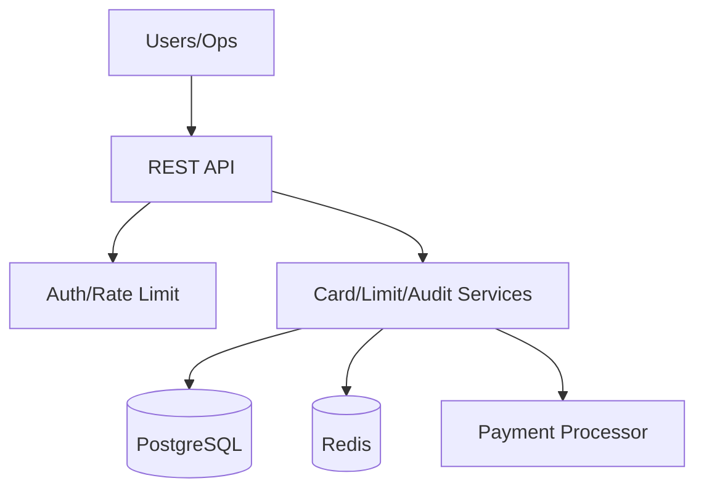
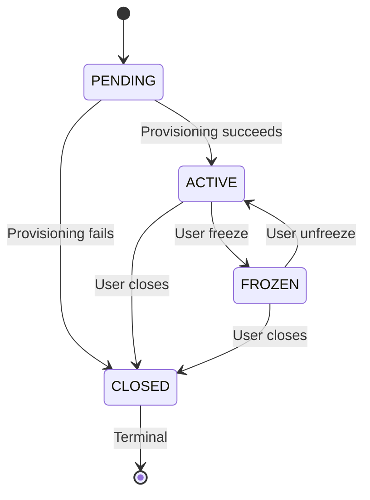
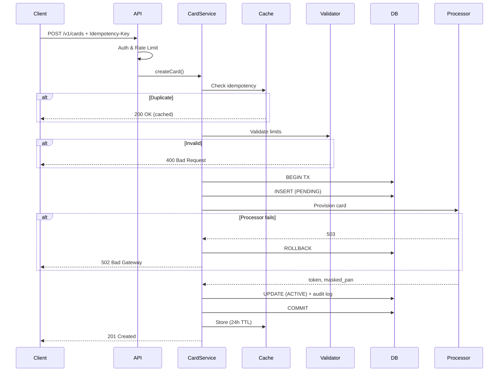

# Virtual Card Lifecycle Specification

> Ingest the information from this file, implement the Low-Level Tasks, and generate the code that will satisfy the High and Mid-Level Objectives.

## High-Level Objective

Enable end-users to manage virtual payment cards throughout their complete lifecycle with full auditability and regulatory compliance. System provides CRUD operations, state management (freeze/unfreeze), spending limits, and transaction visibility.

**Scope:** Virtual card management from creation through deactivation. **Out of scope:** Physical cards, card transfers, rewards, merchant disputes.



---

```mermaid
stateDiagram-v2
    [*] --> PENDING
    PENDING --> ACTIVE: Provisioning succeeds
    PENDING --> CLOSED: Provisioning fails
    ACTIVE --> FROZEN: User freeze
    FROZEN --> ACTIVE: User unfreeze
    ACTIVE --> CLOSED: User closes
    FROZEN --> CLOSED: User closes
    CLOSED --> [*]: Terminal
\```

## Mid-Level Objectives

The following objectives are observable and testable, defining what changes in the world when this system succeeds:

1. **Card Provisioning:** Users can create new virtual cards with configurable initial spending limits, receiving a masked card number and immediate ACTIVE status (post-processor provisioning).

2. **State Management:** Users can freeze cards to prevent all transactions and unfreeze them to restore functionality, with state changes reflected in real-time (< 5 seconds to processor).

3. **Transaction Visibility:** Users can view paginated, filterable transaction history for each card, including pending and completed transactions with merchant details and timestamps.

4. **Limit Configuration:** Users can set and modify three types of spending limits (per-transaction, daily cumulative, monthly cumulative) with currency specification and immediate validation.

5. **Audit Trail:** System maintains an immutable, complete audit log of all card operations (create, freeze, limit changes, closure) with actor identification, timestamp, before/after state, and contextual metadata for compliance queries.

6. **Operations Review:** Operations and compliance teams can query card activity, risk indicators, and audit logs through dedicated interfaces with appropriate access controls and data retention policies.

---

## Non-Functional Requirements & Policy

### Security
- **PCI DSS Level 1:** No full PAN storage, tokenized references only; PAN masking (`****1234`) in all outputs; AES-256 encryption at rest; TLS 1.3 in transit; 90-day key rotation
- **Access Control:** JWT auth (1h expiration), role-based authorization (USER/ADMIN/COMPLIANCE/OPS), resource ownership validation, rate limiting per user/org

### Privacy
- **GDPR/CCPA:** Right to erasure (anonymize after 7y retention), data export API, minimal PII (email, user ID only), data residency (EU/US)
- **Retention:** Active cards indefinite; closed cards 7y; audit logs 7y immutable; transactions 7y

### Audit & Compliance
- **Audit Logs:** Immutable, structured events for all operations; fields: event_type, card_id, actor_id, timestamp, old_state, new_state, metadata; append-only with hash chain; indexed for compliance queries
- **Reporting:** Daily volume reports, high-value alerts (>$10K), suspicious pattern detection, encrypted CSV export

### Reliability
- **SLA:** 99.9% uptime (43 min/month downtime)
- **Consistency:** Strong for writes, eventual (<5s) for transaction history
- **Degradation:** Cached reads during processor outages
- **DR:** RPO 1h, RTO 4h

### Performance Targets (p95/p99)

| Operation | p95 | p99 | Rationale |
|-----------|-----|-----|-----------|
| Card creation | <500ms | <1s | Near-instant provisioning |
| Freeze/unfreeze | <200ms | <400ms | Immediate security response |
| Transaction list (100) | <300ms | <500ms | Real-time fraud review |
| Limit update | <300ms | <600ms | User confidence |

**Throughput:** 100 cards/s, 500 state changes/s, 2000 queries/s
**Rate Limits:** User 100 req/min, Org 1K req/min (reads 2x writes), HTTP 429 with `Retry-After`

---

## Implementation Notes

### Data Handling Rules
1. **Monetary Values:** Use `Decimal` exclusively (Python: `decimal.Decimal`, Node.js: `decimal.js`); Database: `DECIMAL(19,4)`; API: string format `"500.00"`
2. **Currency:** ISO 4217 codes only (`USD`, `EUR`, `GBP`); no conversion
3. **PAN Masking:** Format `****1234`; never log full PAN; store token only
4. **Timestamps:** ISO 8601 with timezone `2025-05-05T10:30:00Z`; store UTC, `timestamptz` in DB

### Idempotency
- **Required:** All POST/PATCH/DELETE operations
- **Mechanism:** `Idempotency-Key` UUID header
- **Behavior:** First request executes, duplicates return cached (200 OK); different payload returns 409 Conflict
- **TTL:** 24 hours in Redis

### Error Response Format (RFC 7807)
```json
{
  "type": "https://api.example.com/errors/validation-error",
  "title": "Validation Error",
  "status": 400,
  "detail": "Spending limit amount must be positive",
  "instance": "/cards/card_abc123/limits",
  "invalid_fields": ["amount"]
}
```

### Card Status Transitions
```
PENDING → ACTIVE (processor provisioning succeeds)
ACTIVE ↔ FROZEN (user-initiated)
ACTIVE/FROZEN → CLOSED (terminal, irreversible)
PENDING → CLOSED (provisioning failure)
```



Invalid transitions → 400 Bad Request.

### Concurrency Control
- **Optimistic Locking:** `version` field, incremented on update
- **API:** Client sends `If-Match: {version}` header
- **Conflict:** 409 if version mismatch, client re-fetches and retries

---

## Context

### Beginning Context
**Database:** `users` table exists (id, email, name, created_at)

**External Systems:**
- **Payment Processor API:** Card provisioning, freeze/unfreeze, transaction retrieval, webhooks
- **Auth Service:** JWT with role claims, 1h token expiration, 30d refresh
- **Audit Logging:** Event stream (Kafka) to compliance data store, JSON format

**Application:** API framework ready (FastAPI/Express), database migrations available, monitoring (Prometheus/Grafana)

### Ending Context

**Database Schema:**
```sql
CREATE TABLE virtual_cards (
  id UUID PRIMARY KEY,
  user_id UUID NOT NULL REFERENCES users(id),
  card_token VARCHAR(255) UNIQUE NOT NULL,
  masked_pan VARCHAR(12) NOT NULL,
  status VARCHAR(20) CHECK (status IN ('PENDING', 'ACTIVE', 'FROZEN', 'CLOSED')),
  spending_limits JSONB DEFAULT '{}',
  created_at TIMESTAMPTZ DEFAULT NOW(),
  updated_at TIMESTAMPTZ DEFAULT NOW(),
  version INTEGER DEFAULT 1,
  INDEX idx_user_status (user_id, status)
);

CREATE TABLE card_audit_logs (
  id BIGSERIAL PRIMARY KEY,
  event_type VARCHAR(50) NOT NULL,
  card_id UUID REFERENCES virtual_cards(id),
  actor_id UUID REFERENCES users(id),
  timestamp TIMESTAMPTZ DEFAULT NOW(),
  old_state JSONB,
  new_state JSONB,
  metadata JSONB DEFAULT '{}',
  INDEX idx_card_audit (card_id, timestamp DESC)
);

CREATE TABLE transactions (
  id UUID PRIMARY KEY,
  card_id UUID REFERENCES virtual_cards(id),
  amount DECIMAL(19,4) NOT NULL,
  currency VARCHAR(3) NOT NULL,
  merchant_name VARCHAR(255),
  timestamp TIMESTAMPTZ NOT NULL,
  status VARCHAR(20) CHECK (status IN ('PENDING', 'COMPLETED', 'DECLINED')),
  INDEX idx_card_transactions (card_id, timestamp DESC)
);

CREATE TABLE idempotency_keys (
  key UUID PRIMARY KEY,
  operation VARCHAR(100),
  request_hash VARCHAR(64),
  response_status INTEGER,
  response_body JSONB,
  created_at TIMESTAMPTZ DEFAULT NOW(),
  expires_at TIMESTAMPTZ NOT NULL
);
```

**Spending Limits JSONB:** `{per_transaction: {amount, currency}, daily: {amount, currency, period_start, spent_in_period}, monthly: {...}}`

**API Endpoints:** POST/GET /v1/cards, GET /v1/cards/{id}, PATCH /v1/cards/{id}/status, PATCH /v1/cards/{id}/limits, GET /v1/cards/{id}/transactions, DELETE /v1/cards/{id}

**Services:** CardService, LimitEnforcementService, AuditLogService, ProcessorIntegrationService, TransactionSyncService

**Documentation:** OpenAPI spec, security checklist, audit schema, retention policy, GDPR/CCPA attestation

### API Request Flow


---

## Edge Cases & Failure Modes

The following table explicitly defines expected behavior for edge cases and failure scenarios:

| Scenario | Expected Behavior | HTTP Status | Audit/Compliance Impact |
|----------|-------------------|-------------|-------------------------|
| **Create card while user at card limit** (e.g., 10 cards max) | Reject request with error: "Maximum card limit reached for user" | 400 Bad Request | Log creation attempt with rejection reason |
| **Freeze already frozen card** | Accept request idempotently, no state change, return current state | 200 OK | Log duplicate operation with idempotency note |
| **Unfreeze card that was never frozen** | If status is ACTIVE, accept idempotently; if CLOSED, reject | 200 OK / 400 | Log operation attempt |
| **Set negative spending limit** | Reject with validation error: "Limit amount must be positive" | 400 Bad Request | Log invalid input attempt with submitted value |
| **Set limit below current period spend** | Reject with error: "New limit cannot be below current period spend" | 400 Bad Request | Log validation failure with current spend |
| **Set limit while transaction in-flight** | Accept change, apply to transactions after timestamp | 200 OK | Log limit change with effective timestamp |
| **Transaction on frozen card** | Processor declines, log security event with transaction details | N/A (processor) | High-priority security audit log |
| **Concurrent freeze operations** | Use optimistic locking; first succeeds, second gets 409 Conflict | 409 Conflict | Both operations logged with outcome (success/conflict) |
| **View transactions for deleted (CLOSED) card** | If user owns card, return transactions; otherwise 403 | 200 OK / 403 | Log access attempt with authorization decision |
| **Create card with expired JWT** | Reject with authentication error | 401 Unauthorized | Security log with IP, user agent, expired token ID |
| **Database timeout during card creation** | Rollback transaction, return service unavailable, idempotency prevents duplicate | 503 Service Unavailable | Alert operations team, log for retry analysis |
| **Invalid/expired card token from processor** | Rollback card creation, return bad gateway error | 502 Bad Gateway | Critical alert, log for vendor escalation |
| **Rate limit exceeded** | Reject with rate limit error, include Retry-After header (60 seconds) | 429 Too Many Requests | Log for abuse detection pattern analysis |
| **Spending limit change during period rollover** | Queue change to apply at period boundary, return 202 Accepted | 202 Accepted | Log scheduled change with effective time |
| **Create card with duplicate idempotency key** | If payload matches: return cached result; if different: return conflict | 200 OK / 409 | Log duplicate detection |
| **Concurrent limit updates** | Version conflict, return 409, client re-fetches and retries | 409 Conflict | Log both update attempts with conflict resolution |
| **Transaction sync failure from processor** | Retry with exponential backoff (max 5 attempts), alert if persistent failure | N/A (background) | Error log, operations alert after 5 failures |
| **User requests card closure while pending transactions exist** | Allow closure, pending transactions will complete or decline based on final state | 200 OK | Log closure with pending transaction count |
| **Query audit logs without COMPLIANCE role** | Deny access with authorization error | 403 Forbidden | Security log of unauthorized access attempt |
| **Processor webhook with invalid HMAC signature** | Reject webhook, log security event | 401 Unauthorized | High-priority security alert for potential attack |
| **Create card with invalid currency code** | Reject with validation error listing supported currencies | 400 Bad Request | Log validation failure |
| **Empty spending limits in creation request** | Apply system defaults (per-transaction: $1000, daily: $5000, monthly: $20000) | 200 OK | Log with default values applied |

---

## Verification Strategy

### Per Mid-Level Objective

**1. Card Provisioning** - Unit: validation, status init, idempotency; Integration: processor mock, DB insert, audit log; E2E: full flow with masked PAN

**2. State Management** - Unit: state machine, version increment, idempotency; Integration: optimistic locking, processor calls, audit; E2E: freeze→decline, unfreeze→success, concurrent conflicts

**3. Transaction Visibility** - Unit: pagination, filtering, authorization; Integration: performance (10K dataset), index verification, permissions; E2E: API pagination, date/status filters, masked PAN

**4. Limit Configuration** - Unit: validation, JSONB parsing, period rollover; Integration: version control, audit, eventual consistency (<5s); E2E: set/modify limits, verify enforcement

**5. Audit Trail** - Unit: event types, state capture, metadata; Integration: immutability, 7y retention, hash chain; Compliance: all ops logged, CSV export

**6. Operations Review** - Integration: query performance (<1s/1M), RBAC, encryption; E2E: compliance reports, CSV export, suspicious patterns

### Test Categories Summary

| Category | Coverage Target | Tools | Focus Areas |
|----------|----------------|-------|-------------|
| **Unit Tests** | > 80% code coverage | pytest / Jest | Business logic, validations, state machines |
| **Integration Tests** | All database operations, external API mocks | pytest / Jest with testcontainers | Database transactions, API contracts, audit logging |
| **E2E Tests** | Critical user journeys (5-10 scenarios) | Postman / RestAssured | Full stack flows via HTTP API |
| **Performance Tests** | All API endpoints under 2x peak load | k6 / Locust | Latency targets (p95/p99), throughput limits |
| **Security Tests** | OWASP Top 10 coverage | OWASP ZAP / Burp Suite | Authorization bypasses, SQL injection, PAN exposure |
| **Compliance Tests** | Audit log completeness | Custom scripts | Every operation logged, retention verified, export format |

### Acceptance Criteria Pattern
All tasks follow standard pattern: ✓ Compiles/runs ✓ Unit tests pass (≥3/function) ✓ Integration verified ✓ Security met ✓ Audit logs correct ✓ Performance targets ✓ Docs updated. Task-specific criteria listed per task.

---


## Low-Level Tasks

All 20 detailed implementation tasks have been extracted to a separate document for better organization and readability.

**→ See [implementation-tasks.md](./implementation-tasks.md) for complete task specifications**

Each task includes:
- Objective mapping to mid-level goals
- Detailed prompts for AI/engineers
- Specific files to create/update
- Implementation details
- Acceptance criteria

**Task Summary:**
- Tasks 1-3: Foundation (database schema, state machine, API endpoints)
- Tasks 4-6: Core features (limits, state control, transactions)
- Tasks 7-9: Security & compliance (audit, PAN masking, idempotency)
- Tasks 10-13: Business logic (enforcement, errors, limits API, rate limiting)
- Tasks 14-17: Authorization & concurrency (permissions, closure, performance, locking)
- Tasks 18-20: Operations (compliance reports, monitoring, processor integration)

---

## Appendix: Quick Reference

**Card Model:** `{id, user_id, card_token, masked_pan:"****1234", status:ACTIVE, spending_limits:{per_transaction, daily, monthly}, created_at, updated_at, version}`

**Transaction Model:** `{id, card_id, amount:"45.67", currency:USD, merchant_name, merchant_category, timestamp, status:COMPLETED, decline_reason, processor_transaction_id}`

**Audit Log:** `{id, event_type:CARD_FROZEN, card_id, actor_id, timestamp, old_state:{status, version}, new_state:{status, version, reason}, metadata:{ip, user_agent, request_id, idempotency_key}}`

---

## Summary

Complete, layered blueprint for virtual card lifecycle in regulated FinTech: **Clear objectives** (vision→tasks), **Rigorous non-functional requirements** (PCI DSS, GDPR/CCPA, audit, performance), **Explicit edge cases**, **Comprehensive verification** (unit/integration/E2E/performance/security/compliance), **Industry best practices** (idempotency, optimistic locking, Decimal, PAN masking, rate limiting, RFC 7807). Each task traceable to objectives with acceptance criteria for AI/engineering teams.
