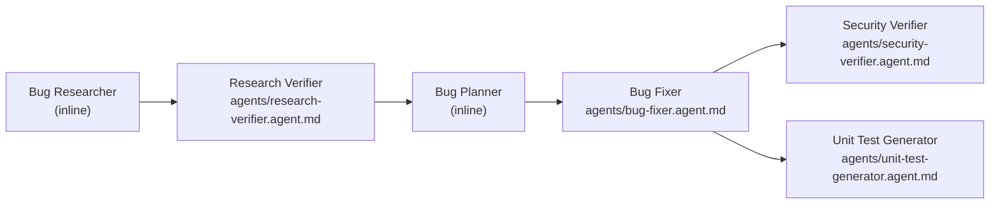

# AiTicketHub — 4-Agent Bug Pipeline

## Author

> **Student**: Viktoriia Skirko  
> **Course**: Gen AI Software Engineering  
> **Homework**: 4 — 4-Agent Pipeline

---

## Overview

AiTicketHub is an ASP.NET Core 9.0 REST API for customer support ticket management. This homework adds a **4-agent Claude pipeline** that automatically finds bugs in the codebase, fixes them, runs a security review, and generates unit tests — all from a single shell command.



---

## Agents

| Agent | File | Model | Why this model |
|-------|------|-------|----------------|
| Bug Researcher | inline (`run-pipeline.sh`) | `claude-sonnet-4-5` | Reading and summarising code is a straightforward comprehension task; mid-tier is fast and cost-effective |
| Research Verifier | `agents/research-verifier.agent.md` | `claude-opus-4-5` | Verification is a precision reasoning task — the strongest model minimises false confirmation |
| Bug Planner | inline (`run-pipeline.sh`) | `claude-sonnet-4-5` | Structured planning from already-verified inputs; mid-tier is sufficient |
| Bug Fixer | `agents/bug-fixer.agent.md` | `claude-sonnet-4-5` | Applying well-specified edits and running tests is routine; no deep reasoning needed |
| Security Verifier | `agents/security-verifier.agent.md` | `claude-opus-4-5` | Security review requires nuanced threat-model judgment; strongest model minimises missed vulnerabilities |
| Unit Test Generator | `agents/unit-test-generator.agent.md` | `claude-sonnet-4-5` | Test scaffolding is pattern-repetitive; mid-tier is fast and accurate at matching project style |

---

## Skills

| Skill | Used by | Purpose |
|-------|---------|---------|
| `skills/research-quality-measurement.md` | Research Verifier | Defines Excellent / Adequate / Insufficient / Rejected quality levels |
| `skills/unit-tests-FIRST.md` | Unit Test Generator | Defines Fast / Independent / Repeatable / Self-validating / Timely test principles |

---

## Project Structure

```
homework-4/
├── agents/
│   ├── research-verifier.agent.md
│   ├── bug-fixer.agent.md
│   ├── security-verifier.agent.md
│   └── unit-test-generator.agent.md
├── skills/
│   ├── research-quality-measurement.md
│   └── unit-tests-FIRST.md
├── context/bugs/001/           ← all agent outputs land here
├── src/AiTicketHub/            ← application source (modified by Bug Fixer)
├── tests/AiTicketHub.Tests/    ← tests (extended by Unit Test Generator)
├── docs/screenshots/
├── run-pipeline.sh
├── HOWTORUN.md
└── README.md
```

---

## Running the Application

```bash
# Build
dotnet build AiTicketHub.sln

# Run the API (Swagger at http://localhost:5000/swagger)
dotnet run --project src/AiTicketHub/API

# Run all tests
dotnet test AiTicketHub.sln
```

## Running the Pipeline

See [HOWTORUN.md](HOWTORUN.md) for full prerequisites and step-by-step instructions.

```bash
./run-pipeline.sh
```

---

## Pipeline Outputs

After a successful run, `context/bugs/001/` contains:

| File | Produced by |
|------|-------------|
| `codebase-research.md` | Bug Researcher |
| `verified-research.md` | Research Verifier |
| `implementation-plan.md` | Bug Planner |
| `fix-summary.md` | Bug Fixer |
| `security-report.md` | Security Verifier |
| `test-report.md` | Unit Test Generator |
