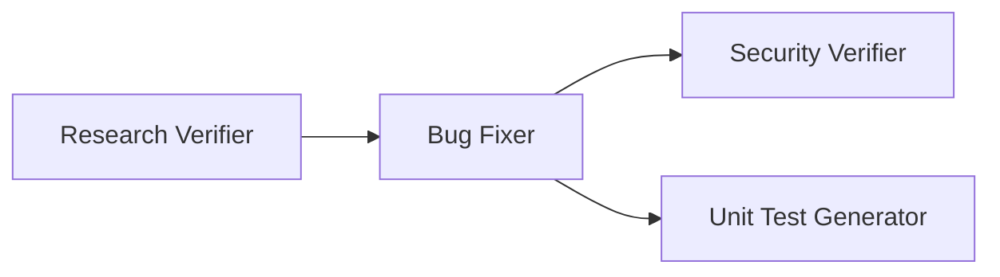

# Homework 4: 4-Agent Pipeline

**Student**: Ruslan Formanchuk

## Overview

A 4-agent pipeline for automated bug fixing, security verification, and test generation.



## Pipeline Agents

| Agent | Model | Purpose |
|-------|-------|---------|
| Research Verifier | claude-sonnet-4 | Validates research accuracy |
| Bug Fixer | claude-haiku-4 | Applies fixes from plan |
| Security Verifier | claude-sonnet-4 | Scans for vulnerabilities |
| Unit Test Generator | claude-haiku-4 | Generates FIRST-compliant tests |

### Model Selection Justification

- **Sonnet** for Research Verifier and Security Verifier: These tasks require careful analysis and reasoning to verify accuracy and identify security issues.
- **Haiku** for Bug Fixer and Unit Test Generator: These are routine tasks following explicit plans - faster model is sufficient.

## Sample Application

Simple Express REST API for user management with intentional bugs:

| Bug | Location | Description |
|-----|----------|-------------|
| Off-by-one | `userService.js:10` | Pagination skips first page |
| Null handling | `userService.js:30` | Crashes on missing user |
| SQL Injection | `database.js:52` | String concatenation in query |

## Quick Start

```bash
cd homework-4
npm install
npm start         # Start server on :3000
npm test          # Run tests
npm run pipeline  # Run 4-agent pipeline
```

## Project Structure

```
homework-4/
├── src/
│   ├── index.js
│   ├── constants/
│   ├── db/
│   ├── routes/
│   └── services/
├── agents/
│   ├── research-verifier.agent.md
│   ├── bug-fixer.agent.md
│   ├── security-verifier.agent.md
│   └── unit-test-generator.agent.md
├── skills/
│   ├── research-quality-measurement.md
│   └── unit-tests-FIRST.md
├── context/bugs/
│   ├── bug-001-off-by-one/
│   └── bug-002-null-handling/
├── tests/
└── docs/screenshots/
```

## API Endpoints

| Method | Endpoint | Description |
|--------|----------|-------------|
| GET | /users | List users (paginated) |
| GET | /users/:id | Get user by ID |
| GET | /users/search?name= | Search users |
| POST | /users | Create user |
| GET | /health | Health check |

## Skills

### Research Quality Measurement
Defines quality levels (EXCELLENT/GOOD/FAIR/POOR) and scoring criteria for verifying research accuracy.

### FIRST Principles
Unit testing principles: Fast, Independent, Repeatable, Self-validating, Timely.

## Pipeline Outputs

For each bug, the pipeline generates:
- `verified-research.md` - Research verification results
- `fix-summary.md` - Applied changes summary
- `security-report.md` - Security scan results
- `test-report.md` - Generated tests report
