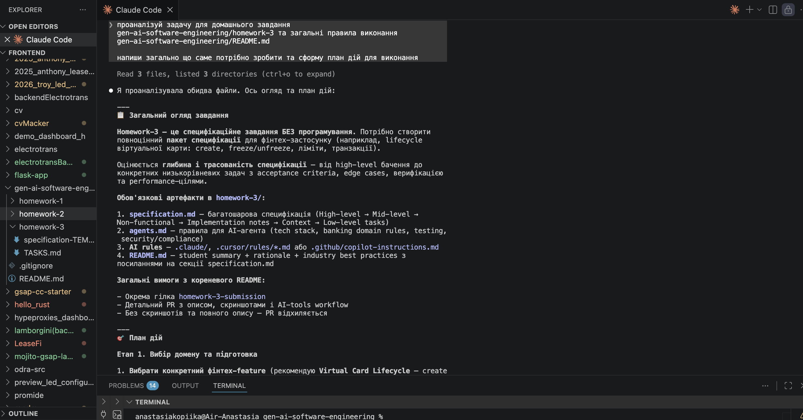
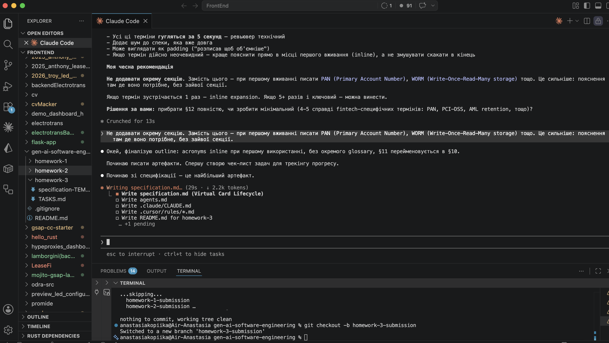
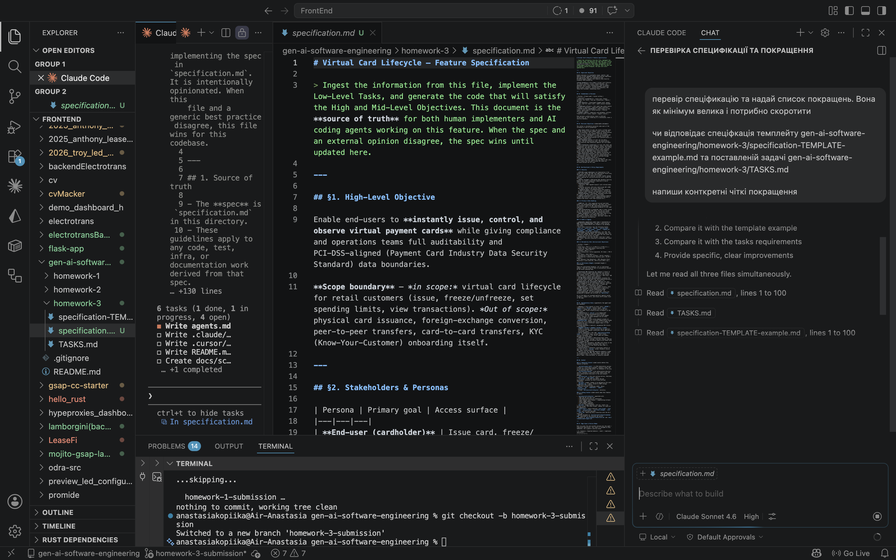
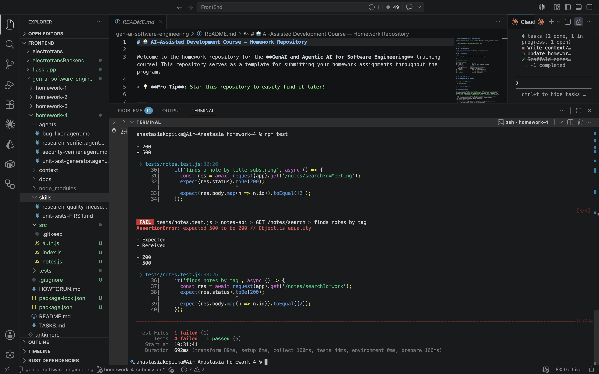
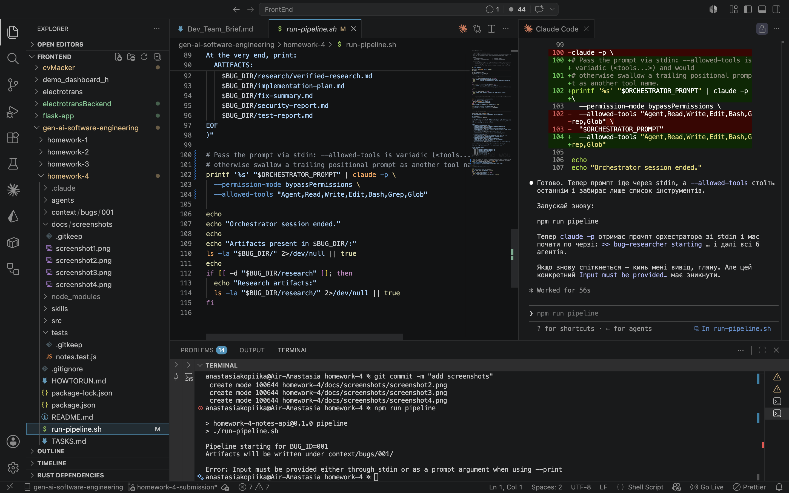
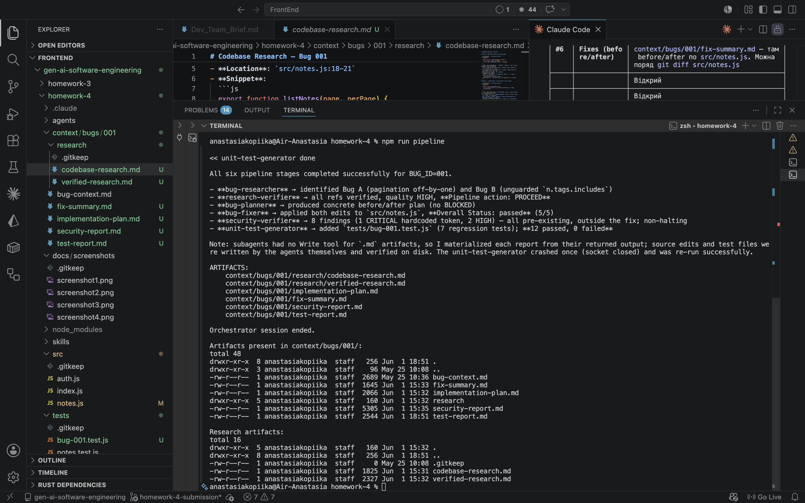
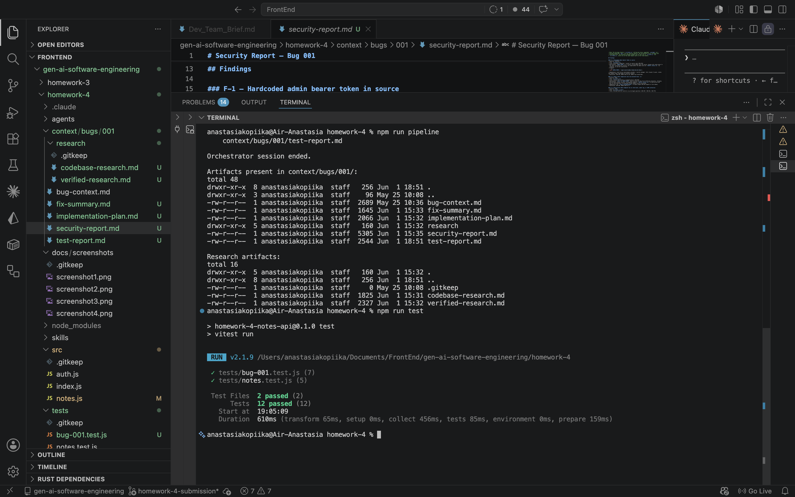

# Homework 4 — 4-Agent Pipeline

> Pipeline implemented and run end-to-end. All agent artifacts are committed and
> `npm test` is green. Remaining: attach screenshots and open the PR (see **Progress**).

## Author
Anastasia Kopiika

## Overview
4-agent pipeline (Research Verifier → Bug Fixer → Security Verifier → Unit Test Generator)
operating on a small sample application with seeded bugs and a security issue.

## Pipeline (6 agents)
```
Bug Researcher → Research Verifier → Bug Planner → Bug Fixer
                                                 ├─→ Security Verifier
                                                 └─→ Unit Test Generator
```

| # | Agent | File | Model | Why this model |
|---|-------|------|-------|----------------|
| 1 | Bug Researcher       | `agents/bug-researcher.agent.md`        | `claude-opus-4-7`   | Root-cause analysis across multiple files; mistakes here cascade. |
| 2 | Research Verifier    | `agents/research-verifier.agent.md`     | `claude-opus-4-7`   | Trust boundary of the pipeline; over-leniency lets bad research through. |
| 3 | Bug Planner          | `agents/bug-planner.agent.md`           | `claude-sonnet-4-6` | Structured transformation from verified research to plan. |
| 4 | Bug Fixer            | `agents/bug-fixer.agent.md`             | `claude-haiku-4-5`  | Mechanical edits per plan; speed and cost matter. |
| 5 | Security Verifier    | `agents/security-verifier.agent.md`     | `claude-opus-4-7`   | Broad knowledge (OWASP/CWE) + reasoning about untrusted input flow. |
| 6 | Unit Test Generator  | `agents/unit-test-generator.agent.md`   | `claude-sonnet-4-6` | Idiomatic vitest tests + edge-case reasoning; Sonnet balances quality and cost. |

## Conventions
- **`{id}`** in agent files is the bug-bundle id under `context/bugs/`. The orchestrator (Stage 5) passes it via the `BUG_ID` env var; for this homework `BUG_ID=001`.
- Each agent file declares `model:` in its frontmatter — this is the explicit model selection required by the assignment.
- All agents are designed as **Claude Code subagents** invoked by the orchestrator via the Agent tool. Verifiers (Research Verifier, Security Verifier) have read-only tools by construction.

## Sample application — `notes-api`
A minimal Express REST API for user notes with in-memory storage.

- Source: `src/index.js`, `src/notes.js`, `src/auth.js`
- Tests: `tests/notes.test.js` (vitest + supertest)
- Endpoints: list with pagination, search by title/tag, delete (admin-only)
- Seeded with **2 intentional bugs** and **1 intentional security issue**

Bugs (input for the Bug Researcher) are documented in
[`context/bugs/001/bug-context.md`](context/bugs/001/bug-context.md).
The security issue is **not** pre-listed there — Security Verifier discovers it independently.

### Baseline (before pipeline) — screenshot #4
```
Test Files  1 failed (1)
     Tests  4 failed | 1 passed (5)
```
The two seeded bugs: pagination off-by-one (`listNotes`) and a 500 crash on search
(`searchNotes` calls `.includes` on an undefined `tags`).

## Skills
Two skills are committed and consumed by the agents that need them:

- **`skills/research-quality-measurement.md`** — a 4-level scale (HIGH / MEDIUM / LOW /
  INSUFFICIENT) with a "lowest finding wins" aggregation rule and a per-level pipeline
  action. The **Research Verifier** uses it to rate the research and decide PROCEED vs STOP.
- **`skills/unit-tests-FIRST.md`** — defines **F**ast, **I**ndependent, **R**epeatable,
  **S**elf-validating, **T**imely for the project's vitest/supertest stack. The
  **Unit Test Generator** follows it and fills in a FIRST checklist in `test-report.md`.

## Pipeline runner (single command)
```bash
npm run pipeline        # or ./run-pipeline.sh   (BUG_ID=001 by default)
```
`run-pipeline.sh` syncs `agents/*.agent.md` → `.claude/agents/` and `skills/` →
`.claude/skills/`, then starts **one** `claude -p` orchestrator session that dispatches
all six subagents in order via the Agent tool, halting on STOP / BLOCKED / failed
between steps. See `HOWTORUN.md` for prerequisites and reset instructions.

## Pipeline run — results (BUG_ID=001)
| Stage | Agent | Artifact | Outcome |
|-------|-------|----------|---------|
| 1 | Bug Researcher      | `research/codebase-research.md` | Both bugs localized with file:line + snippet |
| 2 | Research Verifier   | `research/verified-research.md` | **Research Quality: HIGH (4/4) → PROCEED** |
| 3 | Bug Planner         | `implementation-plan.md`        | Minimal before/after per file |
| 4 | Bug Fixer           | `fix-summary.md`                | **Overall Status: passed** (2 lines changed in `src/notes.js`) |
| 5 | Security Verifier   | `security-report.md`            | **8 findings** — 1 CRITICAL (hardcoded admin token, CWE-798), 2 HIGH, 2 MED, 2 LOW, 1 INFO |
| 6 | Unit Test Generator | `test-report.md` + `tests/bug-001.test.js` | **12 passed (5 pre-existing + 7 new)**, 0 retries |

The seeded security issue (hardcoded `ADMIN_TOKEN` in `src/auth.js`) is **not** listed in
`bug-context.md` — the Security Verifier discovered it independently and reported it as
F-1 CRITICAL. Per its read-only contract, it reports without editing code.

## How AI was used
- **Agent + skill design**: drafted the six `*.agent.md` definitions and two skills, then
  used Cursor to review the agents and suggest improvements (screenshot #3).
- **The pipeline itself is the AI work product**: every artifact above was produced by the
  six Claude subagents, not hand-authored. The only hand-written inputs are the sample app
  (`src/`) and the seeded bug manifest (`bug-context.md`).
- **Model selection per agent** is explicit in each frontmatter and justified in the table
  above — Opus for the reasoning-heavy research/security roles, Sonnet for structured
  transformation and test generation, Haiku for the mechanical fixer.

## Challenges
- **Variadic CLI flag swallowed the prompt.** `claude --allowed-tools <tools...>` is
  variadic, so a trailing positional prompt was consumed as another tool name and the run
  failed with `Input must be provided …` (screenshot #5). Fixed by piping the orchestrator
  prompt via **stdin** instead of passing it positionally.
- **Print mode buffers output.** `claude -p` emits the whole `>> starting / << done` log at
  the end, so the run looks idle while it works; progress is observable by watching the
  artifact files appear under `context/bugs/001/`.

See `HOWTORUN.md` for run instructions.

---

## Progress

### Stages
- [x] **Stage 0** — Repo scaffold (branch `homework-4-submission`, folder skeleton, deliverable files)
- [x] **Stage 1** — Sample mini application (`notes-api`, seeded bugs, baseline tests failing)
- [x] **Stage 2** — Skills review & finalize
  - [x] `skills/research-quality-measurement.md` (aggregation rule, action-per-level, verdict examples)
  - [x] `skills/unit-tests-FIRST.md` (vitest/supertest stack, coverage minimum, reference example)
- [x] **Stage 3** — Agents review & finalize
  - [x] `agents/research-verifier.agent.md` (Pipeline action, INSUFFICIENT stop, fail-fast on missing files)
  - [x] `agents/bug-fixer.agent.md` (Edit preference, npm test, stop-on-failure)
  - [x] `agents/security-verifier.agent.md` (broadened scope: changed + imported + endpoint-reachable, output template)
  - [x] `agents/unit-test-generator.agent.md` (vitest discovery, naming convention, 1 retry max)
  - [x] `agents/bug-researcher.agent.md` (new — produces codebase-research.md)
  - [x] `agents/bug-planner.agent.md` (new — produces implementation-plan.md)
  - [x] Model justification per agent (see table above)
- [x] **Stage 4** — Researcher + Planner outputs (produced by the pipeline run, not hand-authored)
  - [x] `context/bugs/001/research/codebase-research.md`
  - [x] `context/bugs/001/implementation-plan.md`
- [x] **Stage 5** — Orchestration (single command runner)
  - [x] `run-pipeline.sh` — syncs agents/ → .claude/agents/, runs one orchestrator Claude session
  - [x] `npm run pipeline` wired in `package.json`
  - [x] Halts on STOP / BLOCKED / failed between steps
  - [x] HOWTORUN.md documents prerequisites (claude CLI + API key)
- [x] **Stage 6** — Run pipeline on the app, collect agent artifacts
  - [x] `context/bugs/001/research/verified-research.md`
  - [x] `context/bugs/001/fix-summary.md` (Overall Status: passed)
  - [x] `context/bugs/001/security-report.md` (1 CRITICAL hardcoded token + 7 more)
  - [x] `context/bugs/001/test-report.md` (+ `tests/bug-001.test.js`)
- [x] **Stage 7** — After-state verification (`npm test` green: 12 passed / 2 files)
- [x] **Stage 8** — Documentation pass (README final, HOWTORUN final, models justified)
- [ ] **Stage 9** — Open PR (branch → fork; embed screenshots, `### Status` checkboxes, instructor as reviewer)

### Screenshots
- [x] **#1** Prompt / agent design (1 of 2)
  
- [x] **#2** Prompt / agent design (2 of 2)
  
- [x] **#3** Cursor prompt — review agents and list improvements
  
- [x] **#4** Baseline: buggy app + tests failing (`4 failed | 1 passed`)
  
- [x] **#5** Pipeline run — initial failure (`Input must be provided …`, variadic `--allowed-tools` swallowed the prompt; fixed via stdin)
  
- [x] **#6** Pipeline logs after a successful run (6 agents in order, `ARTIFACTS:` list)
  
- [x] **#7** `npm test` all green after fix (`12 passed`)
  

> Security scan and fixes are not screenshotted — the agent reports themselves are committed:
> `context/bugs/001/security-report.md` (F-1 CRITICAL + 7 more) and `context/bugs/001/fix-summary.md` (before/after).
