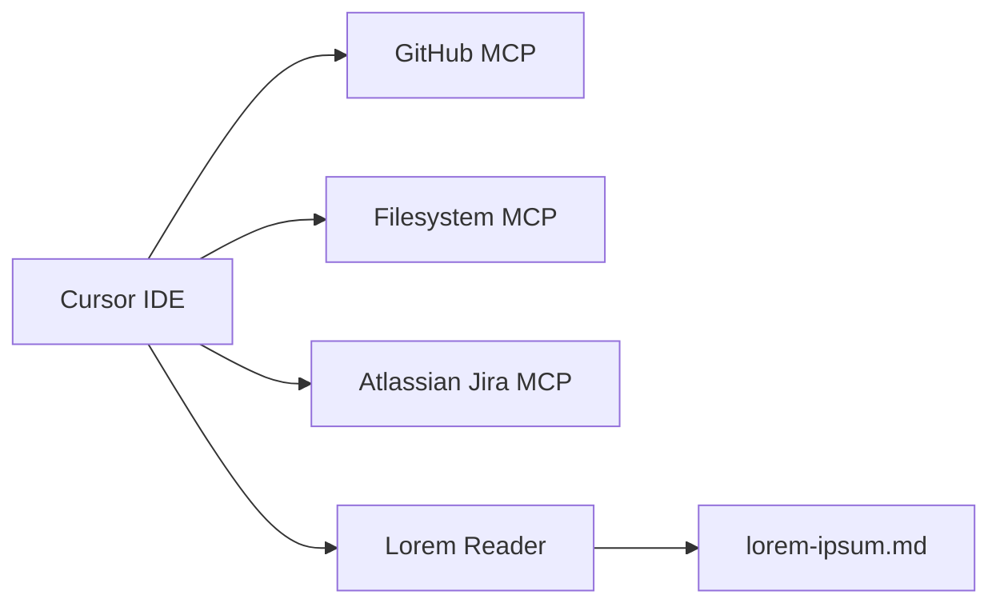

# Homework 5: MCP Server Configuration

**Student**: Ruslan Formanchuk  
**Date Submitted**: June 20, 2026  
**AI Tools Used**: Cursor (Claude)

---

## Overview

This homework configures **four MCP servers** in a Cursor development environment:

1. **GitHub MCP** — query repositories, PRs, and issues
2. **Filesystem MCP** — read and list files in `homework-5/`
3. **Atlassian Jira MCP** — query Jira tickets via OAuth
4. **Custom Lorem Reader** — FastMCP server with resource + `read` tool



## MCP Primitives

| Primitive | Description | Example in this project |
|-----------|-------------|-------------------------|
| **Resource** | URI the AI reads from (files, APIs) | `lorem://text?word_count=30` |
| **Tool** | Action the AI calls to perform operations | `read(word_count=10)` |

Resources expose data passively via URIs. Tools are explicit function calls the agent invokes.

## Configured Servers

| Server | Type | Auth | Purpose |
|--------|------|------|---------|
| `github` | Remote HTTP | OAuth (or PAT fallback) | List PRs, issues, commits |
| `filesystem` | stdio (`npx`) | None | List/read files in `homework-5/` |
| `atlassian` | Remote HTTP | OAuth | Query Jira bugs and tickets |
| `lorem-reader` | stdio (`python3`) | None | Custom FastMCP demo server |

## Quick Start

```bash
# From repository root
cp homework-5/mcp.json .cursor/mcp.json
```

See [HOWTORUN.md](./HOWTORUN.md) for full setup, authentication, and test prompts.

## Project Structure

```
homework-5/
├── README.md
├── HOWTORUN.md
├── mcp.json
├── custom-mcp-server/
│   ├── server.py
│   ├── lorem-ipsum.md
│   ├── requirements.txt
│   └── HOWTORUN.md
└── docs/
    └── screenshots/
        ├── github-mcp-result.png
        ├── filesystem-mcp-result.png
        ├── jira-or-notion-mcp-result.png
        └── custom-mcp-read-tool-result.png
```

## Custom MCP Server

The `lorem-reader` server demonstrates FastMCP primitives:

- **Resource** `lorem://text{?word_count}` — returns N words from `lorem-ipsum.md` (default: 30)
- **Tool** `read(word_count=30)` — same content via tool invocation

## Screenshots

| Screenshot | Description |
|------------|-------------|
| `docs/screenshots/github-mcp-result.png` | GitHub MCP interaction (e.g. list PRs) |
| `docs/screenshots/filesystem-mcp-result.png` | Filesystem MCP file listing/read |
| `docs/screenshots/jira-or-notion-mcp-result.png` | Jira bug query (ticket keys only) |
| `docs/screenshots/custom-mcp-read-tool-result.png` | Custom `read` tool invocation |

## Security

- No API tokens committed to `mcp.json`
- OAuth preferred for GitHub and Atlassian
- GitHub PAT set via `export GITHUB_PAT=ghp_...` environment variable
- Jira screenshots show ticket keys only, not titles or descriptions
